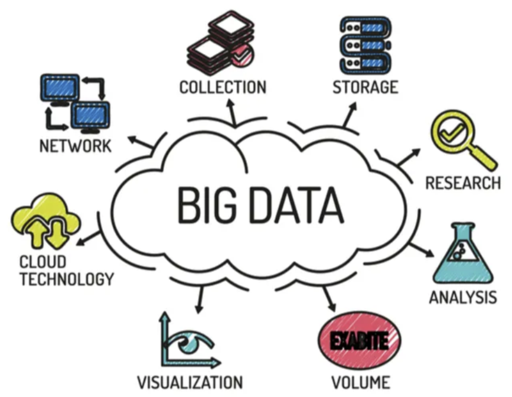
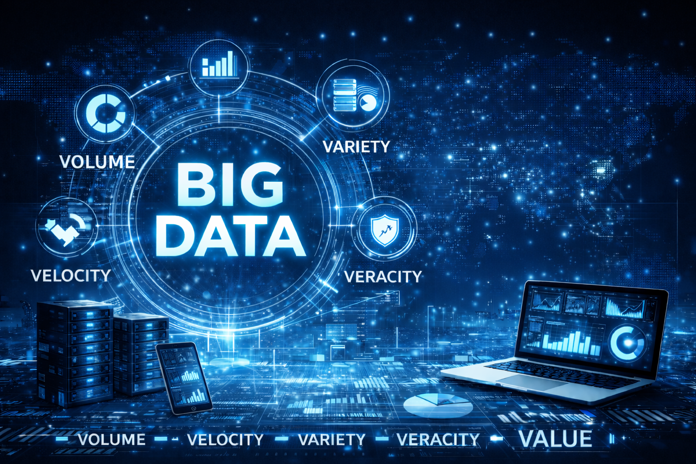
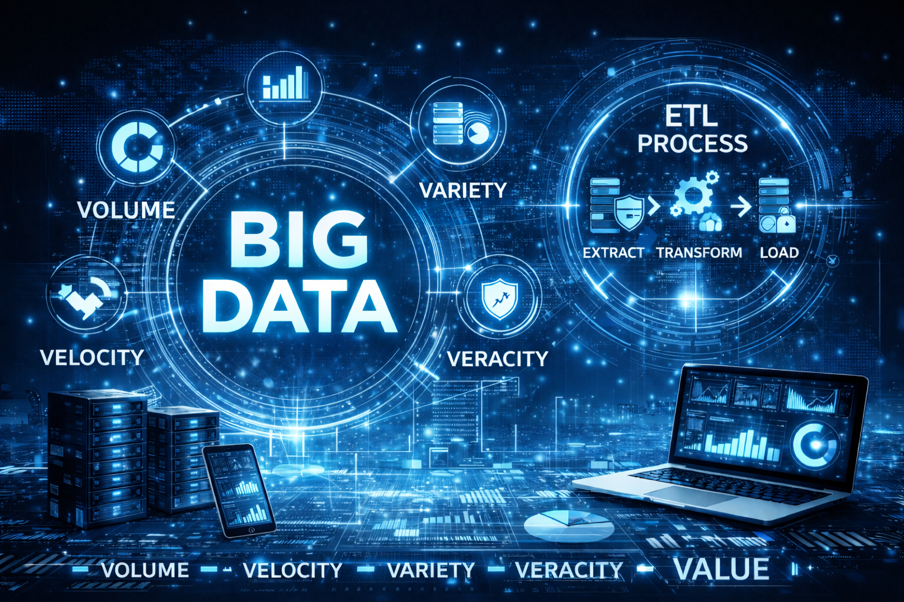

|                             |                          |                                 |
| --------------------------- | ------------------------ | ------------------------------- |
| **Techniker HF Informatik** | **Scripting / Big data** |  |

- [1. Einführung in Big Data \& ETL](#1-einführung-in-big-data--etl)
  - [1.1. Was ist Big Data?](#11-was-ist-big-data)
  - [1.2. Die 5 Vs von Big Data](#12-die-5-vs-von-big-data)
  - [1.3. ETL – Extract, Transform, Load](#13-etl--extract-transform-load)
    - [1.3.1. Was ist ETL?](#131-was-ist-etl)
    - [1.3.2. Warum ist ETL so wichtig?](#132-warum-ist-etl-so-wichtig)
    - [1.3.3. Extract (Extraktion)](#133-extract-extraktion)
    - [1.3.4. Transform (Transformation)](#134-transform-transformation)
    - [1.3.5. Load (Laden)](#135-load-laden)
  - [1.4. ETL vs. ELT (moderne Datenpipelines)](#14-etl-vs-elt-moderne-datenpipelines)
- [2. Aufgaben](#2-aufgaben)
  - [2.1. Skript mit Startup-Argumenten implementieren](#21-skript-mit-startup-argumenten-implementieren)

---

# 1. Einführung in Big Data & ETL

## 1.1. Was ist Big Data?

Big Data bezeichnet Datenmengen, die so g**ross, komplex oder schnell wachsend sind**, dass sie mit klassischen Datenverarbeitungssystemen nicht mehr effizient verarbeitet werden können.
Dies umfasst **strukturierte**, **semi‑strukturierte** und **unstrukturierte Daten** aus vielen unterschiedlichen Quellen wie Web‑Logs, IoT‑Sensoren, Social Media oder Geschäftstransaktionen.

- Big‑Data‑Datenmengen sind "**zu komplex für traditionelle Analyseansätze**" und entstehen fortlaufend aus Sensoren, Smart Devices und digitalen Interaktionen.
  - [coursera.org](https://www.coursera.org/articles/5-vs-of-big-data)

- Big Data sind **massive, komplexe Datensätze, die exponentiell wachsen** und nicht durch traditionelle Systeme verarbeitet werden können.
  - [smowl.net](https://smowl.net/en/blog/big-data-5v/)

---

## 1.2. Die 5 Vs von Big Data

- **Volume (Datenvolumen)**
  - Enorme Datenmengen, die im Terabyte‑ bis Petabyte‑Bereich liegen (z. B. Millionen von täglichen Transaktionen).
  - Beispiel: Streaming‑Plattformen wie Netflix verarbeiten riesige Datenmengen an Nutzungsstatistiken.
- **Velocity (Geschwindigkeit)**
  - Daten entstehen in Hochgeschwindigkeit, oft in Echtzeit.
  - Beispiele: Börsenkurse, IoT‑Sensorströme, GPS‑Tracking.
- **Variety (Vielfalt)**
  - Daten liegen in unterschiedlichsten Formaten vor:
    - strukturiert (SQL, Tabellen)
    - semi‑strukturiert (JSON, XML)
    - unstrukturiert (Bilder, Videos, Texte, Logs)
- **Veracity (Wahrhaftigkeit/Qualität)**
  - Daten können unvollständig, fehlerhaft oder widersprüchlich sein – eine grosse Herausforderung.
- **Value (Wert)**
  - Der eigentliche Nutzen liegt in den Erkenntnissen, die aus Daten gewonnen werden:
    - z.B. Prozessoptimierung, personalisierte Angebote, Prognosen.

---

## 1.3. ETL – Extract, Transform, Load

### 1.3.1. Was ist ETL?

ETL ist ein Prozess, der Daten aus **verschiedenen Quellen** extrahiert, transformiert und anschliessend lädt – meist in ein **Data Warehouse oder Data Lake**.
ETL ist ein zentraler Datenintegrationsprozess für Datenqualität, Analyse und Machine‑Learning‑Arbeitslasten.

### 1.3.2. Warum ist ETL so wichtig?

Weil Big Data folgende Herausforderungen mit sich bringt:

- viele heterogene Datenquellen
- unstrukturierte Daten
- extrem grosse Datenvolumen
- Notwendigkeit für Datenqualität
- Analyseanforderungen (Machine Learning, BI)

### 1.3.3. Extract (Extraktion)

Daten werden aus verschiedenen Quellen gesammelt:

- Datenbanken
- Webservices/APIs
- Logfiles
- IoT‑Sensoren
- Dateien (CSV, JSON)

Herausforderungen:

- unterschiedliche Formate
- verschiedene Protokolle
- Inkonsistenzen im Schema

### 1.3.4. Transform (Transformation)

Die Daten werden bereinigt, vereinheitlicht und angepasst:

- Formatierungen
- Typkonvertierungen
- Validierung
- Anreicherung (z. B. Geo‑Daten)
- Aggregationen
- Entfernen fehlerhafter Werte
- Business Rules anwenden

### 1.3.5. Load (Laden)

Die transformierten Daten werden in ein Zielsystem geladen:

- Data Warehouse
- Data Lake
- NoSQL‑Datenbanken
- Analytics Engines

Das Laden kann erfolgen als:

- Batch Load (z. B. stündlich)
- Incremental Load (nur Änderungen)
- Streaming Load (Echtzeit)

## 1.4. ETL vs. ELT (moderne Datenpipelines)

Moderne Cloud‑Systeme ermöglichen **ELT**, um die Transformation in leistungsfähige MPP‑Systeme zu verlagern (z.B. BigQuery, Snowflake).

| **ETL**                      | **ELT**                                       |
| ---------------------------- | --------------------------------------------- |
| Transformation vor           | Transformation nach dem Laden                 |
| Klassisch in Data Warehouses | Moderne Cloud‑Data‑Lakes                      |
| Gut für strukturierte Daten  | Ideal für grosse, unstrukturierte Datenmengen |

 

---

# 2. Aufgaben

## 2.1. Skript mit Startup-Argumenten implementieren

| **Vorgabe**             | **Beschreibung**                                                      |
| :---------------------- | :-------------------------------------------------------------------- |
| **Lernziele**           | Kann den Begriff BigData erläutern                                    |
|                         | Versteht wozu ETL benötigt wird und kann Unterschied zu ELT erläutern |
| **Sozialform**          | Partnerarbeit                                                         |
| **Hilfsmittel**         |                                                                       |
| **Erwartete Resultate** |                                                                       |
| **Zeitbedarf**          | 40 min                                                                |
| **Lösungselemente**     | Kurzpräsentation                                                      |

**A1:**

Erklären Sie die fünf **V**s von Big Data jeweils in einem Satz mit einem eigenen Praxisbeispiel.

**A2:**

Beschreiben Sie die Schritte **Extract**, **Transform**, **Load** anhand eines Beispiels:

- "Ein Webshop möchte nächtlich alle Bestellungen in ein Data Warehouse übertragen, um daraus Verkaufsstatistiken zu erstellen."

**A3:**

Warum benötigen klassische SQL‑Datenbanken bei Big Data Unterstützung durch Data Lakes?
Unterschied Batch vs. Stream‑Processing?
