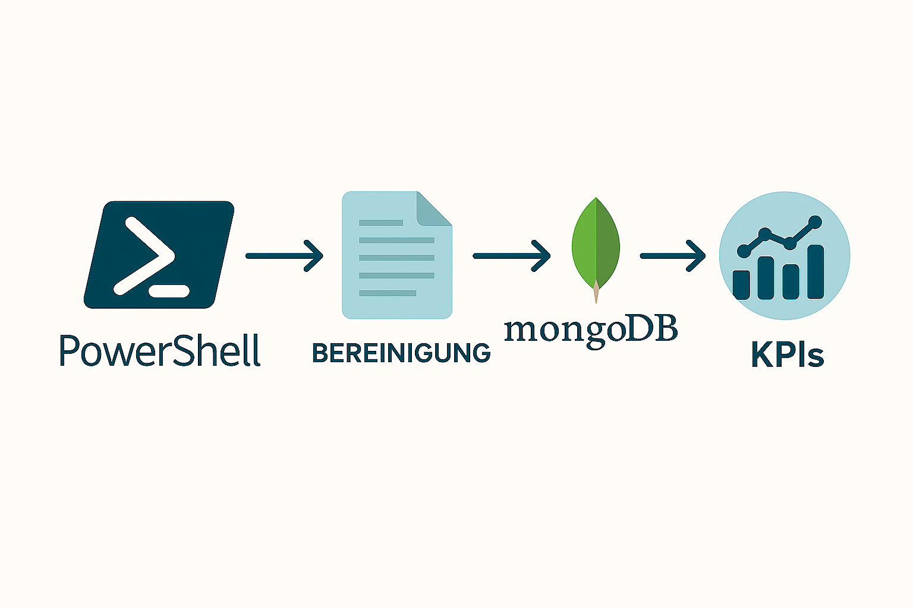
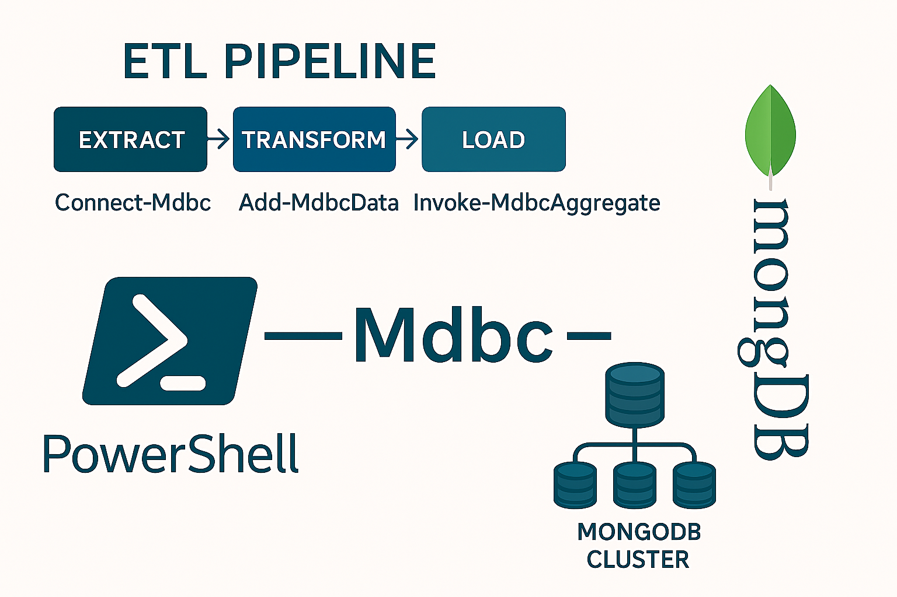

|                             |                          |                                 |
| --------------------------- | ------------------------ | ------------------------------- |
| **Techniker HF Informatik** | **Scripting / Big data** |  |

- [1. BigData mit PowerShell und MongoDB](#1-bigdata-mit-powershell-und-mongodb)
  - [1.1. Lernziele](#11-lernziele)
  - [1.2. Kontext \& Nutzen von Mdbc (kurz)](#12-kontext--nutzen-von-mdbc-kurz)
  - [1.3. Exakte Voraussetzungen (Checkliste)](#13-exakte-voraussetzungen-checkliste)
  - [1.4. Installation \& erster Verbindungsaufbau](#14-installation--erster-verbindungsaufbau)
  - [1.5. Verbinden (Client → DB → Collection)](#15-verbinden-client--db--collection)
  - [1.6. Kern‑Cmdlets (Praxisorientierter Überblick)](#16-kerncmdlets-praxisorientierter-überblick)
- [2. Aufgaben](#2-aufgaben)
  - [2.1. Einstieg Verbinden und Daten einfügen](#21-einstieg-verbinden-und-daten-einfügen)
  - [2.2. Big-Data-Workflow (CSV)](#22-big-data-workflow-csv)
  - [2.3. Big-Data-Workflow (WebAPI)](#23-big-data-workflow-webapi)

---

# 1. BigData mit PowerShell und MongoDB

## 1.1. Lernziele

- erklären, warum MongoDB für Big-Data-Szenarien geeignet ist
- beschreiben, welche Rolle das PowerShell-Modul mdbc spielt
- eine Verbindung von PowerShell zu MongoDB herstellen
- Daten mit PowerShell lesen, schreiben und abfragen
- typische Fehler bei Setup und Verbindung beheben
- einfache Big-Data-Use-Cases selbstständig umsetzen



## 1.2. Kontext & Nutzen von Mdbc (kurz)

- **Mdbc** ist ein PowerShell‑Modul auf Basis des offiziellen MongoDB C#‑Treibers.
- Es macht MongoDB‑Operationen „PowerShell‑freundlich“ (Cmdlets statt Treiber‑API).
- Ideal für Scripting/ETL/Automatisierung: Daten bereinigen, importieren/exportieren, Abfragen, Aggregationen, Indizes – alles nativ in PowerShell.

**PowerShell Script** -> **mdbc Modul** -> **MongoDB Driver** -> **MongoDB Server**

[Mdbc - GibHut](https://github.com/nightroman/Mdbc)

## 1.3. Exakte Voraussetzungen (Checkliste)

Empfohlen für den Kurs: PowerShell 7.x (Core) oder Windows PowerShell 5.1, MongoDB Community Server/Atlas, Internetzugang für Gallery‑Install.

- **PowerShell**
  - PowerShell 7.x oder 5.1; Mdbc ist als PowerShell Gallery Modul verfügbar (PS 5.1+ / Core).
  - Modulmanagement via PowerShellGet / Install-Module.
- .**NET‑Abhängigkeit**
  - Für ältere Windows PowerShell Varianten war .NET 4.7.2 gefordert
- **MongoDB**
  - Lokaler mongod oder Zugriff auf MongoDB Atlas (Connection‑String). Vor dem Start sicherstellen, dass der Dienst läuft / erreichbar ist.
  - `mongodb://localhost:27017`
- **Rechte/Netzwerk**
  - Firewall/Port 27017 bzw. Atlas‑IP‑Allowlist korrekt; TLS/Authentifizierung je nach Umgebung. (Für Atlas+LDAP gab es Issues/Workarounds; siehe Referenz‑Thread.)



## 1.4. Installation & erster Verbindungsaufbau

```powershell
# Als Benutzer (ohne Admin) installieren:
Install-Module Mdbc -Scope CurrentUser

# Modul in der aktuellen Session laden:
Import-Module Mdbc

# Überprüfung
Get-Module mdbc -ListAvailable

# Hilfe und verfügbaren Befehlssatz erkunden
help about_Mdbc
help Connect-Mdbc -Full
Get-Command -Module Mdbc

# Die about_Mdbc‑Hilfeseite listet die Cmdlets und typische Workflows.
```

## 1.5. Verbinden (Client → DB → Collection)

**Hinweis Atlas:**

- Connection‑String aus Atlas (inkl. Benutzer/Passwort & Optionen) direkt in -ConnectionString verwenden.
- Bei speziellen Mechanismen (z. B. PLAIN/LDAP) TLS‑Parameter korrekt setzen; siehe bekannte Diskussionen/Issue‑Lösungen

```powershell
# Beispiel 1: lokale Instanz, DB "hf_class", Collection "logs"
Connect-Mdbc -ConnectionString "mongodb://localhost:27017" `
             -Database hf_class `
             -Collection logs

# Beispiel 2: Verbindung zu MongoDB herstellen
Connect-Mdbc -ConnectionString "mongodb://localhost:27017" -Database bigdata

# Collection auswählen
Get-MdbcCollection -Name logs
```

## 1.6. Kern‑Cmdlets (Praxisorientierter Überblick)

[](https://www.powershellgallery.com/packages/Mdbc/7.0.1/Content/en-US%5Cabout_Mdbc.help.txt)

```powershell

# Beispiel 1: Dokument einfügen
$doc = @{
    timestamp = Get-Date
    machine   = "M1"
    temperature = 92.4
    status = "OK"
}

Add-MdbcData -Collection sensordaten -InputObject $doc

# Beispiel 2:
# INSERT (einzeln/mehrere)
Add-MdbcData @{ _id = 1; name = "Alice"; city = "Bern" }
Add-MdbcData -Many @(
  @{ _id = 2; name = "Bob"; city = "Zürich" },
  @{ _id = 3; name = "Cara"; city = "Basel" }
)

# FIND (Filter + Projektion + Sortierung)
Get-MdbcData -Filter @{ city = "Bern" } -Project @{ _id = 0; name = 1 } -Sort @{ name = 1 }

# UPDATE (klassisch)
Update-MdbcData -Filter @{ _id = 1 } -Update @{ '$set' = @{ city = "Luzern" } }

# DELETE
Remove-MdbcData -Filter @{ _id = 2 }

# Upsert‑Muster (Idempotenz)
Update-MdbcData -Filter @{ _id = 99 } `
  -Update @{
    '$set'        = @{ name = "Upsert User"; city = "Bern" }
    '$setOnInsert'= @{ createdAt = (Get-Date) }
  } `
  -Upsert

# Aggregation Pipeline (Analytics/KPIs)
Invoke-MdbcAggregate @(
  @{ '$match' = @{ city = @{ '$exists' = $true } } },
  @{ '$group' = @{ _id = '$city'; c = @{ '$sum' = 1 } } },
  @{ '$sort'  = @{ c = -1 } }
)

# Datenexport/-import (JSON/BSON ohne direkten DB‑Zugriff)
# Export/Import von BSON/JSON-Dateien (offline)
Export-MdbcData -Path ".\backup.bson"
Import-MdbcData -Path ".\backup.bson"

# Datenbanken/Collections verwalten & Indizes
# Datenbanken/Collections abfragen
Get-MdbcDatabase
Get-MdbcCollection

# Collection anlegen/löschen
Add-MdbcCollection -Name "orders"
Remove-MdbcCollection -Name "temp"

# Index hinzufügen (Beispiel: Zeit/Status)
Invoke-MdbcCommand -Command @{
  createIndexes = "logs"
  indexes = @(@{ key = @{ ts = 1 }; name = "ts_asc" },
              @{ key = @{ status = 1; ts = -1 }; name = "status_ts" })
}
```

</br>

---

# 2. Aufgaben

## 2.1. Einstieg Verbinden und Daten einfügen

| **Vorgabe**             | **Beschreibung**                                     |
| :---------------------- | :--------------------------------------------------- |
| **Lernziele**           | eine Verbindung von PowerShell zu MongoDB herstellen |
|                         | Daten mit PowerShell lesen, schreiben und abfragen   |
| **Sozialform**          | Einzelarbeit                                         |
| **Hilfsmittel**         |                                                      |
| **Erwartete Resultate** |                                                      |
| **Zeitbedarf**          | 40 min                                               |
| **Lösungselemente**     | PowerShell-Script (.ps1)                             |

**Auftrag:**

1. Verbinde PowerShell mit MongoDB
2. Erstelle eine Collection logs
3. Füge mindestens 5 Dokumente ein:
   1. timestamp
   2. source
   3. level (INFO/WARN/ERROR)
   4. message
4. Lies alle ERROR-Einträge aus

---

## 2.2. Big-Data-Workflow (CSV)

| **Vorgabe**             | **Beschreibung**                                     |
| :---------------------- | :--------------------------------------------------- |
| **Lernziele**           | eine Verbindung von PowerShell zu MongoDB herstellen |
|                         | Daten mit PowerShell lesen, schreiben und abfragen   |
| **Sozialform**          | Einzelarbeit                                         |
| **Hilfsmittel**         |                                                      |
| **Erwartete Resultate** |                                                      |
| **Zeitbedarf**          | 40 min                                               |
| **Lösungselemente**     | PowerShell-Script (.ps1)                             |

**Auftrag:**

1. Importiere eine CSV-Datei mit [Sensordaten](./x_gitres/sensordaten.csv)
2. Konvertiere jede Zeile in ein MongoDB-Dokument
3. Speichere die Daten in MongoDB
4. Erstelle eine Abfrage:
   1. Anzahl ERRORs pro Maschine
5. Exportiere das Resultat als CSV

**Zusatz (optional):**

- Automatisiere den Import
- Füge Logging hinzu

---

## 2.3. Big-Data-Workflow (WebAPI)

| **Vorgabe**             | **Beschreibung**                                          |
| :---------------------- | :-------------------------------------------------------- |
| **Lernziele**           | Daten aus externe WebAPI abrufen                          |
|                         | eine Verbindung von PowerShell zu MongoDB herstellen      |
|                         | Daten mit PowerShell in einer MongoDB Datenbank speichern |
| **Sozialform**          | Einzelarbeit                                              |
| **Hilfsmittel**         |                                                           |
| **Erwartete Resultate** |                                                           |
| **Zeitbedarf**          | 90 min                                                    |
| **Lösungselemente**     | PowerShell-Script (.ps1)                                  |

**Auftrag:**

- Ein Unternehmen möchte Daten aus einer externen WebAPI automatisiert beziehen, speichern und auswerten.
- Die Daten werden regelmässig aktualisiert und sollen für Analyse- und Entscheidungszwecke genutzt werden.
- Zur Umsetzung stehen folgende Technologien zur Verfügung:
  - PowerShell für das Skripting und die Automatisierung
  - WebAPI als Datenquelle (REST, JSON)
  - MongoDB als NoSQL-Datenbank
  - KPI-Auswertung zur Bewertung der Daten

**Programmiere eine Datenpipeline, welche:**

- Daten aus einer WebAPI abruft
- die Daten aufbereitet und speichert
- Kennzahlen (KPIs) aus den gespeicherten Daten berechnet
- die Ergebnisse nachvollziehbar dokumentiert

**Empfohlene Datenquellen für die Aufgabe:**

1. [Finanz- & Kryptodaten (coingecko)](https://www.coingecko.com/en/api)
   - Aktuelle Wechselkurse für über 160 Währungen.
   - Liefert aktuelle Kurse von tausenden Kryptowährungen. Keine Registrierung für Basis-Abfragen nötig.
     - URL: https://api.coingecko.com/api/v3/coins/markets?vs_currency=usd
2. [Open Data Schweiz Opendata.swiss)](https://opendata.swiss/de)
   - Das zentrale Portal für Schweizer Behördendaten.
   - Beispiele: Aktuelle Standorte von Mobility-Fahrzeugen, Postleitzahlen-Verzeichnisse oder Wetterdaten von MeteoSchweiz.
3. [Open Transport Data](https://opentransportdata.swiss/de/) 
   - Echtzeit-Fahrplandaten des öffentlichen Verkehrs (SBB/ZVV etc.).
4. [Wissenschaft & Umwelt](https://api.nasa.gov)
   - NASA APIs: Riesige Auswahl an Daten zu Asteroiden, Mars-Fotos oder Erdbeobachtung.
   - URL: https://api.nasa.gov (Erfordert kostenlosen API-Key).
5. [OpenWeatherMap](https://openweathermap.org/)
   - Der Klassiker für Wetterdaten weltweit.
   - Vergleiche zwischen verschiedenen Städten zu skripten.

**Beispielvorlage:**

```powershell
# Test-Abfrage für CoinGecko (Top 5 Coins)
$uri = "https://api.coingecko.com/api/v3/coins/markets?vs_currency=eur&order=market_cap_desc&per_page=5&page=1"

$data = Invoke-RestMethod -Uri $uri

# Daten in der Konsole visualisieren
$data | Select-Object name, symbol, current_price | Format-Table

# ...
```

---

© 2026 Lukas Müller – Licensed under CC BY-NC-ND 4.0
See [LICENSE](..\license.md) file for details.
