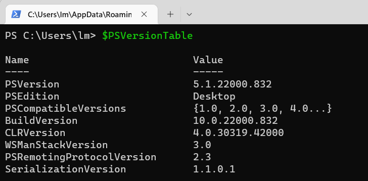
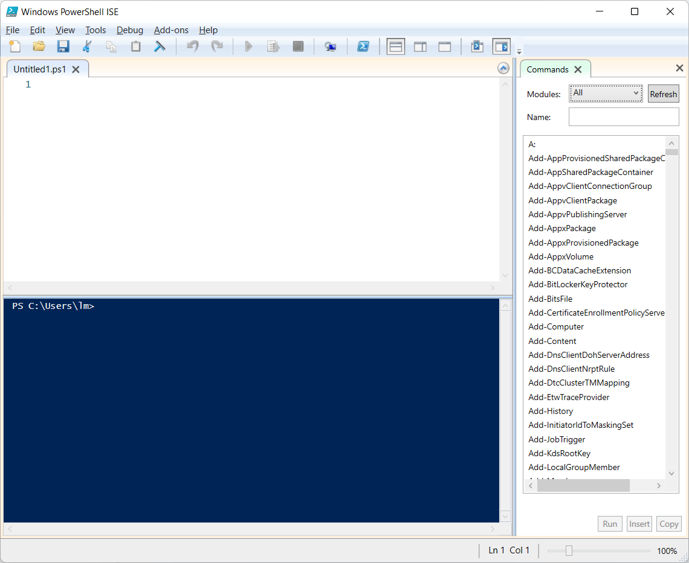
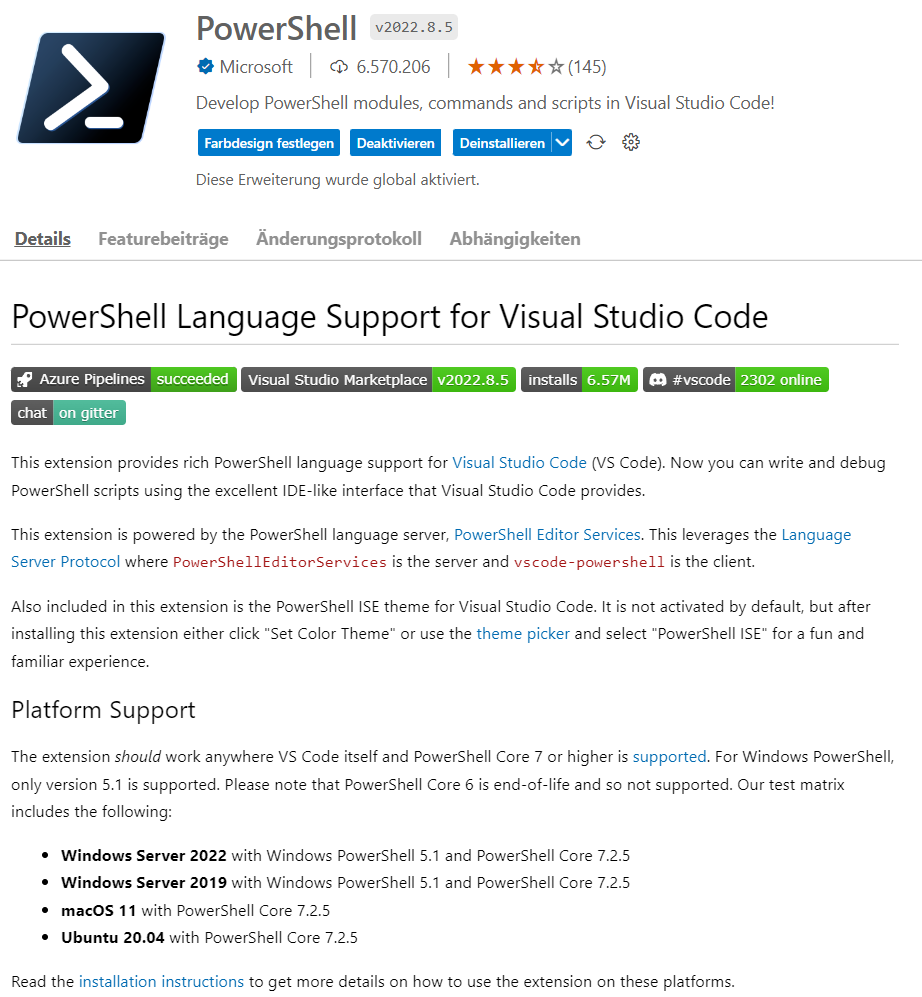
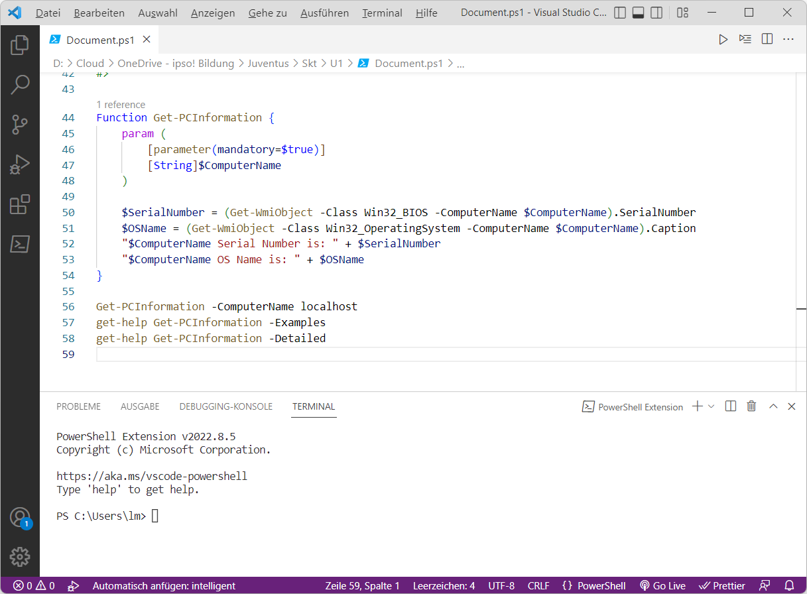
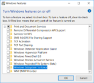
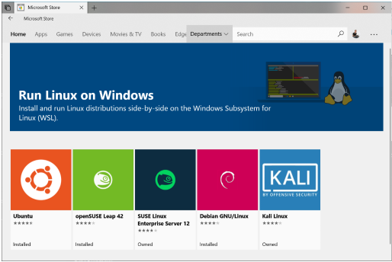
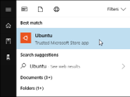

|                             |                               |                              |
| --------------------------- | ----------------------------- | ---------------------------- |
| **Techniker HF Informatik** | **Kurs Scripting / Big data** |  |

- [1. Voraussetzungen / Softwareinstallationen](#1-voraussetzungen--softwareinstallationen)
  - [1.1. PowerShell](#11-powershell)
    - [1.1.1. PowerShell-Konsole](#111-powershell-konsole)
    - [1.1.2. PowerShell ISE (Editor)](#112-powershell-ise-editor)
    - [1.1.3. Visual Studio Code](#113-visual-studio-code)
  - [1.2. Bash](#12-bash)
    - [1.2.1. Linux Installation\*\*](#121-linux-installation)
    - [1.2.2. Das Windows Subsystem for Linux (WSL)](#122-das-windows-subsystem-for-linux-wsl)
- [2. Aufgabe - Installation u. Softwarevoraussetzungen / Tools](#2-aufgabe---installation-u-softwarevoraussetzungen--tools)

---

 

# 1. Voraussetzungen / Softwareinstallationen

## 1.1. PowerShell

- [Installing PowerShell on Windows](https://learn.microsoft.com/en-us/powershell/scripting/install/installing-powershell-on-windows?view=powershell-7.5)
- [Install PowerShell on Linux](https://learn.microsoft.com/en-us/powershell/scripting/install/installing-powershell-on-linux?view=powershell-7.5)
- [Installing PowerShell on macOS](https://learn.microsoft.com/en-us/powershell/scripting/install/installing-powershell-on-macos?view=powershell-7.5)

### 1.1.1. PowerShell-Konsole

Die **Konsole** muss auf dem System installiert sein.

### 1.1.2. PowerShell ISE (Editor)

Für die PS-Skript Entwicklung muss die **ISE** installiert sein

### 1.1.3. Visual Studio Code

Anstelle PowerShell ISE kann auch der **Visual Code Editor** verwendet werden.
Mit der Installation der PowerShell Extension unterstützt der Editor den kompletten PowerShell Befehlsumfang.

[PowerShell in Visual Studio Code](https://code.visualstudio.com/docs/languages/powershell)

---

## 1.2. Bash

### 1.2.1. Linux Installation**

Lauffähige Linux Installation als Host oder Gastsystem.
**Als Virtualisierungslösung werden folgende Produkte empfohlen:**

- Oracle Virtual Box
- Microsoft Hyper-V
- Parallels Workstation

### 1.2.2. Das Windows Subsystem for Linux (WSL)

- Bietet eine Kompatibilitätsschicht zum Ausführen von Linux Programmen.
- Partnerschaft von Microsoft und Canonical (Ubuntu)
- Das Subsystem führt nicht alle Linux-Programme aus (GUI, Kernelfunktionen
- Installationsoption aktivieren
  - `Enable-WindowsOptionalFeature -Online -FeatureName Microsoft-Windows-Subsystem-Linux`
  - 
  - 

- **Starten der Ubuntu Umgebung**
  - 

Beim ersten Start der Linux-Umgebung werden Sie aufgefordert, Benutzernamen und Kennwort einzugeben. Diese müssen nicht mit Ihrem Windows-Benutzernamen und -Kennwort übereinstimmen, sondern werden innerhalb der Linux-Umgebung verwendet.

 

# 2. Aufgabe - Installation u. Softwarevoraussetzungen / Tools

| **Vorgabe**             | **Beschreibung**                     |
| :---------------------- | :----------------------------------- |
| **Lernziele**           | Softwarevoraussetzungen sind erfüllt |
| **Sozialform**          | Einzelarbeit                         |
| **Auftrag**             | Softwareinstallationen auf Laptop    |
| **Hilfsmittel**         | siehe Download links                 |
| **Erwartete Resultate** |                                      |
| **Zeitbedarf**          | 40 min                               |
| **Lösungselmente**      | Ausführbare SW Anwendungen           |

Installiere alle erforderlichen Softwarekomponenten auf Deinem Rechner.
Teste soweit möglich, dass alle Komponenten ohne Fehler ausgeführt werden und funktionstauglich sind.
