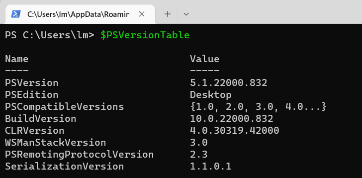
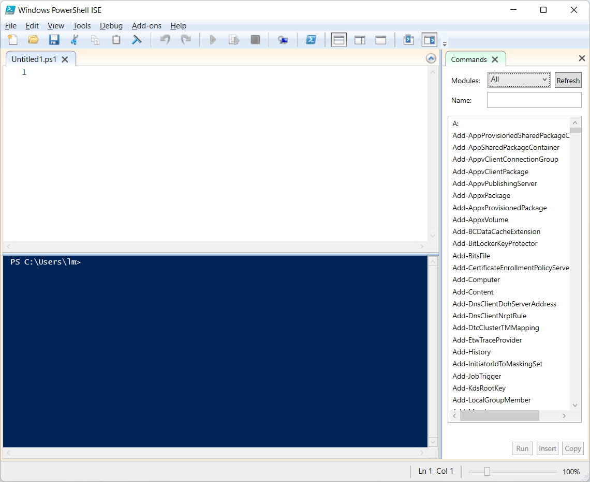
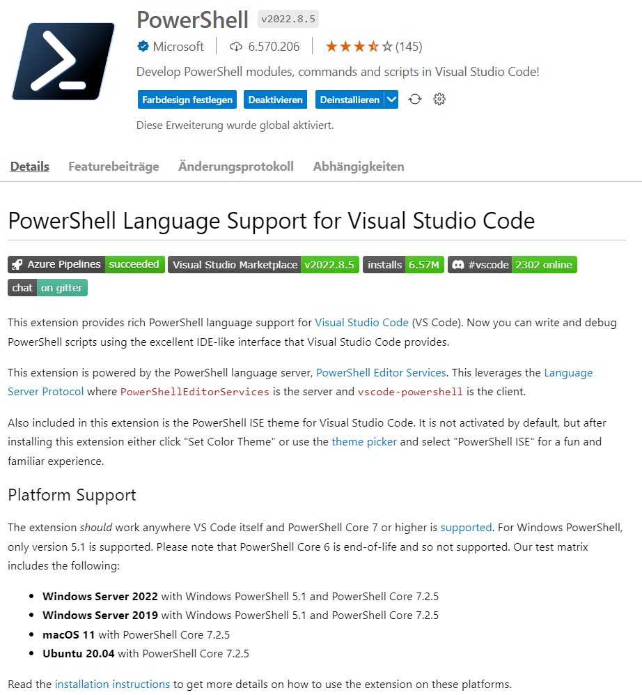
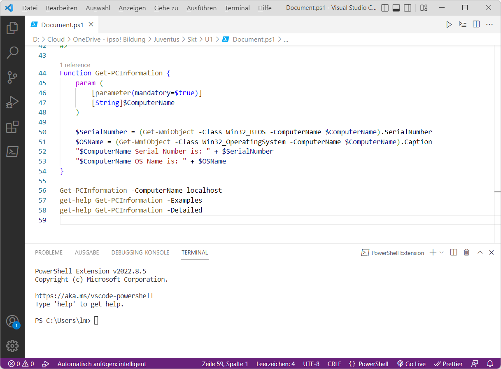
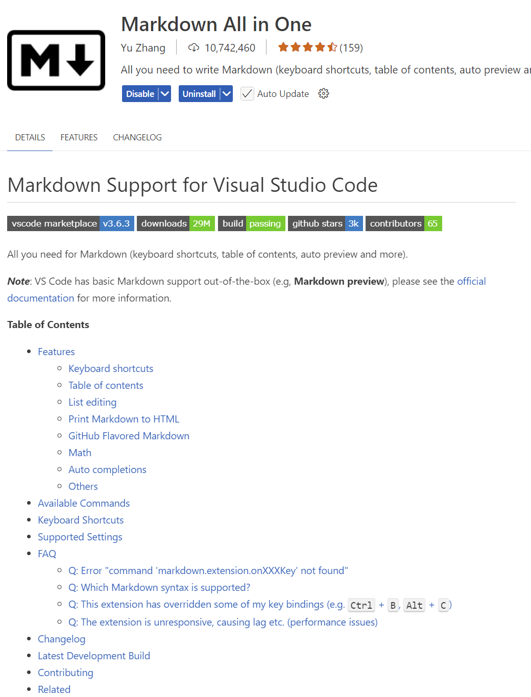
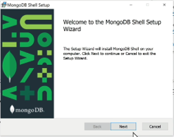
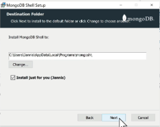
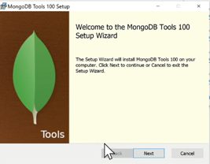
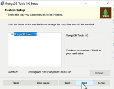

|                             |                               |                                 |
| --------------------------- | ----------------------------- | ------------------------------- |
| **Techniker HF Informatik** | **Kurs Scripting / Big data** |  |

- [1. Voraussetzungen / Softwareinstallationen](#1-voraussetzungen--softwareinstallationen)
  - [1.1. PowerShell](#11-powershell)
    - [1.1.1. PowerShell-Konsole](#111-powershell-konsole)
    - [1.1.2. PowerShell ISE (Editor)](#112-powershell-ise-editor)
  - [1.2. Visual Studio Code (VSC)](#12-visual-studio-code-vsc)
    - [1.2.1. Extension PowerShell](#121-extension-powershell)
    - [1.2.2. Extension Material Icon Theme](#122-extension-material-icon-theme)
    - [1.2.3. Extension Markdown All in One](#123-extension-markdown-all-in-one)
  - [1.3. MongoDB](#13-mongodb)
    - [1.3.1. Docker](#131-docker)
    - [1.3.2. MongoDB-Docker-Image herunterladen](#132-mongodb-docker-image-herunterladen)
    - [1.3.3. MongoDB-Docker-Container starten](#133-mongodb-docker-container-starten)
    - [1.3.4. MongoDB Downloads (Optional)](#134-mongodb-downloads-optional)
    - [1.3.5. Installation Server](#135-installation-server)
    - [1.3.6. Installation Shell u. Tools](#136-installation-shell-u-tools)
    - [1.3.7. MongoDB for VS-Code](#137-mongodb-for-vs-code)
  - [1.4. Mongo-Shell (mongosh) Commands](#14-mongo-shell-mongosh-commands)
- [2. Aufgaben](#2-aufgaben)
  - [2.1. Installation u. Softwarevoraussetzungen / Tools](#21-installation-u-softwarevoraussetzungen--tools)
  - [2.2. GitHub Account erstellen](#22-github-account-erstellen)

---

 

# 1. Voraussetzungen / Softwareinstallationen

## 1.1. PowerShell

- [Installing PowerShell on Windows](https://learn.microsoft.com/en-us/powershell/scripting/install/installing-powershell-on-windows?view=powershell-7.5)
- [Install PowerShell on Linux](https://learn.microsoft.com/en-us/powershell/scripting/install/installing-powershell-on-linux?view=powershell-7.5)
- [Installing PowerShell on macOS](https://learn.microsoft.com/en-us/powershell/scripting/install/installing-powershell-on-macos?view=powershell-7.5)

### 1.1.1. PowerShell-Konsole

Die **Konsole** muss auf dem System installiert sein.

### 1.1.2. PowerShell ISE (Editor)

Für die PS-Skript Entwicklung muss die **ISE** installiert sein

---

 

## 1.2. Visual Studio Code (VSC)

Anstelle PowerShell ISE kann auch der **Visual Code Editor** verwendet werden.
Mit der Installation der PowerShell Extension unterstützt der Editor den kompletten PowerShell Befehlsumfang.

[Download Visual Studio Code](https://code.visualstudio.com/)

### 1.2.1. Extension PowerShell

[PowerShell in Visual Studio Code](https://code.visualstudio.com/docs/languages/powershell)

 

### 1.2.2. Extension Material Icon Theme

 

### 1.2.3. Extension Markdown All in One

[Markdown Getting-Started](https://www.markdownguide.org/getting-started/)

---

## 1.3. MongoDB

### 1.3.1. Docker

- MongoDB lässt sich effektiv in einem Docker-Container betreiben. 
- Auf Docker Hub gibt es zwei Arten von MongoDB-Images: 
  - die **Community Edition** und die **Enterprise Edition**.
- Welche dieser beiden Varianten für Sie am besten geeignet ist, hängt von Ihren spezifischen Ansprüchen ab. 
- Die **Community Edition** wird typischerweise für nicht-kommerzielle Zwecke oder kleinere Bereitstellungen genutzt.

- [Docker Hub](https://hub.docker.com/_/mongo)

### 1.3.2. MongoDB-Docker-Image herunterladen

Um einen MongoDB-Docker-Container zu erstellen, beginnen wir zuerst damit, das entsprechende Image für die Ausführung von Docker Hub zu beziehen. Öffnen Sie Ihr Terminal bzw. Ihre Kommandozeile und führen Sie den folgenden Befehl aus:

> `docker pull mongo:latest`

### 1.3.3. MongoDB-Docker-Container starten

Nachdem das Docker-Image für MongoDB erfolgreich heruntergeladen wurde, können Sie nun einen Container basierend auf diesem Image starten:

> `docker run --name mongodb-container -d -p 27017:27017 mongo:latest`

- `docker run`: Startet einen neuen Docker-Container
- `--name mongodb-container`: Gibt dem Container den Namen „mongodb-container“
- `-d`: Mit diesem Parameter starten Sie den Container im Hintergrund (detached mode). Dadurch ist das Terminal weiterhin nutzbar, während der Container läuft.
- `-p 27017:27017`: Öffnet den MongoDB-Standard-Port 27017 des Containers auf Ihrem Hostsystem
- `mongo:latest`: Gibt die Anweisung, das neueste verfügbare Image zu beziehen

### 1.3.4. MongoDB Downloads (Optional)

- [Download Community Edition](https://www.mongodb.com/try/download/community)
- [MongoDB Shell](https://www.mongodb.com/try/download/shell)
- [Database Tools (msi Package)](https://www.mongodb.com/try/download/database-tools)

### 1.3.5. Installation Server

- MongoDB Community Server Download
- Vollständige Installation
- Inkl. Compass

### 1.3.6. Installation Shell u. Tools

- Mongo Shell
  - 
  - 

- MongoDB Tools
  - 
  - 

### 1.3.7. MongoDB for VS-Code

- 

 

---

## 1.4. Mongo-Shell (mongosh) Commands

- Die MongoDB-Shell ist der schnellste Weg zum Verbinden, Konfigurieren, Abfragen und Arbeiten mit Ihrer MongoDB-Datenbank.
- Die Shell fungiert als Befehlszeilen-Client des MongoDB-Servers.

- Shell starten
  - `C:\>mongosh.exe`
- Datenbanken anzeigen
  - `test>show dbs`
- Shell beenden
  - `test> exit`

---

 

# 2. Aufgaben

## 2.1. Installation u. Softwarevoraussetzungen / Tools

| **Vorgabe**             | **Beschreibung**                     |
| :---------------------- | :----------------------------------- |
| **Lernziele**           | Softwarevoraussetzungen sind erfüllt |
| **Sozialform**          | Einzelarbeit                         |
| **Auftrag**             | Softwareinstallationen auf Laptop    |
| **Hilfsmittel**         | siehe Download links                 |
| **Erwartete Resultate** |                                      |
| **Zeitbedarf**          | 40 min                               |
| **Lösungselemente**     | Ausführbare SW Anwendungen           |

Installiere alle erforderlichen Softwarekomponenten auf Deinem Rechner.
Teste soweit möglich, dass alle Komponenten ohne Fehler ausgeführt werden und funktionstauglich sind.

 

## 2.2. GitHub Account erstellen

| **Vorgabe**         | **Beschreibung**                           |
| :------------------ | :----------------------------------------- |
| **Lernziele**       | GitHub Account seht zur Verfügung          |
|                     | GitHub Benutzername in OneNote eingetragen |
| **Sozialform**      | Einzelarbeit                               |
| **Auftrag**         | siehe unten                                |
| **Hilfsmittel**     | Internet / Browser                         |
| **Zeitbedarf**      | 10 min                                     |
| **Lösungselemente** |                                            |

Erstelle einen GitHub Account. Verwende dabei wenn möglich eine IPSO E-Mail Adresse.
Gehe dabei wie folgt vor:

1. Gehe auf die Website
   1. <https://github.com/>
2. Klicke auf **„Sign up“**
   1. Oben rechts auf der Startseite findest du die Schaltfläche „Sign up“ (Registrieren).
3. Gib deine E-Mail-Adresse ein
   1. Beispiel: <dein.name@student.ipso.ch>
   2. ? Klicke dann auf **„Continue“**
4. Wähle einen Benutzernamen
   1. Das ist dein öffentlicher Name auf GitHub, z.B. **codefan123**.
5. Lege ein sicheres Passwort fest
   1. Mindestens 8 Zeichen, am besten mit Gross-, Kleinbuchstaben, Zahlen und Symbolen.
6. Gib an, ob du E-Mails von GitHub erhalten willst
   1. Das ist optional.
7. Verifiziere, dass du kein Roboter bist
   1. GitHub zeigt dir manchmal ein kleines Rätsel oder Bild-Puzzle.
8. Bestätige deine E-Mail-Adresse
   1. GitHub sendet dir eine Mail mit einem Bestätigungslink – klicke darauf, um dein Konto zu aktivieren.
9. Wähle deine GitHub-Einstellungen
   1. Privatperson oder Unternehmen
   2. Deine Interessen
10. Fertig!
    1. Du wirst zu deinem GitHub-Dashboard weitergeleitet.
11. Trage nun dein GitHub Benutzername im Class Notebook (Teams) bei Kursnotizen ein.
