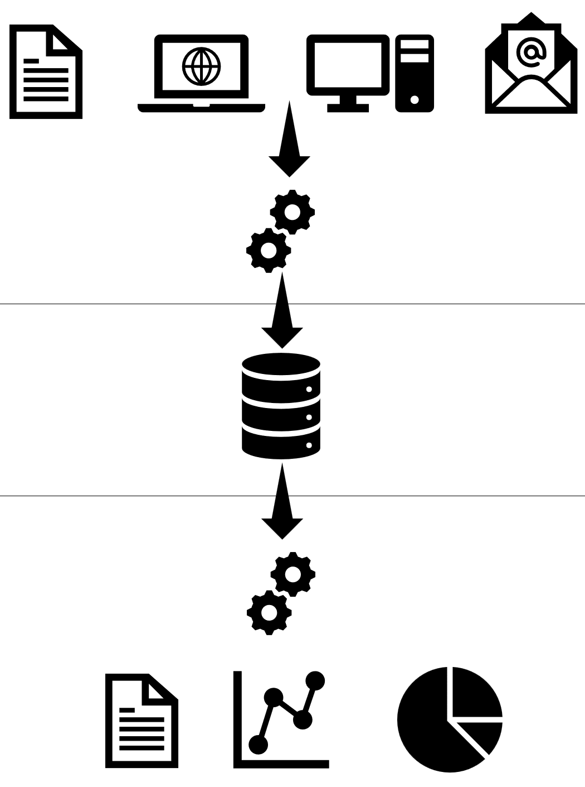

|                             |                               |                                 |
| --------------------------- | ----------------------------- | ------------------------------- |
| **Techniker HF Informatik** | **Kurs Scripting / Big data** |  |

- [1. Projektarbeit "Skriptingtechnik / BigData"](#1-projektarbeit-skriptingtechnik--bigdata)
  - [1.1. Organisation](#11-organisation)
  - [1.2. Allgemeines](#12-allgemeines)
  - [1.3. Auftrag](#13-auftrag)
  - [1.4. Grundsätzliche Rahmenbedingungen](#14-grundsätzliche-rahmenbedingungen)
  - [1.5. Vorgabe der Applikation](#15-vorgabe-der-applikation)
  - [1.6. Bewertungen](#16-bewertungen)
  - [1.7. Termine](#17-termine)

 

# 1. Projektarbeit "Skriptingtechnik / BigData"

## 1.1. Organisation

|                     |                                                           |
| :------------------ | :-------------------------------------------------------- |
| **Lernziele**       | Skripting / BigData Projekt realisieren                   |
| **Sozialform**      | Partnerarbeit (max. 2-3 Mitglieder)                       |
| **Auftrag**         | siehe unten                                               |
| **Hilfsmittel**     | Internet                                                  |
| **Zeitbedarf**      | Total ca. 8-12h                                           |
| **Lösungselemente** | Vollständiges Projekt inkl. Dokumentation u. Präsentation |

## 1.2. Allgemeines

In dieser Projektarbeit erarbeiten Sie in Gruppen (2 Personen) einen realistischen Anwendungsfall, in dem PowerShell zur Automatisierung, Systemintegration oder Datenverarbeitung zusammen mit BigData eingesetzt wird.

> **Beispiel: Das Marketing-Team benötigt eine automatisierte Pipeline, die stündlich die neuesten "Trending Products" von einer API abruft, diese bereinigt und für die langfristige Analyse in eine Big-Data-Datenbank speichert.**

## 1.3. Auftrag

- Sie entwickeln ein Projekt nach freier Wahl, welches sich aus einem Skript- und BigData (Datenbank) Teil zusammensetzt und als eine vollständige Applikation resultiert.
- Die beiden Techniken Skripting und Datenbanken sind integrierender Bestandteil einer Applikation.
- Im Projekt müssen die aufgeführten Rahmenbedingungen und spezifischen Anforderungen vollständig berücksichtigt und implementiert werden.
- Das Projekt ist in zwei Phasen Aufgabenbeschreibung bzw. Konzeption und Realisierung zu unterteilen und in dieser Reihenfolge abzuarbeiten.

## 1.4. Grundsätzliche Rahmenbedingungen

Für die Implementierung dieser Projektarbeit gelten die nachfolgend aufgeführten grundsätzlichen Rahmenbedingungen:

- **Konzeption**
  - Die Konzeption Dokumentation sollte 4 bis max. 6 A4 Seiten umfassen.
  - Kurzbeschreibung der Gesamtaufgabe, unterteilt in Datenbeschaffung, Archivierung und Auswertung (KPI's)
  - Beschreibung der Zielsetzungen, unterteilt in Muss- und Wunschziele
  - Abgrenzung, was gehört zur Lösung und was nicht (Systemgrenze bestimmen)
  - Grobplanung und Aufwandschätzung in Stunden
  - Erforderliche Hilfsmittel (SW-Produkte, Lizenzen usw.)
- **Realisierung**
  - Beide Entwicklungsbereiche Skript (ETL, Analyse) und BigData (Datenbank) müssen Bestandteil einer Applikation sein
  - Die Lösung muss auf einem Windows oder Linux Betriebssystem lauffähig sein
  - Die Skriptprogrammierung muss in PowerShell erfolgen
  - Als Datenbank ist MongoDB einzusetzen
  - Das Projekt muss modular aufgebaut sein
  - Es muss mindestens eine fortgeschrittene Technik enthalten sein
  - Logging muss implementiert sein
  - Fehlerbehandlung muss enthalten
  - Das Projekt und Programmcode muss dokumentiert sein
  - Die Realisierung darf erst nach abgeschlossener und durch den Dozenten genehmigter Konzeptionsphase erfolgen
  - Die Implementierung hat gemäss Vorgaben zur Namenskonventionen und Standards und Guide Lines zu erfolgen
  - Am Schluss muss die Lösung mit einer Live-Demonstration präsentiert werden (inkl. Diskussion, Reflexion)

## 1.5. Vorgabe der Applikation

Die Applikation hat sich aus einem Datenbeschaffungs- (Quelle), Archivierung- (persistente Datenhaltung) und einem Auswertungsteil (Analyse, KPI) zusammenzusetzen.

## 1.6. Bewertungen

| **Kriterium**                                | **Punkte** |
| -------------------------------------------- | :--------: |
| **Analyse & Konzept**                        |            |
| - Problemstellung klar verstanden            |     3      |
| - Datenquellen korrekt analysiert            |     3      |
| - Ablauf logisch & nachvollziehbar           |     3      |
| - Big-Data-Bezug korrekt eingeordnet         |     3      |
|                                              |            |
| **PowerShell-Skripting**                     |            |
| - Funktionen & Parameter sinnvoll eingesetzt |     3      |
| - Schleifen & Bedingungen korrekt            |     3      |
| - Fehlerbehandlung (try/catch)               |     3      |
| - Lesbarkeit & Stil                          |     3      |
|                                              |            |
| **MongoDB / Big-Data-Integration (ETL)**     |            |
| - Filterung & Transformation                 |     3      |
| - Aggregation (Statistiken)                  |     3      |
| - Datenqualität berücksichtigt               |     3      |
| - Big-Data-Konzepte korrekt angewendet       |     3      |
|                                              |            |
| **Automatisierung & Robustheit**             |            |
| - Automatisierungsidee (z.B. Zeitsteuerung)  |     3      |
| - Logging implementiert                      |     3      |
| - Debug-/Fehlermeldungen sinnvoll            |     3      |
| - Testing                                    |     3      |
|                                              |            |
| **Dokumentation & Präsentation**             |            |
| - Technische Dokumentation (README.md)       |     3      |
| - Verständlichkeit für Dritte                |     3      |
| - Präsentation / Erklärung                   |     3      |
| - Reflexion & Ausblick                       |     3      |
|                                              |            |
| **Total**                                    |   **60**   |

> **Notenskala: Erreichte Punktzahl x 5 / Max. Punktzahl + 1 = Note (auf 1/10 Noten gerundet)**

## 1.7. Termine

Termin für Konzeptabgabe: **21.06.2026, 14:00 Uhr, OpenOLAT (Ordner Studierende)**
Termin für Projektabgabe: **25.06.2026, 23:59 Uhr, OpenOLAT (Ordner Studierende)**
