|                             |                          |                                 |
| --------------------------- | ------------------------ | ------------------------------- |
| **Techniker HF Informatik** | **Scripting / Big data** |  |

- [1. MongoDB](#1-mongodb)
  - [1.1. Einleitung](#11-einleitung)
  - [1.2. Was ist MongoDB?](#12-was-ist-mongodb)
  - [1.3. Überblick](#13-überblick)
  - [1.4. Grundlagen](#14-grundlagen)
    - [1.4.1. Datenmodel (JSON)](#141-datenmodel-json)
    - [1.4.2. Collections](#142-collections)
    - [1.4.3. Struktur eines JSON-Dokuments](#143-struktur-eines-json-dokuments)
  - [1.5. ObjectId](#15-objectid)
    - [1.5.1. Aufbau der ObjectId](#151-aufbau-der-objectid)
    - [1.5.2. Eigenschaften der ObjectId](#152-eigenschaften-der-objectid)
  - [1.6. \_id Feld](#16-_id-feld)
  - [1.7. Vergleich RDBMS u. MongoDB Schema Design](#17-vergleich-rdbms-u-mongodb-schema-design)
  - [1.8. Datenmodell](#18-datenmodell)
    - [1.8.1. Embedding](#181-embedding)
    - [1.8.2. Referencing](#182-referencing)
  - [1.9. BSON](#19-bson)
  - [1.10. Gesamtübersicht](#110-gesamtübersicht)
- [2. Aufgaben](#2-aufgaben)
  - [2.1. MongoDB Shell Einführung](#21-mongodb-shell-einführung)
  - [2.2. Get Started with Atlas](#22-get-started-with-atlas)

---

</br>

# 1. MongoDB

## 1.1. Einleitung

In einem Tag:

- führt Walmart **24 Millionen** Transaktionen aus
- werden 100 TB Daten bei Facebook hochgeladen
- 175 Millionen Tweets werden auf Twitter gemacht

[MongoDB](https://www.mongodb.com/)

> **Wie werden solche Daten effizient gespeichert, ausgeführt und abgerufen?**

## 1.2. Was ist MongoDB?

**MongoDB** (abgeleitet vom engl. humongous, "gigantisch") ist eine dokumentenorientierte, verteilte **NoSQL-Datenbank**.
Im Gegensatz zu SQL-Datenbanken arbeitet MongoDB mit **JSON-ähnlichen Dokumenten**, die flexibel und **schemalos** sind.

Vorteile von MongoDB:

- Flexible Datenstruktur
- Hohe Skalierbarkeit
- Schnelle Entwicklung durch schemalose Datenmodelle

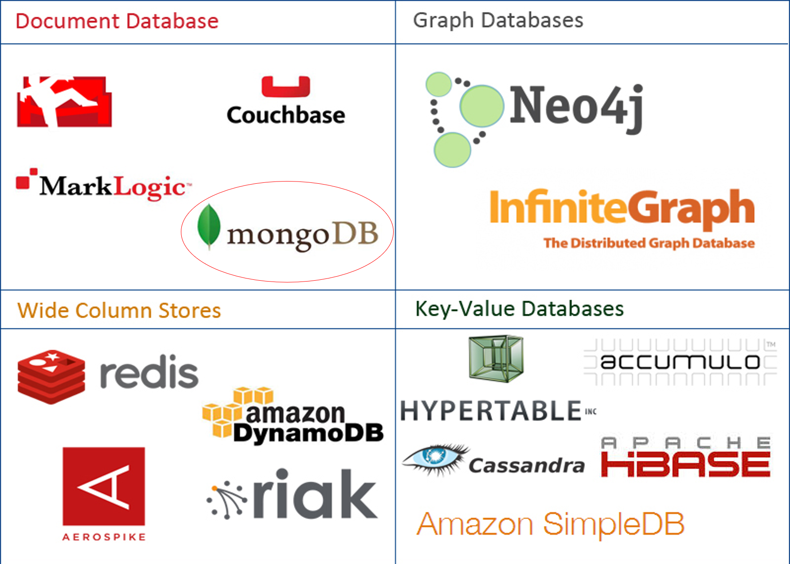

## 1.3. Überblick


- **MongoDB** ist eine Open-Source-Dokumentdatenbank und führende NoSQL-Datenbank.
- **MongoDB** ist in C++ geschrieben.
- **MongoDB** ist eine plattformübergreifende, **dokumentenorientierte** Datenbank, die hohe Leistung, hohe Verfügbarkeit und einfache Skalierbarkeit bietet.
- Der **schemalose** Ansatz der **dokumentenorientierten** Datenbanken macht die Entwicklung flexibler.
- MongoDB ist eine Dokumentendatenbank, die eine Sammlung verschiedener **JSON-ähnlichen Dokumente** enthält. Anzahl der Felder, Inhalt und Grösse des Dokuments kann von Dokument zu Dokument unterschiedlich sein.
- Anwendungsdaten lassen sich auf natürlichere Weise modellieren, da die Daten in komplexen Hierarchien verschachtelt werden, dabei aber immer abfragbar und indizierbar bleiben.
- Es braucht bei Abfragen **keine komplexe Join Operationen**.
- Konvertierung / Mapping von Anwendungsobjekten zu Datenbankobjekten wird nicht benötigt.

>**Tabellen haben ausgedient - Dokumente als Datensätze**

## 1.4. Grundlagen

### 1.4.1. Datenmodel (JSON)

- MongoDB speichert Daten in Form von JSON-Dokumenten.
- Diese werden in **Sammlungen (Collections)** organisiert, die wiederum Teil einer Datenbank sind.

Was ist ein JSON Dokument?

- JavaScript Object Notation
- Ein JSON-Dokument entspricht einem Datenbankeintrag

```json
{
  "name": "Max Mustermann",
  "email": "max@example.com",
  "stadt": "Berlin",
  "alter": 29
}
```

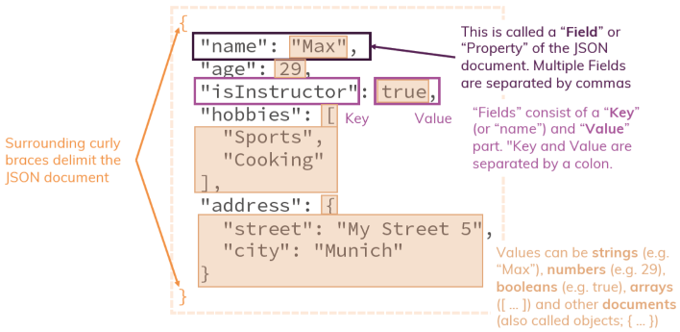

### 1.4.2. Collections

- Dokumente werden innerhalb von **Collections** gespeichert.
- **Collections** sind Gruppen von irgendwie zusammenhängenden Dokumenten, die jedoch nicht dieselbe Struktur haben müssen.
- Entwickler müssen das Schema der Datenbank nicht im Voraus kennen, sondern können es während der Entwicklung dynamisch ändern.
- 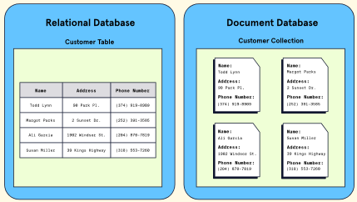
- 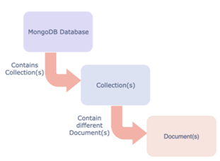

Eine Collection beinhaltet Dokumente

- 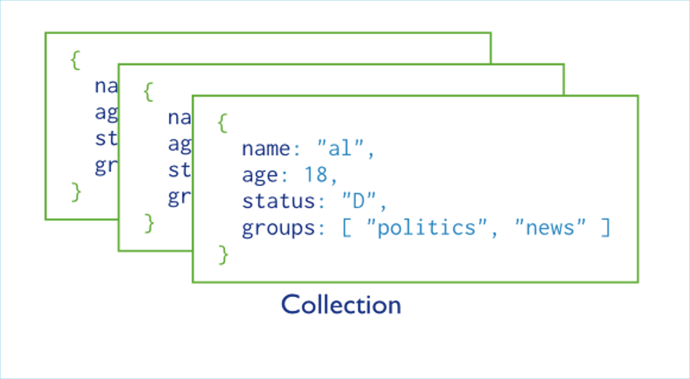

Beispiel:

- 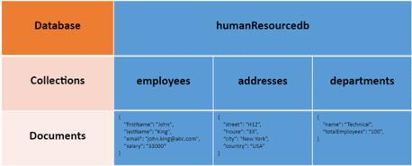

### 1.4.3. Struktur eines JSON-Dokuments

- Das MongoDB-Dokument speichert Daten im **JSON-Format**.
- "firstName", "lastName", "email" und "salary" sind die **Felder**.
- **_id** ist das **Primärschlüsselfeld** mit eindeutiger ObjectId.
- **skills** ist ein Array und address enthält ein weiteres JSON-Dokument.

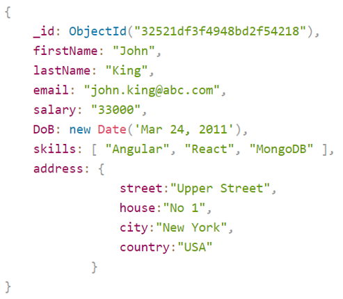

Vergleich Tabellen vs. Dokumente

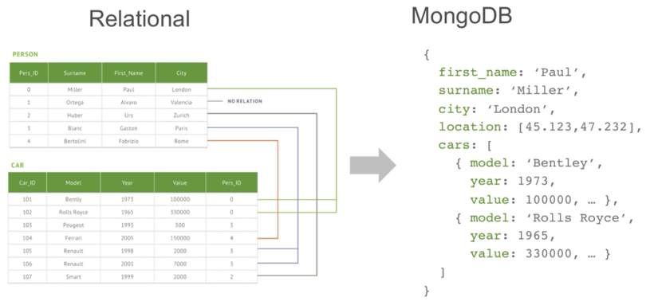

Typisierte Dokumente u. Datenstrukturen

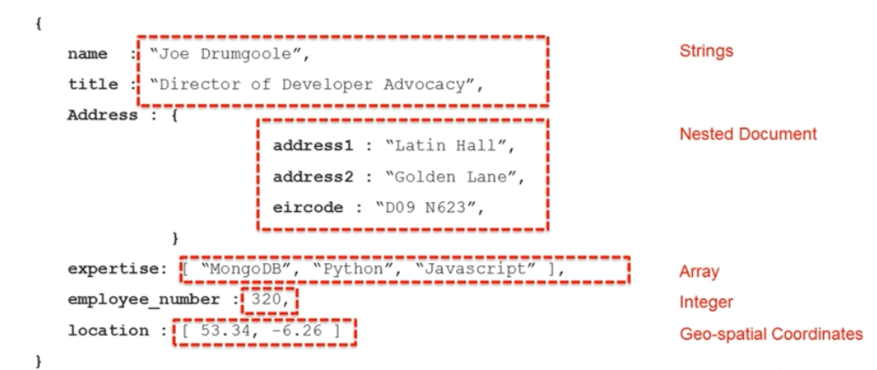

Dokumente enthalten verschiedene Datenstrukturen

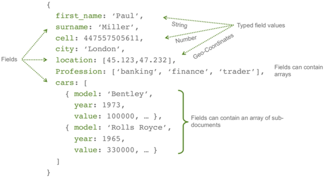

## 1.5. ObjectId

Die **ObjectId** in MongoDB ist ein einzigartiger, 12-Byte grosser Identifikator, der standardmässig von MongoDB für die Felder **_id** erzeugt wird, wenn kein eigener Wert bereitgestellt wird.
Sie dient dazu, Dokumente eindeutig zu identifizieren.
Die **ObjectId** ist ein zentraler Bestandteil von MongoDB, der sicherstellt, dass jedes Dokument **eindeutig identifizierbar** ist.
Ihre integrierte Zeitstempel- und Maschinenkennung macht sie sowohl effizient als auch praktisch für viele Anwendungsfälle.

### 1.5.1. Aufbau der ObjectId

Eine **ObjectId** besteht aus 12 Bytes, die in folgende Abschnitte unterteilt sind:

- 4 Bytes: Unix-Timestamp (Sekunden seit dem 1. Januar 1970).
- 5 Bytes: Maschinenkennung (Host-spezifische Informationen, wie z. B. die MAC-Adresse).
- 3 Bytes: Prozess-ID des MongoDB-Clients.
- 3 Bytes: Inkrementeller Zähler, der bei jedem neuen ObjectId-Aufruf hochgezählt wird.

```javascript
ObjectId("64af2b5c8f3a4d5e5c9d8e01")
```

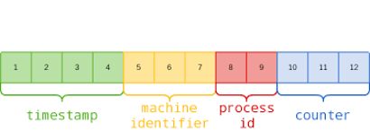

### 1.5.2. Eigenschaften der ObjectId

- Eindeutigkeit
  - Jede **ObjectId** ist weltweit eindeutig.
- Zeitstempel
  - Der Zeitstempel in den ersten 4 Bytes erlaubt es, den Erstellungszeitpunkt eines Dokuments zu ermitteln.
- Automatische Erstellung
  - Wenn kein **_id**-Wert angegeben wird, erstellt MongoDB automatisch eine ObjectId.

## 1.6. _id Feld

- Jedes in einer Collection gespeicherte Dokument benötigt ein eindeutiges **_id**-Feld, das als Primärschlüssel dient.
- Das _id Feld wird automatisch indiziert. Suchanfragen mit der Angabe {`_id: <someval>`} beziehen sich auf den **_id**-Index .
- Für _id kann auch einen anderen Datentyp als ObjectID verwenden werden.

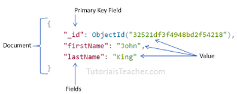

## 1.7. Vergleich RDBMS u. MongoDB Schema Design

Daten werden nicht streng durch Beziehungen dargestellt.
Insgesamt sind nicht relationale Datenbanken darauf spezialisiert, unstrukturierte Daten zu speichern, die nicht sauber in Zeilen und Spalten passen.

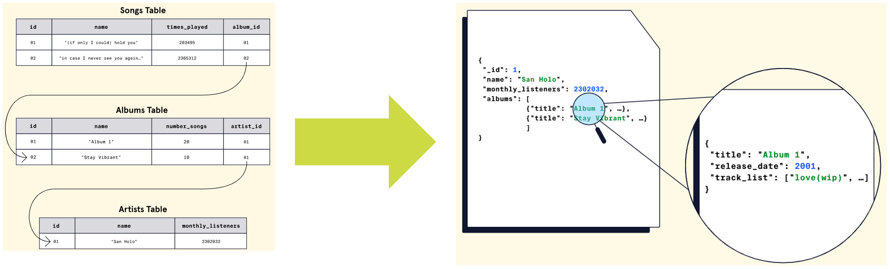

## 1.8. Datenmodell

### 1.8.1. Embedding

Bei der **Einbettung** werden verwandte Daten direkt in einem Dokument gespeichert. Dies eignet sich für Szenarien, in denen Daten häufig zusammen gelesen werden und eine starke Beziehung zwischen den Daten besteht.

```json
{
  "titel": "Einführung in MongoDB",
  "autor": "Max Mustermann",
  "inhalt": "MongoDB ist eine NoSQL-Datenbank...",
  "kommentare": [
    {
      "name": "Lisa",
      "text": "Sehr hilfreich!",
      "datum": "2024-12-25"
    },
    {
      "name": "Tom",
      "text": "Danke für die Erklärung!",
      "datum": "2024-12-26"
    }
  ]
}
```

### 1.8.2. Referencing

Beim **Referencing** werden Daten in separaten Dokumenten gespeichert und durch **Referenzen** verknüpft. Dies eignet sich für Szenarien, in denen Daten modular und wiederverwendbar sein sollen.

```json
{
  "_id": "post123",
  "titel": "Einführung in MongoDB",
  "autor": "Max Mustermann",
  "inhalt": "MongoDB ist eine NoSQL-Datenbank...",
  "kommentare": ["kommentar1", "kommentar2"]
}

{
  "_id": "kommentar1",
  "postId": "post123",
  "name": "Lisa",
  "text": "Sehr hilfreich!",
  "datum": "2024-12-25"
}

{
  "_id": "kommentar2",
  "postId": "post123",
  "name": "Tom",
  "text": "Danke für die Erklärung!",
  "datum": "2024-12-26"
}
```

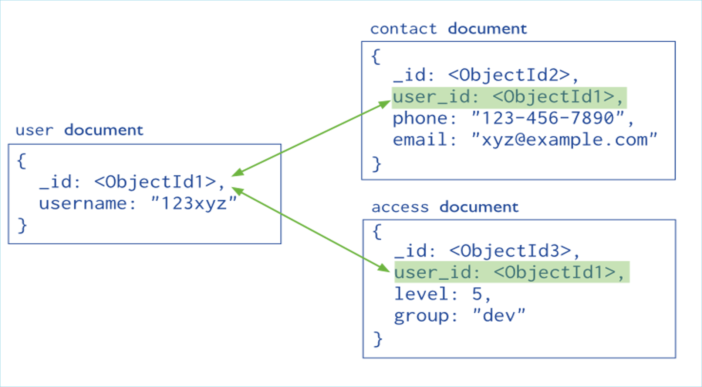

## 1.9. BSON

- BSON steht für „**Binary JSON**“
- Die binäre Struktur von **BSON** codiert Typ- und Längeninformationen, wodurch sie im Vergleich zu JSON viel **schneller** durchlaufen werden können.
- **BSON** fügt einige **nicht-JSON-native Datentypen** hinzu, wie Datums- und Binärdaten
- MongoDB speichert Daten sowohl intern als auch über das Netzwerk im **BSON-Format**

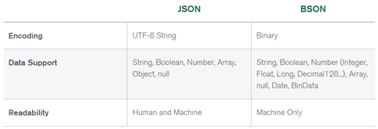

## 1.10. Gesamtübersicht

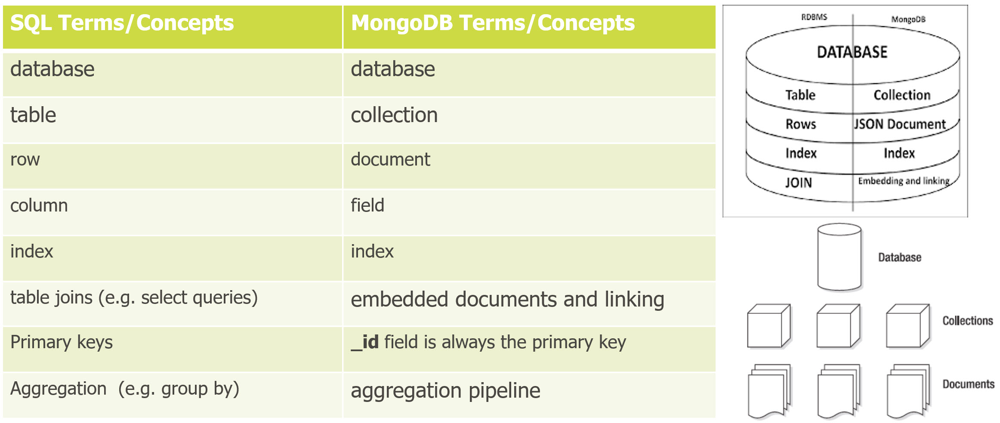

# 2. Aufgaben

## 2.1. MongoDB Shell Einführung

| **Vorgabe**             | **Beschreibung**                                                      |
| :---------------------- | :-------------------------------------------------------------------- |
| **Lernziele**           | Kennt einfache Basiselemente einer MongoDB Datenbank                  |
|                         | Kennt die Möglichkeiten **Datenbanken** und **Collections** anzulegen |
|                         | Kennt die einfache Abfragebefehle                                     |
| **Sozialform**          | Einzelarbeit                                                          |
| **Auftrag**             | siehe unten                                                           |
| **Hilfsmittel**         | [Internet](https://www.mongodb.com/docs/manual/crud/)                 |
| **Erwartete Resultate** |                                                                       |
| **Zeitbedarf**          | 30 min                                                                |
| **Lösungselemente**     | Markdown Dokument                                                     |

MongoDB stellt für die **CRUD-Befehle** entsprechende **Methoden** (Operations) zur Verfügung.
Arbeite im nachfolgenden Tutorial [Run Commands](https://www.mongodb.com/docs/mongodb-shell/run-commands/) die folgenden Kapitel durch:

- **Run Commands**
- **Perform CRUD Operations**

Fasse die **Run-Commands** und die **CRUD-Befehle** in einem Markdown Dokument zusammen.

---

## 2.2. Get Started with Atlas

| **Vorgabe**             | **Beschreibung**                                            |
| :---------------------- | :---------------------------------------------------------- |
| **Lernziele**           | Können einen Atlas-Cluster Zugang einrichten                |
|                         | Können den Zugriff zum Cluster von lokalen Tools einrichten |
|                         | Können in der MongoDB Shell Befehle ausführen               |
| **Sozialform**          | Einzelarbeit                                                |
| **Auftrag**             | siehe unten                                                 |
| **Hilfsmittel**         | Internet                                                    |
| **Erwartete Resultate** |                                                             |
| **Zeitbedarf**          | 40 min                                                      |
| **Lösungselemente**     | Atlas Account eingerichtet, Verbindungszeichenfolge         |

**MongoDB Atlas** bietet eine einfache Möglichkeit, Ihre Daten in der Cloud zu hosten und zu verwalten.

**Aufgabe 1:**

- Der nachfolgenden Link führt zu einem Tutorial [Get Stared with Atlas](https://www.mongodb.com/docs/atlas/getting-started).
- In diesem Tutorial kann ein **Atlas-Clusters** (free) erstellt und mit insgesamt 7 Schritten eingerichtet werden.
- Arbeite dieses Tutorial komplett bis zum Schritt 7 durch und stelle sicher, dass deine Zugangsdaten nicht verloren bzw. vergessen gehen.

Links

- <https://www.mongodb.com/docs/guides/>

**Aufgabe 2:**

- Ermittle die Verbindungsinformation zum Cluster und versuche von der Shell (`mongosh`) und Compass Anwendung eine Verbindung zum Cluster einzurichten.

---

© 2026 Lukas Müller – Licensed under CC BY-NC-ND 4.0
See [LICENSE](lincense.md) file for details.
