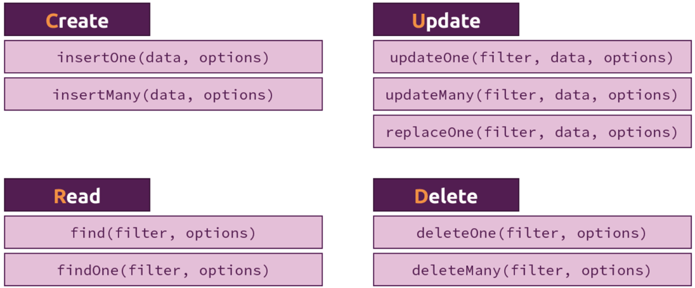
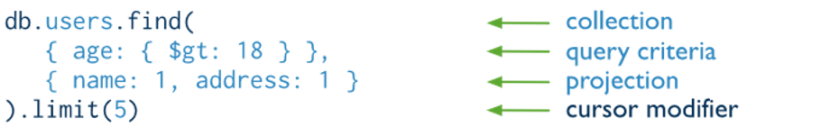

|                             |                               |                                 |
| --------------------------- | ----------------------------- | ------------------------------- |
| **Techniker HF Informatik** | **Kurs Scripting / Big data** |  |

- [1. MongoDB Shell (mongosh)](#1-mongodb-shell-mongosh)
  - [1.1. Einleitung](#11-einleitung)
  - [1.2. Wichtige Befehle der MongoDB-Shell](#12-wichtige-befehle-der-mongodb-shell)
- [2. CRUD-Operationen](#2-crud-operationen)
  - [2.1. Dokument suchen - find(), findOne()](#21-dokument-suchen---find-findone)
  - [2.2. Dokument einfügen - insertOne()](#22-dokument-einfügen---insertone)
  - [2.3. Mehrere Dokument einfügen - insertMany()](#23-mehrere-dokument-einfügen---insertmany)
  - [2.4. Daten ersetzen - replaceOne()](#24-daten-ersetzen---replaceone)
  - [2.5. Daten ersetzen updateOne()](#25-daten-ersetzen-updateone)
  - [2.6. Daten aktualisieren updateMany()](#26-daten-aktualisieren-updatemany)
  - [2.7. Dokumente löschen - deleteOne, deleteMany](#27-dokumente-löschen---deleteone-deletemany)
  - [2.8. CRUD-Operationen](#28-crud-operationen)
  - [2.9. Cursor Methoden - sort(), limit(), skip()](#29-cursor-methoden---sort-limit-skip)
- [3. Aufgaben](#3-aufgaben)
  - [3.1. Gruppenarbeit CRUD-Operationen](#31-gruppenarbeit-crud-operationen)
  - [3.2. Erste Schritte mit MongoDB (Uni)](#32-erste-schritte-mit-mongodb-uni)

---

</br>

# 1. MongoDB Shell (mongosh)

## 1.1. Einleitung

- Die MongoDB-Shell (`mongo oder mongosh`) ist eine interaktive JavaScript-Umgebung, die als Schnittstelle zur MongoDB-Datenbank dient.
- Mit ihr können Entwickler Datenbanken verwalten, Daten abfragen und manipulieren, Skripte ausführen und administrative Aufgaben erledigen.
- Die Shell wird häufig für Entwicklungs- und Testzwecke verwendet.

## 1.2. Wichtige Befehle der MongoDB-Shell

```javascript
// Verbindung herstellen
mongosh

// Verbindet die Shell mit einer MongoDB-Instanz (Standard-Port: 27017).
mongosh "mongodb://localhost:27017"

// Datenbank wechseln:
use <datenbankname>
use testDB

// Aktuelle Datenbank anzeigen:
db

// Alle Datenbanken anzeigen:
show dbs

// Alle Sammlungen (Collections) anzeigen:
show collections

// Sammlung erstellen
db.createCollection("<sammlungsname>")

// Sammlung löschen:
db.<sammlungsname>.drop()

// Komplette Datenbank löschen
db.dropDatabase()
```

# 2. CRUD-Operationen

[MongoDB CheatSheet](./Light.pdf)



## 2.1. Dokument suchen - find(), findOne()

Der Befehl `find()` wird verwendet, um Dokumente aus einer Sammlung (Collection) abzufragen. Mit `find()` kannst du bestimmte Filterbedingungen anwenden und steuern, welche Felder zurückgegeben werden sollen.

`find()` wird verwendet, um mehrere Dokumente aus einer Sammlung abzurufen, die die angegebenen Filterbedingungen erfüllen.
`findOne()` wird verwendet, um ein einzelnes Dokument aus einer Sammlung abzurufen, das die angegebenen Filterbedingungen erfüllt. Sobald das erste passende Dokument gefunden wird, stoppt die Suche.



```javascript
findOne() liefert nur das erste Dokument, kein Array.
db.collection.findOne(query, projection, options)

db.inventory.find( { status: "D" } )
db.inventory.find( { status: { $in: [ "A", "D" ] } } )
db.inventory.find( { status: "A", qty: { $lt: 30 } } )

db.inventory.find( { $or: [ { status: "A" }, { qty: { $lt: 30 } } ] } )
db.inventory.find( {
     status: "A",
     $or: [ { qty: { $lt: 30 } }, { item: /^p/ } ]
})

// Suche nach Gleichheit. ($eq)
db.users.find({ name: { $eq: "john" }})

// Suche nach ungleich. ($ne)
db.users.find({ name: { $ne: "john" }})

// Prüfung auf grösser als ($gt) und grösser oder gleich ($gte)
db.users.find({ salary: { $gt: 20000}})
db.users.find({ salary: { $gte: 20000}})

// Prüfung auf kleiner ($lt) und kleiner gleich ($lte)
db.users.find({ salary: { $lt: 20000}})
db.users.find({ age: { $lte: 10000}})

// Prüfen ob Wert in Werteliste enthalten ist ($in)
db.users.find({ name: { $in: ["John", "Doe"]}})

// Prüfung ob Wert nicht in Werteliste enthalten ist ($nin)
db.users.find({ name: { $nin: ["John", "Doe"]}})

// Prüfung, ob mehrere Bedingungen zu treffen ($and)
db.users.find({ $and: [{ salary: 200000}, { name: "John" }]})

// Prüfung ob eine der Bedingungen zutrifft ($or)
db.users.find({ $or: [{ salary: 20000}, { name: "John"}]})

// Invertiert die Suchbedingung ($not)
db.users.find({ name: { $not: { $eq: "John" }}})

// Prüft ob ein Datenfeld enthalten ist($exists)
db.users.find({ name: { $exists: true }})
```

## 2.2. Dokument einfügen - insertOne()

```javascript
// Ein einzelnes Dokument einfügen
db.collection.insertOne(<document>)

// Insert a Single Document
db.products.insertOne( { _id: 10, item: "box", qty: 20 } );

db.inventory.insertOne(
   { item: "canvas", qty: 100, tags: ["cotton"], size: { h: 28, w: 35.5, uom: "cm" } }
);

// Ohne _id Schlüsselwert (auto-generated)
db.employees.insertOne({
  firstname: "John",
  lastname: "King",
  email: "john.king@abc.com"
})

// Mit _id Schlüsselwert (auto-generated)
db.employees.insertOne({
  _id:"1",
  firstname: "John",
  lastname: "King",
  email: "john.king@abc.com"
})
```

## 2.3. Mehrere Dokument einfügen - insertMany()

```javascript
// Syntax
db.collection.insertMany([ <document 1> , <document 2>, ... ])

// Beispiel
db.products.insertMany( [
      { item: "card", qty: 15 },
      { item: "envelope", qty: 20 },
      { item: "stamps" , qty: 30 }
   ] );
   
db.inventory.insertMany([
   { item: "journal", qty: 25, tags: ["blank", "red"], size: { h: 14, w: 21, uom: "cm" } },
   { item: "mat", qty: 85, tags: ["gray"], size: { h: 27.9, w: 35.5, uom: "cm" } },
   { item: "mousepad", qty: 25, tags: ["gel", "blue"], size: { h: 19, w: 22.85, uom: "cm" } }
])
```

## 2.4. Daten ersetzen - replaceOne()

Der Befehl `replaceOne()` wird verwendet, um ein Dokument in einer Sammlung **vollständig** durch ein neues Dokument zu ersetzen. Anders als `updateOne()` überschreibt `replaceOne()` das gesamte Dokument und nicht nur bestimmte Felder.

```javascript
// Syntax
db.courses.replaceOne()

// Beispiel
db.kunden.replaceOne(
  { "name": "Max Mustermann" },  // Filter: Ziel-Dokument finden
  {                             // Neues Dokument
    "name": "Max Mustermann",
    "stadt": "München"
  }
);
```

## 2.5. Daten ersetzen updateOne()

Der Befehl updateOne() wird verwendet, um das erste Dokument in einer Sammlung zu aktualisieren, das den angegebenen Filterkriterien entspricht.

Der Befehl `updateOne()` ist nützlich, um gezielt ein einzelnes Dokument zu aktualisieren. Die Kombination aus Filterkriterien und Update-Operatoren wie `$set, $inc, $rename` usw. bietet Flexibilität für unterschiedliche Anwendungsfälle.

```javascript
// Syntax
db.courses.updateOne({filter}, {$set: {}})

db.kunden.updateOne(
  { "name": "Max Mustermann" }, // Filter: Das zu aktualisierende Dokument
  { $set: { "alter": 31 } }     // Update: Das Feld "alter" wird geändert
);

// Option upsert: Wenn kein passendes Dokument gefunden wird, kann mit upsert: true ein neues Dokument eingefügt werden.
db.kunden.updateOne(
  { "name": "Lisa Müller" },
  { $set: { "stadt": "Hamburg", "alter": 29 } },
  { upsert: true }
);
```

## 2.6. Daten aktualisieren updateMany()

Der Befehl updateMany() wird verwendet, um mehrere Dokumente in einer Sammlung zu aktualisieren, die einem bestimmten Filterkriterium entsprechen.

```javascript
db.courses.updateMany({}, {})

// Wir möchten das Gehalt der Mitarbeiter in der Abteilung "Verkauf" um 10% erhöhen.
db.mitarbeiter.updateMany(
  { "abteilung": "Verkauf" }, // Filter: Nur Dokumente mit "abteilung": "Verkauf"
  { $mul: { "gehalt": 1.1 } } // Update: Multipliziere das Gehalt mit 1.1
);

// Es ist möglich, mehrere Felder gleichzeitig zu aktualisieren, z. B.:
db.mitarbeiter.updateMany(
  { "abteilung": "Verkauf" },
  { 
    $mul: { "gehalt": 1.1 },
    $set: { "bonus": true } // Fügt ein neues Feld hinzu oder aktualisiert es
  }
);
```

## 2.7. Dokumente löschen - deleteOne, deleteMany

Der Befehl `deleteOne()` wird verwendet, um das erste Dokument zu löschen, das den angegebenen Filterkriterien entspricht.
Praktische Anwendung: deleteOne() ist nützlich, wenn sichergestellt werden soll, dass nur ein einzelnes Dokument entfernt wird, auch wenn mehrere die Kriterien erfüllen.

Der Befehl `deleteMany()` verwendet wird, um gezielt mehrere Dokumente basierend auf einem Kriterium zu entfernen.

```javascript
db.kunden.deleteOne({ "name": "Max Mustermann" });

db.kunden.deleteMany({ "stadt": "Berlin" });
```

## 2.8. CRUD-Operationen

```javascript
// Einfügen eines Dokuments:
db.<sammlungsname>.insertOne({ "name": "Max", "alter": 30 })

// Mehrere Dokumente einfügen:
db.<sammlungsname>.insertMany([
  { "name": "Anna", "alter": 25 },
  { "name": "Tom", "alter": 35 }
])

// Abfragen von Dokumenten (alle):
db.<sammlungsname>.find()

// Abfragen von Dokumenten (mit filter):
db.<sammlungsname>.find({ "name": "Max" })

// Nur bestimmte Felder anzeigen:
db.<sammlungsname>.find({}, { "name": 1, "_id": 0 })

// Aktualisieren eines Dokuments:
db.<sammlungsname>.updateOne(
  { "name": "Max" },
  { $set: { "alter": 31 } }
)

// Löschen eines Dokuments (Ein einzelnes Dokument):
db.<sammlungsname>.deleteOne({ "name": "Max" })

// Löschen (alle passenden Dokumente):
db.<sammlungsname>.deleteMany({ "alter": { $lt: 30 } })
```

## 2.9. Cursor Methoden - sort(), limit(), skip()

```javascript
// Sortierung der Daten - sort()
{name:1}    // in alphabetischer Reihenfolge sortieren
{age:-1}    // es wird in umgekehrter Reihenfolge sortiert
db.users.find().sort({ name: 1, age: -1})

// Limitierung der Anzahl Dokumente- limit()
db.users.find().limit(10)

// Dokumente überlesen, Pagination skip()
db.users.find().skip(5)
```

---

</br>

# 3. Aufgaben

## 3.1. Gruppenarbeit CRUD-Operationen

| **Vorgabe**             | **Beschreibung**                                              |
| :---------------------- | :------------------------------------------------------------ |
| **Lernziele**           | Kennt einfache Basiselemente einer MongoDB Datenbank          |
|                         | Kennt die Möglichkeiten Datenbanken und Collections anzulegen |
|                         | Kennt die einfache Abfragebefehle                             |
| **Sozialform**          | Einzelarbeit                                                  |
| **Auftrag**             | siehe unten                                                   |
| **Hilfsmittel**         | [Internet](https://www.mongodb.com/docs/manual/crud/)         |
| **Erwartete Resultate** |                                                               |
| **Zeitbedarf**          | 40 min                                                        |
| **Lösungselmente**      | Markdown Dokument                                             |

MongoDB stellt für die CURD-Befehle entsprechende Methoden (Operations) zur Verfügung.
Recherchiere die der Gruppe zugeteilten Methoden und erstelle eine kurze Befehlsreferenz mit geeigneten Anwendungsbeispielen in einem Markdown Dokument.

**Gruppe 1 - Insert Documents:**

- insertOne()
- insertMany()

**Gruppe 2 - Query Documents:**

- find()
- findOne()
- AND und OR Conditions

**Gruppe 3 - Update Documents:**

- updateOne()
- updateMany()
- replaceOne()

**Gruppe 4 - Delete Documents:**

- deleteOne()
- deleteMany()

## 3.2. Erste Schritte mit MongoDB (Uni)

| **Vorgabe**             | **Beschreibung**                                              |
| :---------------------- | :------------------------------------------------------------ |
| **Lernziele**           | Kennt einfache Basiselemente einer MongoDB Datenbank          |
|                         | Kennt die Möglichkeiten Datenbanken und Collections anzulegen |
|                         | Kennt die einfache Abfragebefehle                             |
| **Sozialform**          | Einzelarbeit                                                  |
| **Auftrag**             | siehe unten                                                   |
| **Hilfsmittel**         | [Internet](https://www.mongodb.com/docs/manual/crud/)         |
| **Erwartete Resultate** |                                                               |
| **Zeitbedarf**          | 40 min                                                        |
| **Lösungselmente**      | MongoDB Shell Befehle                                         |

1. Für eine Uni-Vergleichs-Webseite möchten wir alle **Universitäten** in der Schweiz erfassen
2. Erstelle hierfür zuerst eine neue **Datenbank** (`uni`).
3. Lege dazu eine **Collection** (`universities`) an, und speichere dort (erstmal) 3-5 Universitäten mit Name (`name`) und Stadt (`city`)
4. Wie geben wir eine Liste aller Universitäten aus?
5. Wie greifst du auf eine einzelne Uni zu (per `ID`)?
6. Wie können wir uns alle Universitäten aus einer bestimmten Stadt ausgeben lassen?
7. Wie können wir eine Universität nachträglich umbenennen?
