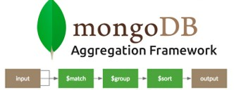
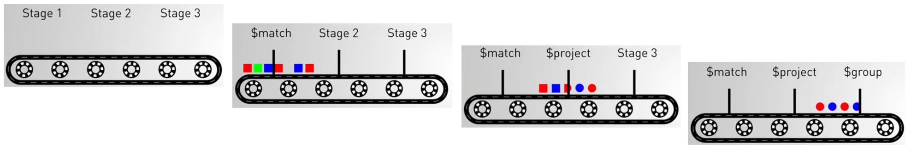
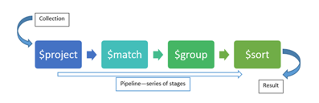
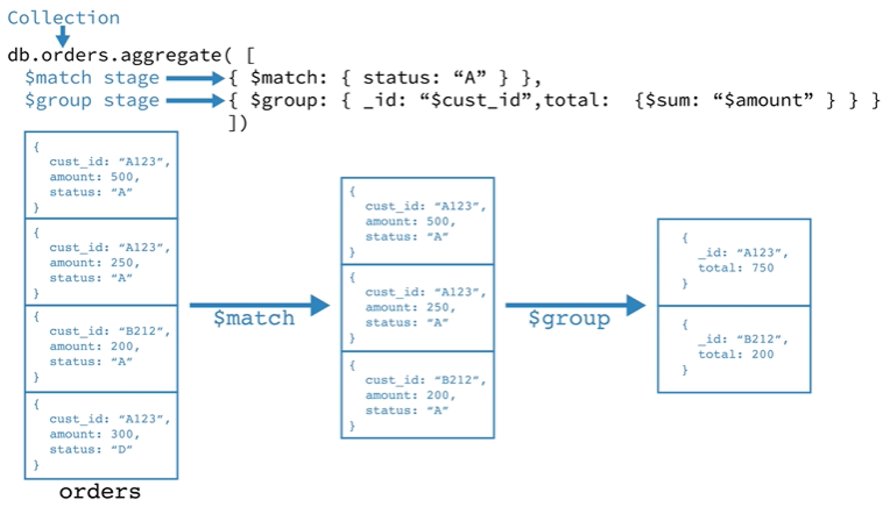
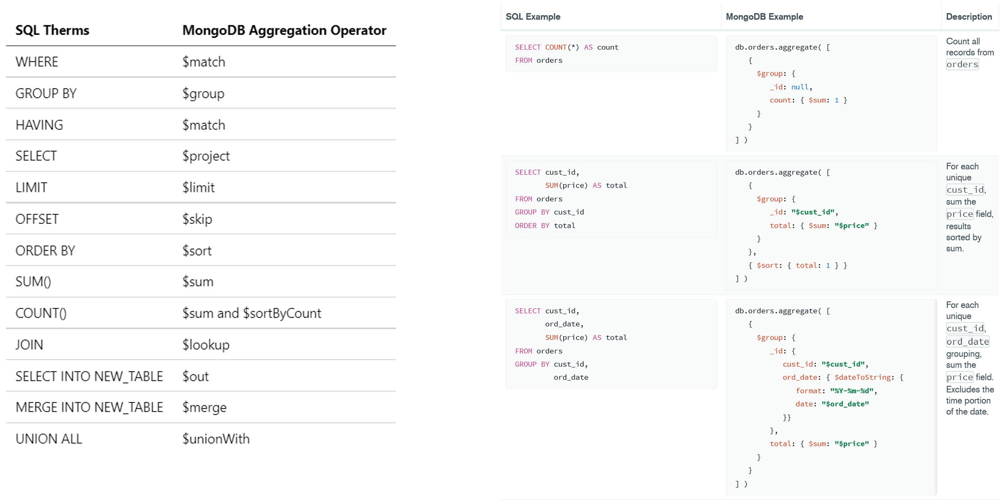
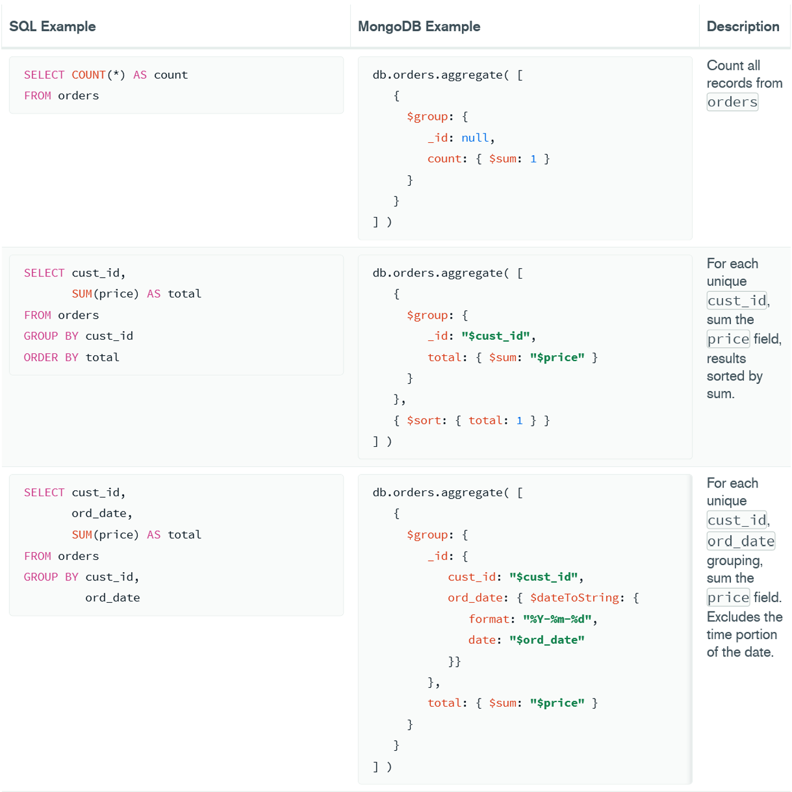
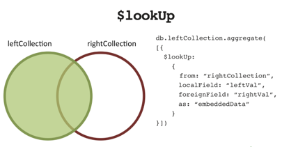

|                             |                          |                                 |
| --------------------------- | ------------------------ | ------------------------------- |
| **Techniker HF Informatik** | **Scripting / Big data** |  |

- [1. MongoDB Query](#1-mongodb-query)
  - [1.1. Dokumente suchen (Vergleichsoperatoren)](#11-dokumente-suchen-vergleichsoperatoren)
  - [1.2. Zusammenfassung](#12-zusammenfassung)
- [2. MongoDB Aggregation Framework](#2-mongodb-aggregation-framework)
  - [2.1. Einleitung](#21-einleitung)
  - [2.2. Was ist die Aggregations-Pipeline?](#22-was-ist-die-aggregations-pipeline)
  - [2.3. Wichtige Stages des Aggregation Frameworks](#23-wichtige-stages-des-aggregation-frameworks)
  - [2.4. Beispiele mit Aggragtion Framework](#24-beispiele-mit-aggragtion-framework)
  - [2.5. Aggregation - Terminologie](#25-aggregation---terminologie)
  - [2.6. $lookup - Aggregation Framework](#26-lookup---aggregation-framework)
  - [2.7. Vorteile](#27-vorteile)
- [3. Aufgaben](#3-aufgaben)
  - [3.1. Erste Schritte mit MongoDB (school)](#31-erste-schritte-mit-mongodb-school)
  - [3.2. MongoDB Vergleichsoperatoren](#32-mongodb-vergleichsoperatoren)
  - [3.3. MongoDB Update Operatoren](#33-mongodb-update-operatoren)
  - [3.4. Daten abfragen SpaceX](#34-daten-abfragen-spacex)
  - [3.5. Daten abfragen (Restaurants)](#35-daten-abfragen-restaurants)
  - [3.6. Aggregation Framework (zipcodes)](#36-aggregation-framework-zipcodes)
  - [3.7. Aggregation Framework ($projection)](#37-aggregation-framework-projection)
  - [3.8. Aggregation Framework ($group)](#38-aggregation-framework-group)

---

</br>

# 1. MongoDB Query

## 1.1. Dokumente suchen (Vergleichsoperatoren)

Die Vergleichsoperatoren in MongoDB bieten eine hohe Flexibilität bei der Abfrage von Daten. Sie ermöglichen es, sowohl einfache als auch komplexe Filterbedingungen zu definieren, um genau die Daten zu extrahieren, die man benötigt.

```javascript
// Suche nach Gleichheit. ($eq)
db.users.find({ name: { $eq: "john" }})

// Suche nach ungleich. ($ne)
db.users.find({ name: { $ne: "john" }})

// Prüfung auf grösser als ($gt) und grösser oder gleich ($gte)
db.users.find({ salary: { $gt: 20000}})
db.users.find({ salary: { $gte: 20000}})

// Prüfung auf kleiner ($lt) und kleiner gleich ($lte)
db.users.find({ salary: { $lt: 20000}})
db.users.find({ age: { $lte: 10000}})

// Prüfen ob Wert in Werteliste enthalten ist ($in)
db.users.find({ name: { $in: ["John", "Doe"]}})

// Prüfung ob Wert nicht in Werteliste enthalten ist ($nin)
db.users.find({ name: { $nin: ["John", "Doe"]}})

// Prüfung, ob mehrere Bedingungen zu treffen ($and)
db.users.find({ $and: [{ salary: 200000}, { name: "John" }]})

// Prüfung ob eine der Bedingungen zutrifft ($or)
db.users.find({ $or: [{ salary: 20000}, { name: "John"}]})

// Invertiert die Suchbedingung ($not)
db.users.find({ name: { $not: { $eq: "John" }}})

// Prüft ob ein Datenfeld enthalten ist($exists)
db.users.find({ name: { $exists: true }})
```

## 1.2. Zusammenfassung

| Operator    | Beschreibung                        | Beispiel                                       |
| ----------- | ----------------------------------- | ---------------------------------------------- |
| **$eq**     | Gleichheit                          | `{ "alter": { $eq: 30 } }`                     |
| **$ne**     | Ungleichheit                        | `{ "stadt": { $ne: "Berlin" } }`               |
| **$gt**     | Grösser als                         | `{ "alter": { $gt: 30 } }`                     |
| **$gte**    | Grösser oder gleich                 | `{ "alter": { $gte: 30 } }`                    |
| **$lt**     | Kleiner als                         | `{ "alter": { $lt: 30 } }`                     |
| **$lte**    | Kleiner oder gleich                 | `{ "alter": { $lte: 30 } }`                    |
| **$in**     | In einer Liste von Werten           | `{ "stadt": { $in: ["Berlin", "Hamburg"] } }`  |
| **$nin**    | Nicht in einer Liste von Werten     | `{ "stadt": { $nin: ["Berlin", "Hamburg"] } }` |
| **$exists** | Überprüft, ob ein Feld existiert    | `{ "email": { $exists: true } }`               |
| **$type**   | Überprüft den Datentyp eines Feldes | `{ "alter": { $type: "int" } }`                |

---

</br>

# 2. MongoDB Aggregation Framework

## 2.1. Einleitung

Das Aggregation Framework in MongoDB ist ein leistungsstarkes Werkzeug zur Verarbeitung und Transformation von Daten innerhalb einer Sammlung (Collection). Es ermöglicht die Durchführung komplexer Operationen wie Filtern, Gruppieren, Sortieren und Berechnen, indem eine **Aggregations-Pipeline** verwendet wird.

- Das Aggregation Framework ist ein Key-Feature in MongoDB.
- In einem Prozess können komplexe Verarbeitungen umgesetzt werden.
- Leistungsstarke Filterung (Expressive filtering)
- Umfangreiche Datentransformation (Powerfull data transformation)
- Statistische Hilfsprogramme und Datenanalyse (Statistical utilities & data analysis)



- Eine Pipeline kann aus ein oder mehrere Stages gebildet werden (Flow).
- Die Dokumente werden durch die Pipeline über alle Stages transportiert (Transformation).
  - `$match` => Dokumente filtern
  - `$project` => Daten selektieren
  - `$group` => Daten gruppieren



## 2.2. Was ist die Aggregations-Pipeline?

Die Aggregations-Pipeline ist eine Sequenz von Stufen (Stages), die nacheinander ausgeführt werden. Jede Stufe führt eine spezifische Operation auf den Daten aus und gibt das Ergebnis an die nächste Stufe weiter.

Eine Aggregationspipeline kann Ergebnisse für Gruppen von Dokumenten zurückgeben. – z.B. Gesamt-, Durchschnitts-, Höchst- und Mindestwerte.



```javascript
db.kunden.aggregate([
  { $match: { "stadt": "Berlin" } },     // Filtert Kunden aus Berlin
  { $group: { _id: "$stadt", count: { $sum: 1 } } } // Zählt Kunden pro Stadt
]);
```

## 2.3. Wichtige Stages des Aggregation Frameworks

- `$match`
  - Filtert Dokumente basierend auf Kriterien (ähnlich wie find()).
- `$group`
  - Gruppiert Dokumente und führt Berechnungen durch.
- `$project`
  - Formatiert das Ergebnis und wählt spezifische Felder aus.
- `$sort`
  - Sortiert Dokumente.
- `$limit` und `$skip`
  - Begrenzen und überspringen von Dokumenten.
- `$unwind`
  - Entpackt Array-Felder, sodass jedes Element im Array ein eigenes Dokument wird.
- `$lookup`
  - Führt einen Join mit einer anderen Sammlung durch.

## 2.4. Beispiele mit Aggragtion Framework

```javascript
db.kunden.aggregate([
  { $match: { alter: { $gt: 30 } } },  // Filtert Kunden älter als 30
  { $group: { _id: "$stadt", durchschnittsalter: { $avg: "$alter" } } }, // Gruppiert nach Stadt
  { $sort: { durchschnittsalter: -1 } } // Sortiert absteigend nach Durchschnittsalter
]);
```

Das folgende Beispiel einer Aggregationspipeline enthält zwei Phasen und gibt die Gesamtbestellmenge von Pizzen mittlerer Grösse gruppiert nach Pizzanamen zurück:

```javascript
db.orders.aggregate([
  { $match: { size: "medium"} },  // State 1: Filter pizza order documents by pizza size
  { $group: { _id: "$name", totalQunatity: { $sum: "$quantity" } } }, // State 2: Group by remaining documents by pizza name and calculate total quantity
]);
```



## 2.5. Aggregation - Terminologie




## 2.6. $lookup - Aggregation Framework

Der `$lookup`-Operator in MongoDB wird im Aggregation Framework verwendet, um Daten aus einer anderen Sammlung (Collection) zu verbinden, ähnlich wie ein JOIN in relationalen Datenbanken.
Dies ermöglicht es, Daten aus verschiedenen Sammlungen zu verknüpfen und zusammenzuführen.
Der `$lookup`-Operator ist ein mächtiges Tool, um Daten aus mehreren Sammlungen zu kombinieren.
Er eignet sich besonders gut für 1:n- und n:1-Beziehungen, wie z. B. Kunden und ihre Bestellungen.
Für komplexere Abfragen oder grössere Datenmengen ist eine sorgfältige Indexierung entscheidend.



Beispiel

```javascript
{
  $lookup: {
    from: "andereSammlung",
    localField: "feldInAktuellerSammlung",
    foreignField: "feldInAndererSammlung",
    as: "outputFeldName"
  }
}
```

Parameter:

- `from`: Der Name der anderen Sammlung, aus der Daten verknüpft werden.
- `localField`: Das Feld in der aktuellen Sammlung, das für die Verbindung verwendet wird.
- `foreignField`: Das Feld in der anderen Sammlung, das mit localField verglichen wird.
- `as`: Der Name des Ausgabefeldes, in dem die verknüpften Daten gespeichert werden.

## 2.7. Vorteile

- **Effizienz**
  - Aggregationen werden direkt auf dem Server ausgeführt und sind für grosse Datenmengen optimiert.
- **Flexibilität**
  - Unterstützung komplexer Datenoperationen, einschliesslich Berechnungen, Transformationslogik und Joins.
- **Pipeline-Modell**
  - Klare und modulare Struktur, um komplexe Datenverarbeitungsaufgaben zu zerlegen.

</br>

# 3. Aufgaben

## 3.1. Erste Schritte mit MongoDB (school)

| **Vorgabe**             | **Beschreibung**                                              |
| :---------------------- | :------------------------------------------------------------ |
| **Lernziele**           | Kennt einfache Basiselemente einer MongoDB Datenbank          |
|                         | Kennt die Möglichkeiten Datenbanken und Collections anzulegen |
|                         | Kennt die einfache Abfragebefehle                             |
| **Sozialform**          | Einzelarbeit                                                  |
| **Auftrag**             | siehe unten                                                   |
| **Hilfsmittel**         | [Internet](https://www.mongodb.com/docs/manual/crud/)         |
| **Erwartete Resultate** |                                                               |
| **Zeitbedarf**          | 50 min                                                        |
| **Lösungselmente**      | Vollständige MongoDB Datei (school.mongodb)                   |

**Aufgabe 1:**

- Erstelle in MongoDB eine neue Datenbank `school` und füge in die Collection `students` deine Klassenkammeraden-/innen mit nachfolgenden Attributen ein:
  - firstname
  - lastname
  - age
  - hobbies (**Bemerkung: sollte ein Array sein**)

**Aufgabe 2:**

- Erstelle folgende Suchabfragen
  - Suche deinen Eintrag mit Vor- u. Nachname
  - Liste alle Einträge sortiert nach Nachname
  - Suche alle Schulkollegen-/innen deren Alter z.B. über 20 liegt
  - Erstelle weitere Suchabfrage nach freier Wahl

**Aufgabe 3:**

- Überlege wie die students Einträge zusätzlich mit einer Adresse bestehend aus (`street`, `zip` und `city`) ergänzt werden kann.

**Aufgabe 4:**

- Überlege wie students mit einem bestimmten Hobby z.B. `Biken` gefunden werden.

**Aufgabe 5:**

- Überlege wie students mit an einer bestimmten Adresse z.B. `zip = 5000` gefunden werden.

---

## 3.2. MongoDB Vergleichsoperatoren

| **Vorgabe**             | **Beschreibung**                                                               |
| :---------------------- | :----------------------------------------------------------------------------- |
| **Lernziele**           | Kennt einfache **Basiselemente** einer MongoDB Datenbank                       |
|                         | Kennt die Möglichkeiten Datenbanken und **Collections** anzulegen              |
|                         | Kennt die einfache **Abfragebefehle**                                          |
| **Sozialform**          | Gruppenarbeit                                                                  |
| **Auftrag**             | siehe unten                                                                    |
| **Hilfsmittel**         | [Internet](https://www.mongodb.com/docs/manual/reference/operator/projection/) |
| **Erwartete Resultate** |                                                                                |
| **Zeitbedarf**          | 90 min                                                                         |
| **Lösungselmente**      | Markdown Dokument                                                              |

**MongoDB** stellt für die Datenverarbeitung eine umfangreiche Sammlung von **Methoden** (Operations) zur Verfügung.
Recherchiere die der Gruppe zugeteilten Methoden und erstelle eine kurze **Befehlsreferenz** mit geeigneten Anwendungsbeispielen in einem Markdown Dokument.

**Gruppe 1 - Vergleichs- und Logische Operatoren:**

- <https://www.mongodb.com/docs/manual/reference/operator/query-comparison/>
- <https://www.mongodb.com/docs/manual/reference/operator/query-logical/>
- $eq, $gt, $gte, usw.
- $and, $not, $nor, usw
  
**Gruppe 2 - Element- und Evaluationsoperatoren:**

- <https://www.mongodb.com/docs/manual/reference/operator/query-element/>
- <https://www.mongodb.com/docs/manual/reference/operator/query-evaluation/>
- $exists
- $type
- $expr
- $jsonSchema
- $mod
- $regex

**Gruppe 3 - Array-Operatoren:**

- <https://www.mongodb.com/docs/manual/reference/operator/query-array/>
- $all
- $elemMatch
- $size

**Gruppe 4 - Projektions-Operatoren:**

- <https://www.mongodb.com/docs/manual/reference/operator/projection/>
- $(projection)
- $elemMatch(projection)
- $slice(projection)

---

## 3.3. MongoDB Update Operatoren

| **Vorgabe**             | **Beschreibung**                                              |
| :---------------------- | :------------------------------------------------------------ |
| **Lernziele**           | Kennt einfache Basiselemente einer MongoDB Datenbank          |
|                         | Kennt die Möglichkeiten Datenbanken und Collections anzulegen |
|                         | Kennt die einfache Abfragebefehle                             |
| **Sozialform**          | Gruppenarbeit                                                 |
| **Auftrag**             | siehe unten                                                   |
| **Hilfsmittel**         | [Internet](https://www.mongodb.com/docs/manual/crud/)         |
| **Erwartete Resultate** |                                                               |
| **Zeitbedarf**          | 60 min                                                        |
| **Lösungselmente**      | Markdown Dokument                                             |

**MongoDB** stellt für die **CURD-Befehle** entsprechende **Methoden** (Operations) zur Verfügung.
Recherchiere die der Gruppe zugeteilten Methoden und erstelle eine kurze Befehlsreferenz mit geeigneten Anwendungsbeispielen in einem Markdown Dokument.

**Gruppe 1 - Update Operatoren:**

- $currentDate
- $inc
- $min
- $max
- $mul
- $rename
- $set
- $setOnInsert
- $unset

**Gruppe 2 - Array Update Operatoren, Teil 1:**

- $
- $[]
- `$[<identifier>]`
- $addToSet
- $pop
- $pull
- $push

**Gruppe 3 - Array Update Operatoren Teil 2:**

- $pushAll
- $each
- $position
- $slice
- $sort

---

## 3.4. Daten abfragen SpaceX

| **Vorgabe**             | **Beschreibung**                                                        |
| :---------------------- | :---------------------------------------------------------------------- |
| **Lernziele**           | Kennen die Befehle um **Daten einzufügen**                              |
|                         | Kennen die Befehle um einfache Abfragen einer **Collection** umzusetzen |
| **Sozialform**          | Einzelarbeit                                                            |
| **Auftrag**             | siehe unten                                                             |
| **Hilfsmittel**         | [Internet](https://www.mongodb.com/docs/manual/crud/)                   |
| **Erwartete Resultate** |                                                                         |
| **Zeitbedarf**          | 50 min                                                                  |
| **Lösungselmente**      | Vollständige Skriptdatei mit sämtlichen Lösungen der Abfrageaufgaben    |

Voraussetzung / Datenbasis

- In der Datei [launches.json](./x_gitres/launches.json) findest du die Raketenstarts von SpaceX.
- Importiere diese JSON Datei ein die Datenbank(SpaceX) und Kollektion (launches).
- Verwende hierfür den `mongoimport` Befehle.

**Aufgabe 1:**

- Wann hat der Raketenstart mit dem Namen (`name`) "Trailblazer" stattgefunden (`date_utc`)?

**Aufgabe 2:**

- Gebe den ersten Raketenstart aus dem Jahr (`date_year`) 2008 aus.
- Bitte beachte, dass du hierzu nach der Spalte **date_utc** sortieren musst
  
**Aufgabe 3:**

- Wie viele Raketenstarts haben im Jahr (`date_year`) 2019 und 2020 insgesamt stattgefunden?

**Aufgabe 4:**

- Hole dir den Namen (`name`) und das Datum (`date_utc`) der Mission, deren Name mit P beginnt.
  - Wie heisst diese?
  - In welchem Jahr hat diese Mission stattgefunden?
  - **Tipp: Für das Filtern kannst du z.B. einen regulären Ausdruck verwenden.**

---

## 3.5. Daten abfragen (Restaurants)

| **Vorgabe**             | **Beschreibung**                                                     |
| :---------------------- | :------------------------------------------------------------------- |
| **Lernziele**           | Kennen die Befehle um Daten einzufügen                               |
|                         | Kennen die Befehle um einfache Abfragen einer Collection umzusetzen  |
| **Sozialform**          | Einzelarbeit                                                         |
| **Auftrag**             | siehe unten                                                          |
| **Hilfsmittel**         | [Internet](https://www.mongodb.com/docs/manual/crud/)                |
| **Erwartete Resultate** |                                                                      |
| **Zeitbedarf**          | 120 min                                                              |
| **Lösungselmente**      | Vollständige Skriptdatei mit sämtlichen Lösungen der Abfrageaufgaben |

**Voraussetzung / Datenbasis:**

- Erstelle eine Datenbank grades und importiere die [restaurants.json](./x_gitres/restaurants.json) in die Collection restaurants.

**Import-Befehl:**

```console
mongoimport  --db restaurant --collection restaurants --file restaurants.json
```

**Schreibe zu nachfolgenden Aufgaben den korrekten Abfragebefehl:**

1. Schreiben Sie eine MongoDB-Abfrage, um alle Dokumente in den Restaurants der Sammlung anzuzeigen.
2. Schreiben Sie eine MongoDB-Abfrage, um die Felder restaurant_id, name, borough und cuisine für alle Dokumente in der Sammlung restaurant anzuzeigen.
3. Schreiben Sie eine MongoDB-Abfrage, um die Felder restaurant_id, name, borough und cuisine anzuzeigen, aber schliessen Sie das Feld_id für alle Dokumente in der Sammlung restaurant aus.
4. Schreiben Sie eine MongoDB-Abfrage, um das Felder zipcode anzuzeigen, aber schliessen Sie das Feld _id für alle Dokumente in der Sammlung restaurant aus.
5. Schreiben Sie eine MongoDB-Abfrage, um alle Restaurants anzuzeigen, die sich im Stadtteil (borough)Brooklyn befinden.
6. Schreiben Sie eine MongoDB-Abfrage, um die ersten 5 Restaurants anzuzeigen, die sich im Stadtteil (borough)Brooklyn befinden.
7. Schreiben Sie eine MongoDB-Abfrage, um die nächsten 5 Restaurants anzuzeigen, nachdem Sie die ersten 5 übersprungen haben, die im Stadtbezirk (borough) Brooklyn liegen.
8. Schreiben Sie eine MongoDB-Abfrage, um die Restaurants zu finden, die eine Punktzahl von mehr als 70 erreicht haben.
9. Schreiben Sie eine MongoDB-Abfrage, um die Restaurants zu finden, die eine Punktzahl von mehr als 70, aber weniger als 100 erreicht haben.
10. Schreiben Sie eine MongoDB-Abfrage, um die Restaurants zu finden, die keine "amerikanische" (American) Küche (cuisine) zubereiten und deren Punktzahl über 70 liegt.
11. Schreiben Sie eine MongoDB-Abfrage, um die Restaurants zu finden, die keine "amerikanische" (‘American’) Küche (cuisine) zubereiten und eine Note "A" (grade) erreicht haben, die nicht zum Stadtbezirk (borough)Brooklyn gehören. Das Dokument muss nach der Küche in absteigender Reihenfolge angezeigt werden.
12. Schreiben Sie eine MongoDB-Abfrage, um die Restaurant-ID, den Namen (name), den Stadtbezirk (borough) und die Küche (cuisine) für die Restaurants zu finden, die "Wil" in den ersten drei Buchstaben ihres Namens enthalten.
13. Schreiben Sie eine MongoDB-Abfrage, um die Restaurant-ID, den Namen, den Bezirk und die Küche für die Restaurants zu finden, die "Food" als die letzten drei Buchstaben in ihrem Namen enthalten.
14. Schreiben Sie eine MongoDB-Abfrage, um die Restaurant-ID, den Namen, den Bezirk und die Küche für die Restaurants zu finden, die "Seafood" als drei Buchstaben irgendwo in ihrem Namen enthalten.
15. Schreiben Sie eine MongoDB-Abfrage, um die Restaurants zu finden, die zum Stadtbezirk Bronx gehören und entweder amerikanische (American) oder chinesische (Chinese) Gerichte zubereiten.
16. Schreiben Sie eine MongoDB-Abfrage, um die Restaurant-ID, den Namen, den Bezirk und die Küche für die Restaurants zu finden, die zu den Bezirken Staaten Island, Queens, Bronx oder Brooklyn gehören.
17. Schreiben Sie eine MongoDB-Abfrage, um die Restaurant-ID, den Namen, den Stadtbezirk und die Küche für die Restaurants zu finden, die nicht zu den Stadtbezirken Staaten Island, Queens, Bronx oder Brooklyn gehören.
18. Schreiben Sie eine MongoDB-Abfrage, um die Restaurant-ID, den Namen, den Bezirk und die Küche für die Restaurants zu finden, die eine Punktzahl (score) von höchstens 10 erreicht haben.
19. Schreiben Sie eine MongoDB-Abfrage, um die Restaurant-ID, den Namen, den Stadtbezirk und die Küche für die Restaurants zu finden, die Gerichte ausser "Amerikanisch" (‘American’) und "Chinesisch" (‘Chinese’) zubereitet haben oder deren Name mit dem Buchstaben "Meer" beginnt.
20. Schreiben Sie eine MongoDB-Abfrage, um die Namen der Restaurants in aufsteigender Reihenfolge zusammen mit allen Spalten anzuordnen.
21. Schreiben Sie eine MongoDB-Abfrage, um die Namen der Restaurants in absteigender Reihenfolge zusammen mit allen Spalten anzuordnen.
22. Schreiben Sie eine MongoDB-Abfrage, um den Namen der Küche in aufsteigender Reihenfolge zu ordnen, und für dieselbe Küche sollte der Stadtbezirk in absteigender Reihenfolge sein.
23. Schreiben Sie eine MongoDB-Abfrage, um zu erfahren, ob alle Adressen das Gebäude (address.building) enthalten oder nicht.
24. Schreiben Sie eine MongoDB-Abfrage, um die Restaurant-ID, den Namen und die Noten (grades) für die Restaurants zu finden, bei denen das zweite Element des Noten-Arrays die Note "A" und die Punktzahl (score) 9 zu einem ISODate "2013-09-11T00:00:00Z" enthält.
25. Schreiben Sie eine Abfrage, um die Restaurants mit Umfragen mit mehr als drei Noten zu finden (Array "grades" enthält mehr als drei Elemente) und zeigen Sie nur den Namen und die Anzahl der Noten an.
26. Schreiben Sie eine Aggregationspipeline, um die Anzahl der Restaurants im Stadtteil "Bronx" für jeden Küchentyp zu zählen. Zeigen Sie die Anzahl der Restaurants an, die karibische "Caribbean" Küche zubereiten. Es wird eine einzige Abfrage erwartet, die alle oben genannten Anforderungen erfüllt.

---

## 3.6. Aggregation Framework (zipcodes)

| **Vorgabe**             | **Beschreibung**                                                                                |
| :---------------------- | :---------------------------------------------------------------------------------------------- |
| **Lernziele**           | Sind in der Lage JSON Dateien in eine MongoDB einzuspielen                                      |
|                         | Kennen die Möglichkeiten der Aggregationsoperatoren                                             |
|                         | Können eine Datenabfrage basierend auf einer Aggregationspipeline mit mehreren Stages umsetzen. |
| **Sozialform**          | Einzelarbeit                                                                                    |
| **Auftrag**             | siehe unten                                                                                     |
| **Hilfsmittel**         | [Internet](https://www.mongodb.com/docs/manual/crud/)                                           |
| **Erwartete Resultate** |                                                                                                 |
| **Zeitbedarf**          | 50 min                                                                                          |
| **Lösungselmente**      | Vollständige Skriptdatei mit sämtlichen Lösungen der Abfrageaufgaben                            |

**Aufgabe 1:**

- Erstelle eine Datenbank "zips" und importiere die "zips.json" in die Collection zipcodes, verwenden hierzu das mongoimport Programm.
- Liste und analysiere mit einer Abfrage find() alle Dokumente in der zipcodes Collection.

```javascript
  {
    "_id": "10280",
    "city": "NEW YORK",
    "state": "NY",
    "pop": 5574,
    "loc": [
              -74.016323,
               40.710537
       ]
  }
```  

**Aufgabe 2:**

- Schreibe mit dem Aggregationsoperator zu nachfolgenden Aufgaben den korrekten Abfragebefehl.
- Verwenden dabei die `mongosh` ein.

1. Liste alle Staaten mit einer Gesamtbevölkerung von mehr als 10 Millionen.
   - Verwenden dabei die $group, $sum, $match Operatoren.
2. Liste die durchschnittliche Bevölkerung der Städte in allen Staaten.
   - Verwenden dabei die $group, $sum, $avg Operatoren
3. Liste die grösste und kleinste Stadt für jeden Bundesstaat.
   - Verwenden dabei die $group, $sort, $project Operatoren

**Aufgabe 3:**

- Löse die obigen Aufgaben auch in der MongoDB Compass (Aggregation) GUI Anwendung.

---

## 3.7. Aggregation Framework ($projection)

| **Vorgabe**             | **Beschreibung**                                                                                |
| :---------------------- | :---------------------------------------------------------------------------------------------- |
| **Lernziele**           | Sind in der Lage JSON Dateien in eine MongoDB einzuspielen                                      |
|                         | Kennen die Möglichkeiten der Aggregationsoperatoren $match, $project, $add, $size               |
|                         | Können eine Datenabfrage basierend auf einer Aggregationspipeline mit mehreren Stages umsetzen. |
| **Sozialform**          | Einzelarbeit                                                                                    |
| **Auftrag**             | siehe unten                                                                                     |
| **Hilfsmittel**         | [Internet](https://www.mongodb.com/docs/manual/crud/)                                           |
| **Erwartete Resultate** |                                                                                                 |
| **Zeitbedarf**          | 50 min                                                                                          |
| **Lösungselmente**      | Vollständige Skriptdatei mit sämtlichen Lösungen der Abfrageaufgaben                            |

**Voraussetzung / Datenbasis:**
In der Datei [launches.json](./x_gitres/launches.json) findest du die Raketenstarts von SpaceX. Importiere diese JSON Dabei ein die Datenbank spacex.

**Aufgabe 1:**

- Wie viele Payloads hat der Raketenstart mit dem Namen "STP-2" (Eigenschaft: name) in den Weltraum geschickt?

**Aufgabe 2:**

- Wie viel Kraftstoff kann die Rakete aus Aufgabe 1 insgesamt tanken?
- Tipp:
  - Du findest diese Angabe unter rocket.first_stage.fuel_amount_tons für die erste Stufe und unter rocket.second_stage.fuel_amount_tons für die 2.Stufe der Rakete
  - Diese beiden Werte sollen mit Hilfe des Aggregation-Frameworks aufaddiert werden!

**Aufgabe 3:**

- SpaceX landet die Raketen ja u.a. auch auf Schiffen
  - Bei wie vielen Raketenstarts waren exakt 5 Schiffe beteiligt?
  - Du findest die Info zu den Schiffen in der Eigenschaft ships
  - Tipp:
    - Erstelle eine neue Eigenschaft, z.B. "shipCount"
    - In dieser wird die Anzahl der Schiffe eingetragen
    - Schreibe das Ergebnis anschliessend in eine neue Collection (z.B."launchesWithShipCount")
    - Die Frage von oben kannst du anschliessend (ohne das Aggregation Framework) mit Hilfe der neuen Collection beantworten

---

## 3.8. Aggregation Framework ($group)

| **Vorgabe**             | **Beschreibung**                                                                                |
| :---------------------- | :---------------------------------------------------------------------------------------------- |
| **Lernziele**           | Sind in der Lage JSON Dateien in eine MongoDB einzuspielen                                      |
|                         | Kennen die Möglichkeiten der Aggregationsoperatoren $match, $project, $add, $size               |
|                         | Können eine Datenabfrage basierend auf einer Aggregationspipeline mit mehreren Stages umsetzen. |
| **Sozialform**          | Einzelarbeit                                                                                    |
| **Auftrag**             | siehe unten                                                                                     |
| **Hilfsmittel**         | [Internet](https://www.mongodb.com/docs/manual/crud/)                                           |
| **Erwartete Resultate** |                                                                                                 |
| **Zeitbedarf**          | 50 min                                                                                          |
| **Lösungselmente**      | Vollständige Skriptdatei mit sämtlichen Lösungen der Abfrageaufgaben                            |

**Voraussetzung / Datenbasis:**
In der Datei [launches.json](./x_gitres/launches.json) findest du die Raketenstarts von SpaceX. Importiere diese JSON Dabei ein die Datenbank spacex.

**Aufgabe 1:**

- Gruppiere die Raketenstarts nach dem Namen der Rakete (`rocket.name`), und ermittle, welcher Raketentyp wie oft gestartet wurde
- Sortiere anschliessend die Daten absteigend nach der Anzahl an Starts und gebe die Rakete aus, die am häufigsten gestartet wurde

**Aufgabe 2:**

- Was war die Mission (Eigenschaft: `name`), bei der insgesamt die grösste Nutzlast gestartet wurde?
  - Das Gewicht einer einzelnen Nutzlast findest du unter "`payloads.mass_kg`"
  - Bitte beachte: Eine Rakete kann mehrere Nutzlasten (z.B. Satelliten) gleichzeitig in den Weltraum starten. In dem Fall müssen die Nutzlasten der einzelnen Satelliten aufsummiert werden!

**Aufgabe 3:**

- SpaceX landet Raketen ja auch auf Schiffen
  - Frage: Welches Schiff war bei den meisten Raketenstarts beteiligt?
  - Du findest den Namen des Schiffes unter ships.name

**Aufgabe 4:**

- Für welches Land wurden die meisten Nutzlasten in den Weltraum gestartet?
  - Die Länder einer Nutzlast findest du unter "`payloads.nationalities`"
  - Bitte beachte:
    - Eine Rakete kann mehrere Nutzlasten haben
    - Eine Nutzlast kann theoretisch für mehrere Länder gestartet worden sein

**Aufgabe 5:**

- Wie viele Kilogramm (`payloads.mass_kg`) wurden insgesamt für das Land "United States" (bzw. "USA") gestartet?
  - Hinweis:
    - In einer der vorherigen Aufgaben hatten wir "United States" in "USA" umbenannt gehabt
    - Je nachdem, ob du das bei dir gemacht hast oder nicht, heisst das Land bei dir also unterschiedlich
  - Alternativ:
    - Über `db.launches.drop()` kannst du die Collection auch komplett entfernen
    - Und dann z.B. über mongoimport neu importieren

---

© 2026 Lukas Müller – Licensed under CC BY-NC-ND 4.0
See [LICENSE](lincense.md) file for details.
