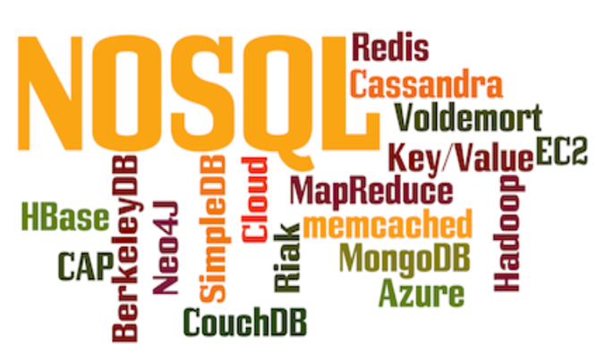
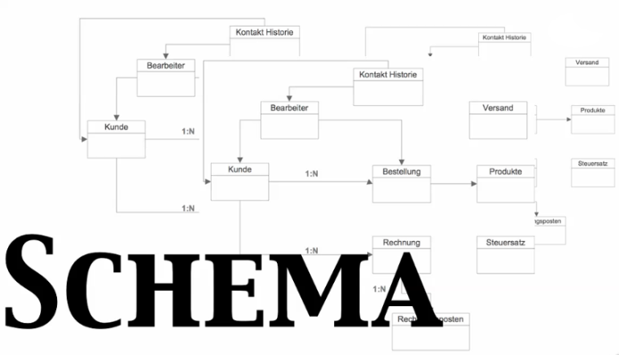
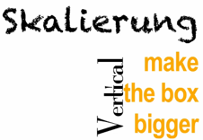
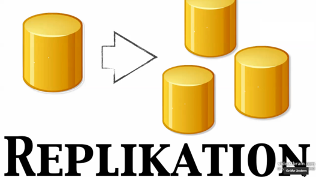
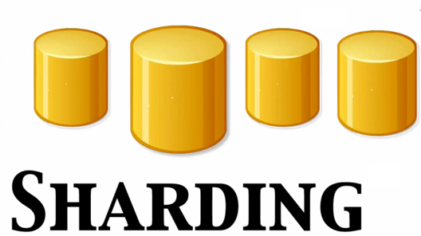
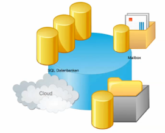

|                             |                               |                                 |
| --------------------------- | ----------------------------- | ------------------------------- |
| **Techniker HF Informatik** | **Kurs Scripting / Big data** |  |

- [1. NoSQL-Datenbanken](#1-nosql-datenbanken)
  - [1.1. Einführung](#11-einführung)
  - [1.2. Vorteile von NoSQL-Datenbanken](#12-vorteile-von-nosql-datenbanken)
  - [1.3. Nachteile von NoSQL-Datenbanken im Vergleich zu SQL](#13-nachteile-von-nosql-datenbanken-im-vergleich-zu-sql)
  - [1.4. SQL-Datenbanken](#14-sql-datenbanken)
    - [1.4.1. Probleme bei SQL-Datenbanken](#141-probleme-bei-sql-datenbanken)
    - [1.4.2. Was steckt hinter ACID](#142-was-steckt-hinter-acid)
    - [1.4.3. Skalierung](#143-skalierung)
  - [1.5. Konzepte zur Datenverteilung](#15-konzepte-zur-datenverteilung)
    - [1.5.1. Replikation](#151-replikation)
    - [1.5.2. Sharding](#152-sharding)
  - [1.6. Fazit](#16-fazit)
  - [1.7. Motivation](#17-motivation)
    - [1.7.1. Skalierbarkeit](#171-skalierbarkeit)
    - [1.7.2. Flexible Datenstrukturen](#172-flexible-datenstrukturen)
    - [1.7.3. Bewältigung grosser Datenmengen (Big Data)](#173-bewältigung-grosser-datenmengen-big-data)
    - [1.7.4. Verteilte und cloudbasierte Architekturen](#174-verteilte-und-cloudbasierte-architekturen)
- [2. Aufgaben](#2-aufgaben)
  - [2.1. Überblick der NoSQL-Datenbankentypen](#21-überblick-der-nosql-datenbankentypen)

---

# 1. NoSQL-Datenbanken

## 1.1. Einführung

- NoSQL-Datenbanken (Not Only SQL) sind eine Klasse von Datenbanksystemen, die sich von relationalen SQL-Datenbanken unterscheiden, indem sie **flexiblere Datenmodelle** und **höhere Skalierbarkeit** bieten.
- Sie wurden entwickelt, um den Anforderungen moderner Anwendungen gerecht zu werden, die **oft grosse Datenmengen** verarbeiten und **hohe Geschwindigkeit** erfordern.

## 1.2. Vorteile von NoSQL-Datenbanken

- **Hohe Skalierbarkeit:**
  - Horizontale Skalierung ist einfacher, wodurch sie sich besser für verteilte Systeme eignen.
- **Flexibilität:**
  - Unterstützt unstrukturierte und semi-strukturierte Daten. Änderungen an der Datenstruktur sind unkompliziert.
- **Performance:**
  - Optimiert für spezielle Anwendungsfälle (z. B. schnelle Lese- und Schreibzugriffe).
- **Verteilte Architektur:**
  - Oft von Grund auf für verteilte Systeme konzipiert, was Ausfallsicherheit erhöht.
- **Geringere Schemastrenge:**
  - Kein festes Schema erforderlich, was Entwicklungszyklen beschleunigen kann.

## 1.3. Nachteile von NoSQL-Datenbanken im Vergleich zu SQL

- **Fehlende Standardisierung:**
  - Keine einheitlichen Abfragesprachen oder Schnittstellen wie SQL, was den Wechsel zwischen Systemen erschwert.
- **Fehlende ACID-Transaktionen (oft):**
  - Viele NoSQL-Datenbanken bieten nur eingeschränkte Konsistenzmodelle, was komplexe Transaktionen erschwert.
- **Weniger geeignet für relationale Daten:**
  - NoSQL-Datenbanken sind nicht optimal, wenn komplexe Beziehungen zwischen Daten erforderlich sind.
- **Steilere Lernkurve:**
  - Erfordert oft spezielles Wissen und Verständnis für das jeweilige Datenmodell.
- **Eingeschränkte Tool-Unterstützung:**
  - Im Vergleich zu SQL-Datenbanken sind Entwicklungs- und Analysetools weniger ausgereift.

## 1.4. SQL-Datenbanken

### 1.4.1. Probleme bei SQL-Datenbanken

- Viele Tabellen 
- Viele Joins bei komplexen Abfragen
- Enormer Zeitbedarf für Join Operationen
- Zugriff auf Tabellen bei Schema-Änderungen nicht gewährleistet
- Strukturänderungen können bei riesigen Daten (Millionen von Datensätzen) Tage dauern. 

### 1.4.2. Was steckt hinter ACID

**ACID** ist ein grundlegendes Konzept, das die Eigenschaften beschreibt, die eine Transaktion in einer relationalen Datenbank erfüllen muss, um Datenkonsistenz und Zuverlässigkeit zu gewährleisten. Das Akronym steht für **Atomicity**, **Consistency**, **Isolation**, **Durability**

- **Atomicy**
  - Alles oder nichts Prinzip, Transaktionen
- **Consistency**
  - Konsistente Datenhaltung
  - Identische Datensicht
- **Isolation**
  - Trennung parallel laufenden Transaktionen
- **Durability**
  - Information langdauernd speichern.

### 1.4.3. Skalierung

- Vertikale Skalierung
  - DB ist zu klein, langsam
  - Fetter Rechner, mehr Core, Arbeitsspeicher, Prozessor
  - 
- Horizontal Skalierung
  - Datenbank verteilen auf mehrere Maschinen (Datencenter)
  - Rechnerverbund ist bei ACID problembehaftet
  - 

## 1.5. Konzepte zur Datenverteilung

### 1.5.1. Replikation

- Übertragen von einer Lokation in eine Andere
- Master => Slave
- Master => Master
- Backup (Kopie) für Verfügbarkeit

### 1.5.2. Sharding

- Ein Master
- Slave enthalten nicht alle Daten (Asien => Asiaten, Europa => Europäer, etc.)
- Spezielle Form der Partitionierung
- Problem
  - Bei ACID ist schreiben sehr langsam

## 1.6. Fazit

NoSQL-Datenbanken eignen sich besonders gut für **moderne, skalierbare Anwendungen**, die mit **grossen Datenmengen** oder dynamischen Strukturen arbeiten. Dennoch sollten sie je nach Anwendungsfall sorgfältig gegen SQL-Datenbanken abgewogen werden, insbesondere wenn Konsistenz, relationale Modelle oder Standardisierung entscheidend sind. Eine hybride Lösung, die beide Ansätze kombiniert, kann oft die beste Wahl sein.

## 1.7. Motivation

- Die Motivation hinter NoSQL-Datenbanken liegt in ihrer Fähigkeit, die **Einschränkungen traditioneller SQL-Systeme zu überwinden** und den Anforderungen moderner, datenintensiver Anwendungen gerecht zu werden.
- Sie bieten Lösungen für **Skalierbarkeit, Flexibilität und Leistung** und sind besonders für dynamische, verteilte und datenintensive Umgebungen geeignet.

### 1.7.1. Skalierbarkeit

- Limitierungen relationaler Datenbanken:
  - Relationale Datenbanken skalieren hauptsächlich vertikal, d. h. durch leistungsfähigere Hardware. Dies kann teuer sein und hat physische Grenzen.
- Lösung durch NoSQL:
  - NoSQL-Datenbanken sind von Grund auf für horizontale Skalierung ausgelegt, sodass sie auf mehrere Server verteilt werden können. Diese verteilte Architektur ermöglicht es, grosse Datenmengen effizient zu verwalten.

### 1.7.2. Flexible Datenstrukturen

- Herausforderungen bei relationalen Datenbanken:
  - Relationale Datenbanken erfordern ein starres Schema. Änderungen am Schema sind aufwendig und können zu Problemen führen, insbesondere bei stark variierenden oder unstrukturierten Daten.
- Vorteile von NoSQL:
  - NoSQL-Datenbanken unterstützen flexible und schemalose Datenmodelle, wodurch sie ideal für Anwendungen sind, bei denen sich die Datenstruktur häufig ändert oder nicht von Anfang an bekannt ist.

### 1.7.3. Bewältigung grosser Datenmengen (Big Data)

- Traditionelle Ansätze:
  - SQL-Datenbanken können Schwierigkeiten haben, mit der exponentiell wachsenden Datenmenge moderner Anwendungen Schritt zu halten.
- NoSQL-Lösung:
  - NoSQL-Datenbanken sind für die Verarbeitung von Big Data optimiert und bieten Mechanismen zur effizienten Speicherung und Abfrage grosser Datenmengen.

### 1.7.4. Verteilte und cloudbasierte Architekturen

- Relationale Einschränkungen:
  - Relationale Datenbanken wurden ursprünglich für einzelne, zentrale Systeme entwickelt. In einer Cloud- oder verteilten Umgebung können sie an ihre Grenzen stossen.
- NoSQL-Vorteil:
  - NoSQL-Datenbanken sind oft von Grund auf für verteilte Architekturen konzipiert. Sie ermöglichen einfache Replikation, hohe Verfügbarkeit und globale Datenzugriffe.

---

 

# 2. Aufgaben

## 2.1. Überblick der NoSQL-Datenbankentypen

| **Vorgabe**             | **Beschreibung**                                                                    |
| :---------------------- | :---------------------------------------------------------------------------------- |
| **Lernziele**           | Die Studierenden gewinnen eine Einsicht über die verschiedenen NoSQL Datenbanktypen |
|                         | Sie verstehen die unterschiedlichen Datenstrukturen und deren Einsatzgebiete        |
| **Sozialform**          | Gruppenarbeit                                                                       |
| **Auftrag**             | siehe unten                                                                         |
| **Hilfsmittel**         | Internet                                                                            |
| **Erwartete Resultate** |                                                                                     |
| **Zeitbedarf**          | 90 min                                                                              |
| **Lösungselmente**      | Präsentation mit Zusammenfassung bzw. Handout (Markdown)                            |

Ermitteln Sie alle **wichtigen Informationen** über das Ihnen zugeteilte Datenprodukte und erstellen Sie eine **Präsentation** inkl. Lösungsbeispiel.

**Dabei sollen folgende Punkte untersucht werden:**

- Grundprinzip der Datenstruktur
- Spezifische Merkmale
- Einsatzbereich (Beispiele)
- Vor-/ Nachteile
- Code bzw. Skript-Beispiele

- Stellen Sie Ihre Ergebnisse mittels einer **Kurzpräsentation** der Klasse vor.
- Verwenden Sie dabei die **Hilfsmittel** wie Flow-Charts, Beamer, Wandtafel usw. und verweisen Sie ggf. auf weitere die Literatur.
- Erklären sie den NoSQL Datenbank Typ den sie zugewiesen bekamen in **eigenen Worten**.
- Suchen sie auch nach weitere Ressourcen und Erklärungen im Internet.
- Definieren sie Anwendungsfälle (Use Cases) in welchen dieser Typ Sinn ergibt.
- Halten sie fest, welches die **Unterschiede** zu Relationalen Datenbanken sind.
- Die Präsentation und die Lösungsbeispiele sind den anderen Klassenkameraden zur Verfügung zu stellen.
- Dauer der Präsentation ca. 15-20 min

**Gruppen:**

- Key-Values Stores
  - Redis (<http://redis.io/>)
  - Amazon DynamoDB (<http://aws.amazon.com/de/dynamodb/>)
- Document Store
  - MongoDB (<https://www.mongodb.com/>)
  - RavenDB (<http://ravendb.net/>)
  - BaseX (<http://basex.org/>)
- Graphdatenbank
  - Neo4j (<http://neo4j.com/>)
- Wide Column Stores
  - Cassandra (<http://cassandra.apache.org/>)
  - HBase (<http://hbase.apache.org/>)
