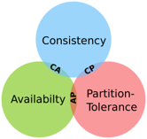
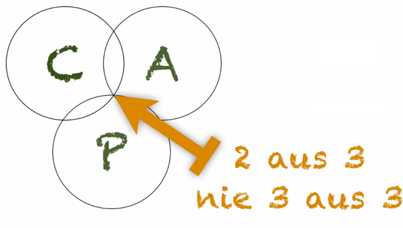
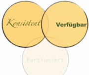
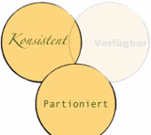
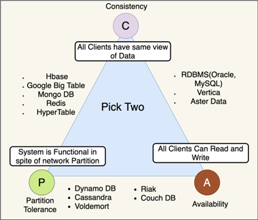

|                             |                          |                                 |
| --------------------------- | ------------------------ | ------------------------------- |
| **Techniker HF Informatik** | **Scripting / Big data** |  |

- [1. CAP-Theorem](#1-cap-theorem)
  - [1.1. Einführung](#11-einführung)
  - [1.2. Die drei Eigenschaften des CAP-Theorems](#12-die-drei-eigenschaften-des-cap-theorems)
    - [1.2.1. Consistency (Konsistenz)](#121-consistency-konsistenz)
    - [1.2.2. Availability (Verfügbarkeit)](#122-availability-verfügbarkeit)
    - [1.2.3. Partition Tolerance (Partitionstoleranz/Ausfalltoleranz)](#123-partition-tolerance-partitionstoleranzausfalltoleranz)
  - [1.3. Auswirkungen des CAP-Theorems](#13-auswirkungen-des-cap-theorems)
    - [1.3.1. Consistency + Availability (CA-System)](#131-consistency--availability-ca-system)
    - [1.3.2. Consistency + Partition Tolerance (CP-System)](#132-consistency--partition-tolerance-cp-system)
    - [1.3.3. Availability + Partition Tolerance (AP-System)](#133-availability--partition-tolerance-ap-system)
  - [1.4. Beispiele und Trade-offs](#14-beispiele-und-trade-offs)
  - [1.5. Produkte](#15-produkte)
- [2. BASE (Basically Available, Soft State, Eventual Consistency)](#2-base-basically-available-soft-state-eventual-consistency)
  - [2.1. Einführung Base](#21-einführung-base)
  - [2.2. Basically Available](#22-basically-available)
  - [2.3. Soft State](#23-soft-state)
  - [2.4. Eventually Consistency](#24-eventually-consistency)
  - [2.5. Zusammenfassung](#25-zusammenfassung)
- [3. Aufgaben](#3-aufgaben)
  - [3.1. Recherche und Analyse des CAP-Theorems und BASE Prinzip](#31-recherche-und-analyse-des-cap-theorems-und-base-prinzip)
  - [3.2. Vergleich von ACID und BASE](#32-vergleich-von-acid-und-base)

---

 

# 1. CAP-Theorem

## 1.1. Einführung

- Das CAP-Theorem ist ein grundlegendes Konzept in der Informatik, das die Einschränkungen und Trade-offs beschreibt, die in v**erteilten Datenbanksystemen**, insbesondere in NoSQL-Datenbanken, auftreten können.
- Es wurde 2000 von Eric Brewer formuliert und später formal bewiesen. Das Theorem besagt, dass ein v**erteiltes System nicht alle drei der folgenden Eigenschaften gleichzeitig vollständig garantieren kann.**
- Das CAP-Theorem hilft Entwicklern, die Architektur von verteilten Systemen besser zu planen, indem es die unvermeidbaren Kompromisse zwischen Konsistenz, Verfügbarkeit und Partitionstoleranz deutlich macht. In der Praxis hängt die Entscheidung von den spezifischen Anforderungen der Anwendung ab.

## 1.2. Die drei Eigenschaften des CAP-Theorems

### 1.2.1. Consistency (Konsistenz)

Alle Knoten im System sehen **dieselben Daten zu jedem Zeitpunkt**. Das bedeutet, dass nach einer Schreiboperation sofort alle Leseanfragen den aktuellen Zustand der Daten zurückgeben. Die Knoten sind also **ständig synchronisiert**.

**Beispiel:** Nach dem Hinzufügen eines neuen Eintrags in einer Datenbank kann dieser von allen Knoten sofort gelesen werden.

Diese Konsistenz darf nicht verwechselt werden mit der Konsistenz der **ACID**, die nur die **innere Konsistenz** eines Datensatzes betrifft.

### 1.2.2. Availability (Verfügbarkeit)

Jeder Knoten des Systems garantiert, dass **jede Anfrage eine Antwort erhält**, auch wenn einige Knoten ausgefallen sind. Dies bedeutet, dass das System **immer betriebsbereit** ist und eine Antwort liefert, jedoch möglicherweise mit veralteten Daten.
Es geht hier **nicht** darum, dass jeder Knoten ständig up and running ist.

**Beispiel:** Selbst wenn ein Teil des Systems ausfällt, kann eine Lese- oder Schreibanfrage bearbeitet werden.

### 1.2.3. Partition Tolerance (Partitionstoleranz/Ausfalltoleranz)

Das System bleibt auch dann funktionsfähig, wenn Netzwerkpartitionen auftreten, d.h., wenn **Kommunikation zwischen einigen Knoten des Systems unterbrochen ist**.

**Beispiel:** In einem verteilten System, das weltweit über mehrere Rechenzentren verteilt ist, könnte es **Netzwerkunterbrechungen** geben, aber das System muss weiterhin funktionieren.

## 1.3. Auswirkungen des CAP-Theorems

- Ein verteiltes System kann immer nur **zwei der drei Eigenschaften gleichzeitig garantieren**.
- Je nach Anwendungsszenario müssen Entwickler einen Kompromiss eingehen.

### 1.3.1. Consistency + Availability (CA-System)

- Das System garantiert **Konsistenz** und **Verfügbarkeit**, kann aber bei Netzwerkpartitionen nicht korrekt funktionieren.
- Verfügbar und Konsistent ist nur möglich, wenn zwischen zwei Knoten kein Netzwerk besteht oder die Knoten auf dem gleichen Server/Instanz installiert sind.
- **Beispiel:** Ein zentralisiertes System **ohne echte Partitionstoleranz** (Single-Node DBMS).

### 1.3.2. Consistency + Partition Tolerance (CP-System)

- Das System garantiert **Konsistenz** auch bei **Netzwerkpartitionen**, nimmt aber in Kauf, dass es während der **Partition nicht verfügbar** ist.
- Bei einem Netzwerk-Ausfall muss sich der Knoten vom Verbund lösen bis die Netzwerkverbindung hergestellt und die Daten synchronisiert sind.
- **Beispiel:** Datenbanken, die bei einem Netzwerkausfall Schreibvorgänge blockieren, um Konsistenz sicherzustellen.

### 1.3.3. Availability + Partition Tolerance (AP-System)

- Das System garantiert **Verfügbarkeit** auch bei **Netzwerkpartitionen**, opfert jedoch die **strikte Konsistenz**.
- Während einem Netzwerk-Ausfalls können zwei Knoten **unterschiedliche** Inhalte zurückliefern (Daten wurde nur auf einem Knoten gespeichert).
- **Beispiel:** Eventual Consistency, bei der Daten n**ach einer Weile konsistent** werden (z. B. Amazon DynamoDB).

NoSQL-Datenbanken sind oft in verteilten Umgebungen im Einsatz, bei denen **Partitionstoleranz unverzichtbar** ist.
Je nach Anwendungsfall setzen sie unterschiedliche Prioritäten:

- **AP-Systeme (Availability + Partition Tolerance):**
  - Systeme wie Cassandra oder DynamoDB priorisieren **Verfügbarkeit** und **Partitionstoleranz** und arbeiten mit "**Eventual Consistenc**y".
- **CP-Systeme (Consistency + Partition Tolerance):**
  - Systeme wie HBase oder MongoDB (im strengen Modus) priorisieren **Konsistenz** und **Partitionstoleranz**, opfern aber unter Umständen die Verfügbarkeit.

## 1.4. Beispiele und Trade-offs

- E-Commerce:
  - Bei einem Online-Shop ist **Verfügbarkeit** oft wichtiger als strikte Konsistenz, da Benutzer auch bei Netzwerkproblemen weiter Bestellungen aufgeben können sollen. Hier wäre **AP** bevorzugt.
- Bankensysteme:
  - Strikte **Konsistenz** ist entscheidend, da fehlerhafte Transaktionsdaten katastrophale Folgen haben könnten. Hier wird **CP** bevorzugt.

- **AP - (Availability + Partition Tolerance)**
  - Priorität
    - Verfügbarkeit ist hoch ebenso Toleranz gegenüber Ausfall einzelner DNS
  - zweitrangig
    - Konsistenz, es kann Tage dauern bis ein geänderter DNS-Eintrag propagiert ist
  - Beispiel
    - **Domain Name System (DNS)** oder Cloud Computing (horizontale Skalierung)
    - Konsistenz  ist untergeordnet, es kann dauern bis ein geänderter DNS-Eintrag propagiert wird. (Cloud-Plattformen, Twitter, Facebook, nicht auf strenge Konsistenz angewiesen)
- **CA - (Consistency + Availability)**
  - Priorität
    - Konsistenz u. Verfügbarkeit, werden in hochverfügbaren Netzwerken betrieben.
    - zweitrangig
      - Partitionierung, müssen nicht zwingend mit Partitionierung umgeben können.
    - Beispiel
      - Relationales **Datenbanksystem RDBMS-Cluster**
      - RDBMS-Cluster mit hoher Verfügbarkeit und Konsistenz
      - Möglichkeiten zu Partitionen ist unwichtig.
- **CP - (Consistency + Partition Tolerance )**
  - Priorität
    - Konsistenz u. Partitionstoleranz muss auch bei Störungen im Datenverkehr sichergestellt werd
  - zweitrangig
    - Verfügbarkeit
  - Beispiel
    - **Finanzanwendung** z.B. Geldautomaten (Ein-/Auszahlungen)
    - Verteilte Finanzanwendungen (Geldautomaten), Konsistenz ist oberstes Gebot.
    - Verfügbarkeit ist zweitrangig. Bei Netzwerkstörungen ist der Geldautomat ausser Betrieb

## 1.5. Produkte

---

 

# 2. BASE (Basically Available, Soft State, Eventual Consistency)

## 2.1. Einführung Base

- **BASE** steht - wie **ACID** - für Konsistenzeigenschaften, welche von NoSQL-Datenbank-Typen verfolgt werden.
- Im Unterschied zu **ACID**, sind die Eigenschaften gelockert.
- Der Grund für die Lockerungen ist das **CAP-Theorem**, welches **verteilte Systeme** behandelt.
- <https://de.wikipedia.org/wiki/CAP-Theorem>

## 2.2. Basically Available

- Systeme, die auf das **BASE**-Modell setzen, versprechen, hochverfügbar zu sein und zu jeder Zeit auf Anfragen reagieren zu können.
- Dafür machen sie **Abstriche bei der Konsistenz** (siehe dazu auch CAP-Theorem).
- Das bedeutet, dass ein System **immer** auf eine Anfrage reagiert. Die Antwort kann aber auch ein Fehler sein oder einen inkonsistenten Datenstand liefern" (wi-wiki.de)

## 2.3. Soft State

Der **Zustand**, in dem noch **nicht alle Änderungen** an das gesamte System propagiert wurden, aber trotzdem auf Anfragen reagieren kann, nennt man auch **Soft State** (wi-wiki.de)

## 2.4. Eventually Consistency

Im Gegensatz zum strengen **ACID**-Modell wird in **BASE** die Konsistenz als eine Art **"Übergang"** betrachtet, sodass nach einem Update **nicht sofort** alle Partitionen aktualisiert werden, sondern erst nach **einer gewissen Zeit**.
Das System wird also **"letztendlich konsistent" (eventually consistent)**, aber bis dahin in einem inkonsistenten Übergangs-Zustand (**soft state**) sein.(wi-wiki.de)

## 2.5. Zusammenfassung

- NoSQL Datenbank-Einordnung
- Performance steht im Vordergrund
- Status u. Konsistenz ordnen sich unter Performance unter
- Client ist irgendwann wieder konsistent

- Wichtig ist, wie das System (Infrastruktur) aufgebaut ist.
  - **ACID** u. **BASE** schliessen sich nicht immer aus.
  - Wenn eine NoSQL-Datenbank nicht in einem verteilten System arbeitet, dann kann auch ACID eingehalten werden!

---

 

# 3. Aufgaben

## 3.1. Recherche und Analyse des CAP-Theorems und BASE Prinzip

| **Vorgabe**             | **Beschreibung**                                                                                                                                  |
| :---------------------- | ------------------------------------------------------------------------------------------------------------------------------------------------- |
| **Lernziele**           | Erwerb eines fundierten Verständnisses der theoretischen Grundlagen   verteilter Datenbanksysteme und deren Anwendung in modernen Datenbanken |
|                         | Schwerpunkt liegt auf dem CAP-Theorem                                                                                                             |
| **Sozialform**          | Gruppenarbeit                                                                                                                                     |
| **Auftrag**             | siehe unten                                                                                                                                       |
| **Hilfsmittel**         | Internet                                                                                                                                          |
| **Erwartete Resultate** |                                                                                                                                                   |
| **Zeitbedarf**          | 40 min                                                                                                                                            |
| **Lösungselmente**      | Präsentation mit Zusammenfassung (Markdown)                                                                                                       |

- Erklären Sie in eigenen Worten die drei Eigenschaften des **CAP-Theorems** (Konsistenz, Verfügbarkeit, Partitionstoleranz).
- Beschreiben Sie kurz, welche Einschränkung das **CAP-Theorem** für die Entwicklung verteilte Systeme vorgibt.
- Nennen Sie ein Beispiel für ein System, das **Konsistenz** und **Partitionstoleranz** priorisiert, und eines, das **Verfügbarkeit** und **Partitionstoleranz** bevorzugt.

## 3.2. Vergleich von ACID und BASE

| **Vorgabe**             | **Beschreibung**                                                   |
| :---------------------- | ------------------------------------------------------------------ |
| **Lernziele**           | Sie kennen die beiden Konzepte ACID u. BASE                        |
|                         | Sie können die wesentliche Unterschiede von ACID u. BASE erläutern |
| **Sozialform**          | Gruppenarbeit                                                      |
| **Auftrag**             | siehe unten                                                        |
| **Hilfsmittel**         | Internet                                                           |
| **Erwartete Resultate** |                                                                    |
| **Zeitbedarf**          | 40 min                                                             |
| **Lösungselmente**      | Präsentation mit Zusammenfassung (Markdown)                        |

Vergleichen Sie die beiden Konsistenzmodelle **ACID** und **BASE** anhand der folgenden Aspekte und erläutern Sie die relevanten Unterschiede:

- **Definition und Konzept:**
  - Erklären Sie die grundlegenden Prinzipien von **ACID** und **BASE**. Welche Ziele verfolgen diese Modelle?
- **Anwendungsbereiche:**
  - Nennen Sie typische Szenarien, in denen **ACID** bzw. **BASE** bevorzugt wird. Welche Anforderungen der jeweiligen Anwendung beeinflussen die Wahl des Modells?
- **Konsistenzverständnis:**
  - Vergleichen Sie die Art und Weise, wie Konsistenz in den beiden Modellen gehandhabt wird (z. B. strikte Konsistenz vs. eventual consistency). Welche Auswirkungen hat dies auf die Systemleistung und Datenintegrität?
- **Verlässlichkeit und Skalierbarkeit:**
  - Diskutieren Sie, wie **ACID** und **BASE** in Bezug auf Skalierbarkeit und Verfügbarkeit abschneiden. Welche Kompromisse müssen eingegangen werden?
- **Beispiele:**
  - Geben Sie jeweils ein konkretes Beispiel für ein System oder eine Technologie, das/die **ACID** bzw. **BASE** verwendet.

---

© 2026 Lukas Müller – Licensed under CC BY-NC-ND 4.0
See [LICENSE](lincense.md) file for details.
