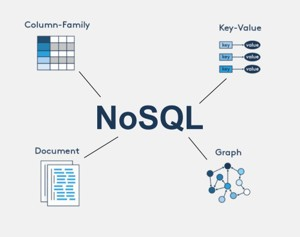
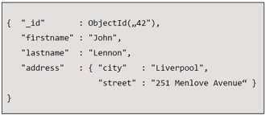
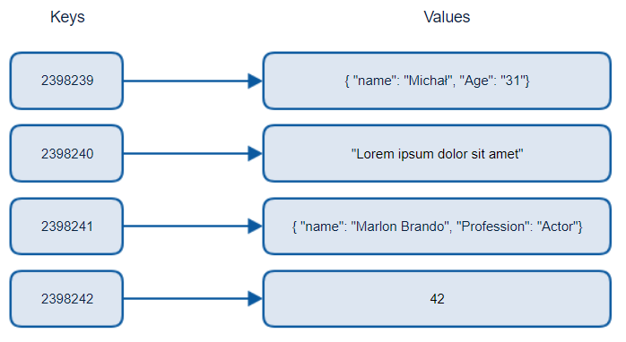
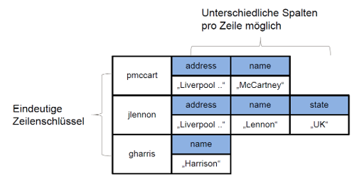
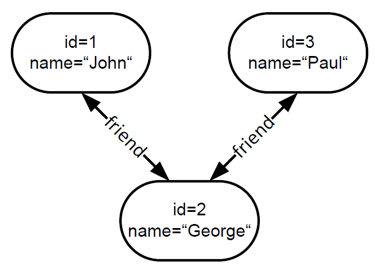
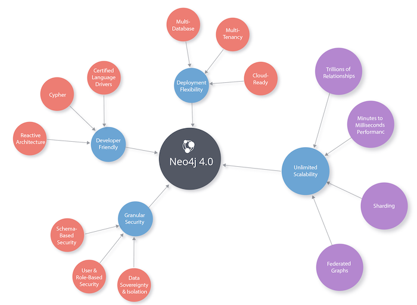

|                             |                               |                                 |
| --------------------------- | ----------------------------- | ------------------------------- |
| **Techniker HF Informatik** | **Kurs Scripting / Big data** |  |

- [1. Hauptgruppen von NoSQL-Datenbanken](#1-hauptgruppen-von-nosql-datenbanken)
  - [1.1. Dokumentdatenbanken](#11-dokumentdatenbanken)
  - [1.2. Key-Value-Datenbanken](#12-key-value-datenbanken)
  - [1.3. Spaltenorientierte Datenbanken](#13-spaltenorientierte-datenbanken)
  - [1.4. Graphdatenbanken](#14-graphdatenbanken)
    - [1.4.1. Beispiel Neo4j](#141-beispiel-neo4j)

---

 

# 1. Hauptgruppen von NoSQL-Datenbanken

## 1.1. Dokumentdatenbanken

- Speichern Daten in Form von Dokumenten (z. B. JSON, BSON, XML).
- Jedes Dokument enthält Felder und Werte, die flexibel gestaltet werden können.
- Möglichkeit Daten zu partitionieren
- Sharding Dokumente aufgrund von schlüsseln verteilen
- Beispiele:
  - MongoDB, CouchDB, Riak, Lotus Notes
- Einsatz:
  - Anwendungen mit stark variierenden Datenstrukturen, Content-Management-Systeme.

## 1.2. Key-Value-Datenbanken

- Speichern Daten als Schlüssel-Wert-Paare, ähnlich wie Hash-Maps.
- Beispiele:
  - Redis, DynamoDB.
- Einsatz:
  - Caching, Sitzungsmanagement, Echtzeitanwendungen.

## 1.3. Spaltenorientierte Datenbanken

- Speichern Daten in Spalten anstelle von Zeilen, was besonders für analytische Abfragen effizient ist.
- Struktur wurde verändert. Daten werden Spaltenweise abgelegt (nicht zeilenorientierte Ablage). 
- Vorteile bei Summen bilden. 
- Spalten können auf unterschiedene Maschinen liegen. 
- Datenbanken sind schemalos.
- Beispiele:
  - Cassandra, HBase.
- Einsatz:
  - Big-Data-Analysen, Data Warehousing.

## 1.4. Graphdatenbanken

- Speichern Daten in Form von Knoten und Kanten, um Beziehungen zwischen Daten zu modellieren.
- Mathematisch komplexe Algorithmen (Dijkstra, A-Star).
- Keine echte Suche möglich, Navigation von Startobjekt.
- Schwer skalierbar, Partition-Tolerance ist gering.
- Beispiele:
  - Neo4j, ArangoDB.
  - Beispiel: Weg soll über einen Verwandten führen ist wichtiger als über Arbeitskolleg oder geschäftlichen Freund.
- Einsatz:
  - Soziale Netzwerke, Empfehlungsdienste, Netzwerküberwachung.

### 1.4.1. Beispiel Neo4j

