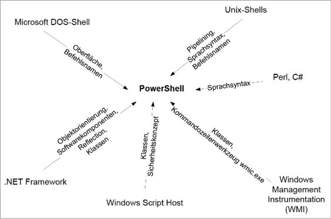
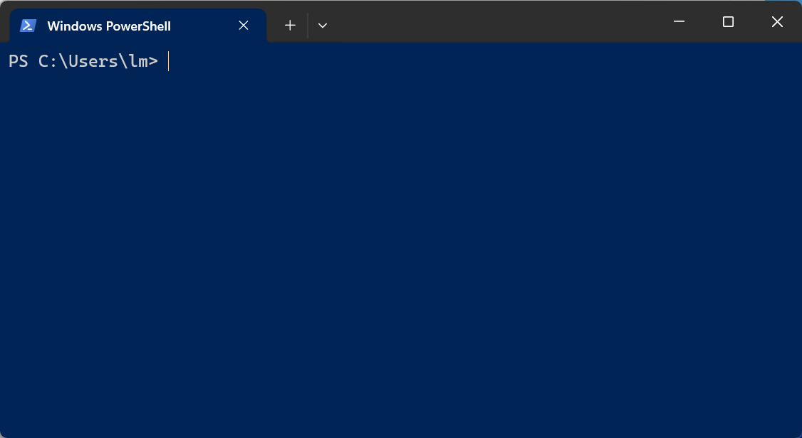
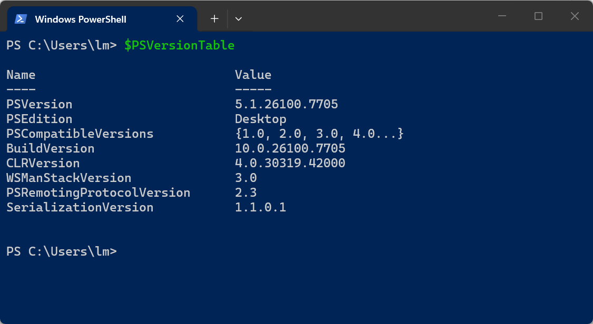
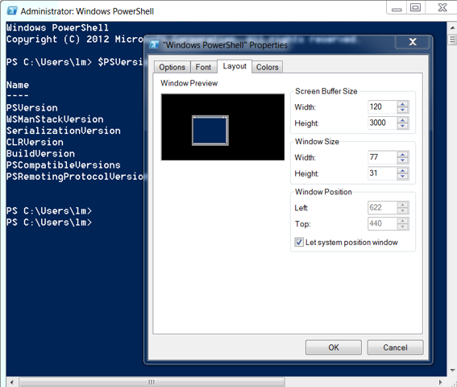
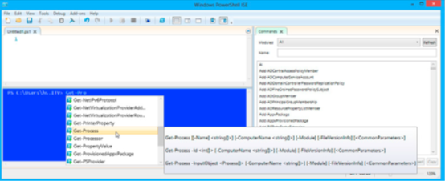
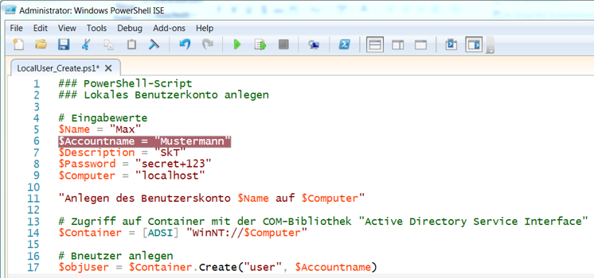
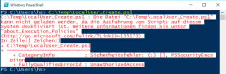
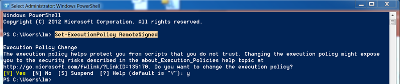

|                             |                               |                                 |
| --------------------------- | ----------------------------- | ------------------------------- |
| **Techniker HF Informatik** | **Kurs Scripting / Big data** |  |

- [1. PowerShell Einführung](#1-powershell-einführung)
  - [1.1. Was ist die Windows PowerShell](#11-was-ist-die-windows-powershell)
  - [1.2. Geschichte der PowerShell](#12-geschichte-der-powershell)
  - [1.3. Architektur der Windows PowerShell](#13-architektur-der-windows-powershell)
- [2. PowerShell einrichten](#2-powershell-einrichten)
  - [2.1. PowerShell testen](#21-powershell-testen)
  - [2.2. PowerShell Konsole einrichten](#22-powershell-konsole-einrichten)
  - [2.3. Den PowerShell-Editor "ISE"](#23-den-powershell-editor-ise)
    - [2.3.1. Debugger](#231-debugger)
- [3. Skriptausführungsrichtlinie](#3-skriptausführungsrichtlinie)
  - [3.1. Policy - Ausführungsrichtlinie](#31-policy---ausführungsrichtlinie)
  - [3.2. PowerShell Version](#32-powershell-version)
    - [3.2.1. Installation der aktuellsten Version (PowerShell 7+)](#321-installation-der-aktuellsten-version-powershell-7)
- [4. Aufgaben](#4-aufgaben)
  - [4.1. Aufgabe - Lernvideo PowerShell erste Schritte](#41-aufgabe---lernvideo-powershell-erste-schritte)
  - [4.2. PowerShell Cmdlet Recherche](#42-powershell-cmdlet-recherche)

---

</br>

# 1. PowerShell Einführung

</br>

## 1.1. Was ist die Windows PowerShell

Die Windows PowerShell (WPS) ist eine neue, **.NET-basierte Umgebung** für
interaktive Systemadministration und Scripting auf der Windows-Plattform.

**Die Kernfunktionen der PowerShell sind:**

- Zahlreiche eingebaute Befehle, die **Commandlets** genannt werden
- Zugang zu allen Systemobjekten, die durch **COM-Bibliotheken**, das **.NET Framework** und die **Windows Management Instrumentation (WMI)** bereitgestellt werden
- Robuster Datenaustausch zwischen **Commandlets** durch Pipelines basierend auf typisierten Objekten
- Eine **einfach** zu erlernende, aber mächtige Skriptsprache mit wahlweise schwacher oder starker Typisierung
- Ein **Sicherheitsmodell**, das die Ausführung unerwünschter Skripte unterbindet
- Die PowerShell kann um **eigene Befehle** erweitert werden.

## 1.2. Geschichte der PowerShell

Microsoft beobachtete in der Unix-Welt eine hohe Zufriedenheit mit den dortigen Kommandozeilen- Shells und entschloss sich daher, das Konzept der Unix-Shells, insbesondere das Pipelining, mit dem .NET Framework zusammenzubringen

- Die PowerShell 1.0 erschien am 6.11.2006
- Die PowerShell 2.0 ist zusammen mit Windows 7/Windows Server 2008 R2 erschienen am 22.7.2009
- Die PowerShell 3.0 ist zusammen mit Windows 8/Windows Server 2012 erschienen am 15.8.2012
- Die PowerShell 4.0 ist zusammen mit Windows 8.1/Windows Server 2012 R2 am 9.9.2013 erschienen
- Die PowerShell 5.0 ist als Teil von Windows 10 erschienen am 29.7.2015
- 2016 kündigte Microsoft an, dass PowerShell Open Source werden würde. PowerShell Core 6.0 unterstützt die Plattformen Windows, Mac OS und Linux, ist Open Source
- Im Jahr 2020 wurde PowerShell 7 veröffentlicht, basierend auf .NET 5.0, und ersetzte PowerShell Core als modernste Version.
- Version 7.2 / 7.3 (2021-2022): Fokus auf Performance, Sicherheit und bessere Integration in die tägliche Arbeit (z.B. verbesserte Tab-Vervollständigung).
- Die aktuelle Version (Stand 2026) PowerShell 7.4 / 7.5 (LTS): Dies ist der aktuelle Standard. Die Basis baut auf .NET 8/9 auf.

**Zukunft von PowerShell:**

- PowerShell 7 wird kontinuierlich weiterentwickelt und bietet regelmässig neue Features. Es wird als universelle Automatisierungsplattform für Windows, Linux und macOS gesehen.

## 1.3. Architektur der Windows PowerShell

Die Windows PowerShell ist eine Symbiose aus:

- DOS-Kommandozeilenfenster
- Den bekannten Skript- und Shell-Sprachen wie Perl, Ruby, ksh und bash
- NET Framework und Windows Management Instrumentation (WMI).



---

</br>

# 2. PowerShell einrichten

## 2.1. PowerShell testen

Die PowerShell verfügt über zwei Modi (interaktiver Modus und Skriptmodus)

PowerShell im interaktiven Modus:



Installierte Version ermitteln



## 2.2. PowerShell Konsole einrichten

PowerShell interaktiver Modus:

- Taskleiste anheften
- Eigenschaften anpassen (z.B. Schriftart)
- Schnellstart ab Taskleiste mit Windows-Taste + 'Zahl'
- 

## 2.3. Den PowerShell-Editor "ISE"

- **Integrated Scripting Environment (ISE)** ist der Name des Skripteditors
- Start über PowerShell-Konsole PS> ISE
- Die ISE verfügt über zwei Fenster:
  - ein Skriptfenster
  - Ein interaktives Befehlseingabefenster (unten).
  - 
  - Befehl Vervollständigung mit Tabulatortaste
  - Alternativ `STRG+Leertaste` drücken für eine Eingabehilfe mit Auswahlfenster (IntelliSense).
  - 

### 2.3.1. Debugger

Ein interessantes Feature ist das Debugging

- Ablaufverfolgung (Zeile für Zeile)
  - Zustand der Variablen betrachten
  - Breakpoint mit **F9** (oder wählen Sie "Toogle Breakpoint")
  - 
  - Im interaktiven Bereich können Sie im Haltemodus den aktuellen Zustand der Variablen abfragen, indem Sie dort z. B. eingeben: `$Name`
  
---

# 3. Skriptausführungsrichtlinie

Die Skriptausführung auf den meisten Windows-Betriebssystem-versionen ist standardmässig in der PowerShell nicht zulässig.
Dies ist kein Fehler, sondern eine Sicherheitsfunktionalität.



Es muss die Skript-Ausführungsrichtlinie verändert werden.



## 3.1. Policy - Ausführungsrichtlinie

Der Grundzustand ist die Ausführungsrichtlinie **Restricted**, womit die Skriptausführung grundsätzlich verweigert wird.
Wenn man Administratorrechte hat kann die Ausführungsrichtlinie mit dem Cmdlet **`Set-ExecutionPolicy`** verändert werden.

```powershell
# Policy
# -----------------------------------------------------------------------------
# Restricted (Eingeschränkt)
# Es können keine Skripts ausgeführt werden. Windows PowerShell kann nur 
# im interaktiven Modus genutzt werden.

# AllSigned (Vollständig signiert)
# Nur von einem vertrauenswürdigen Autor erstellte Skripts können ausgeführt werden.

# RemoteSigned (Remote signiert)
# Heruntergeladene Skripts müssen von einem vertrauenswürdigen Autor signiert werden, 
# bevor sie ausgeführt werden können.

# Unrestricted (Uneingeschränkt) 
# Es gibt überhaupt keine Einschränkungen. 
# Alle Windows PowerShell-Skripts können ausgeführt werden.

# Der Grundzustand ist die Ausführungsrichtlinie Restricted, 
# womit die Skriptausführung grundsätzlich verweigert wird.

# Wenn man Administrator rechte hat kann man die Ausführungsrichtlinie 
# mit dem Cmdlet Set-ExecutionPolicy verändern.
# Diese Änderung gilt dann für alle Benutzer des Systems!

# Policy auslesen
Get-ExecutionPolicy

# Policy setzen
Set-ExecutionPolicy AllSigned       # Nur signierte Scripts werden ausgeführt
Set-ExecutionPolicy RemoteSigned    # Aus dem Internet heruntergeladene Scripts müssen signiert sein
Set-ExecutionPolicy Unrestricted    # Alle Scripts werden ausgeführt. Unsignierten Scripts aus dem Internet müssen bestätigt werden
Set-ExecutionPolicy Bypass          # Keinerlei Einschränkungen, Warnungen oder Prompts
Set-ExecutionPolicy Undefined       # Entfernt eine zugewiesene Richtlinie
```

> **Achtung: Diese Änderung gilt dann für alle Benutzer des Systems!**

```powershell
# Policy ausschalten
Set-ExecutionPolicy -ExecutionPolicy Unrestricted -Force
```

## 3.2. PowerShell Version

Öffne deine aktuelle PowerShell und gib diesen Befehl ein:

```powershell
$PSVersionTable.PSVersion
```

- 5.1, die alte Windows-Standardversion.
- 7.x, bereits modern unterwegs.

### 3.2.1. Installation der aktuellsten Version (PowerShell 7+)

Die PowerShell 7 lässt sich parallel zur Version 5.1 installieren (sie überschreiben sich nicht!).

**Der schnellste Weg (Windows):**

- Nutze den „Windows Package Manager“ (`winget`), der in Windows 10 und 11 eingebaut ist.
- Gib das hier in deine CMD oder PowerShell ein:
  - `winget install --id Microsoft.PowerShell --source winget`
- PowerShell auch kann auch einfach wie eine App aus dem Microsoft Store geladen werden (suchen nach "PowerShell")

**Nach der Installation existieren zwei verschiedene Programme:**

- **Blaues Icon**: Das klassische Windows PowerShell 5.1.
- **Schwarzes Icon**: Das neue, schnelle PowerShell 7.

---

</br>

# 4. Aufgaben

## 4.1. Aufgabe - Lernvideo PowerShell erste Schritte

| **Vorgabe**             | **Beschreibung**                                |
| :---------------------- | :---------------------------------------------- |
| **Lernziele**           | Die PowerShell kann korrekt eingerichtet werden |
| **Sozialform**          | Einzelarbeit                                    |
| **Auftrag**             | Video abspielen                                 |
| **Hilfsmittel**         |                                                 |
| **Erwartete Resultate** |                                                 |
| **Zeitbedarf**          | 5min                                            |
| **Lösungselemente**     |                                                 |

Start das Lernvideo **«PowerShell - Erste Schritte»**(Quelle: youtube) und verfolge aufmerksam die Erläuterungen zur Konfiguration und Einsatz der PowerShell.
Fasse die erläuterten Befehle (Cmdlets) zusammen und führe diese auch auf deinem System aus.

**[Lernvideo](https://www.youtube.com/watch?v=LHsfsdS4qSY)**

---

</br>

## 4.2. PowerShell Cmdlet Recherche

| **Vorgabe**             | **Beschreibung**                               |
| :---------------------- | :--------------------------------------------- |
| **Lernziele**           | Sie kennen einige Grundkonzepte von PowerShell |
|                         | Sie verstehen die Ausführungsrichtlinien       |
|                         | Sie können die Online Hilfe nutzen             |
|                         | Sie verstehen die Syntax von PowerShell        |
| **Sozialform**          | Gruppenarbeit                                  |
| **Auftrag**             | siehe unten                                    |
| **Hilfsmittel**         | Google / ChatGPT usw.                          |
| **Erwartete Resultate** | Präsentation                                   |
| **Zeitbedarf**          | 40min (Arbeit)                                 |
|                         | 5-10min (Präsentation)                         |
| **Lösungselemente**     | Markdown Dokument mit Code Lösungen            |

**A1:**

- Führen Sie die `Update-Help` auf Ihrem System aus.
- Wie lautet das vollständige Cmdlet, das die deutschsprachige Hilfe nicht zur Verfügung steht.

```powershell
#
# Version u. Help Update
# Lädt die aktuellsten Helpfiles herunter
Update-Help -UICulture en-US -Verbose -Force -ErrorAction SilentlyContinue
```

Test die Hilfe wie folgt:

```powershell
Get-Help Get-Help -Full
Get-Help Get-Help -Online  # Online Hilfe im Browser

# Infos zu Themen und Konzepten rund um PowerShell mit about... anzeigen
Get-Help about_*
```

**A2:**

- Rufen Sie die Hilfe für das Cmdlet `Get-Service` auf.
- Vergleichen Sie die Ausgabe, wenn Sie keine weiteren Parameter angeben mit der Ausgabe, die Sie jeweils bei zusätzlicher Eingabe es Parameters `-Detailed`, `-Full` bzw. `-Examples` erhalten.

**A3:**

- Finden Sie heraus, welche Cmdlet den Parameter `-Verb` verwenden.
- Lesen Sie in der Hilfe zu einem der angezeigten Cmdlet nach, was der Parameter bedeutet.

**A4:**

- Lassen Sie sich Beispiele für das Cmdlet `Get-Process` anzeigen.

**A5:**

- Welche Eigenschaften von Diensten auf Ihrem Rechner kann das Cmdlet `Get-Service` anzeigen?

**A6:**

Recherchieren Sie mit den bekannten Mitteln:

1. Die Syntax des Cmdlets `Get-Module`
2. Beispiele zum Einsatz des Cmdlets `Get-PSDrive`
3. Was der Parameter `-Format` des Cmdlets `Get-Date` bedeutet

**A7:**

Lesen Sie die vollständigen Hilfetexte zu den vorgestellten Get-Befehlen `Get-History`, `Get-Process` und `Get-PSProvider`

**A8:**

Finden Sie heraus, welche Eigenschaft Ihnen für das Cmdlet `Get-Module` Verfügung stehen.
