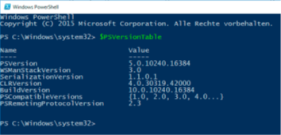

|                             |                               |                              |
| --------------------------- | ----------------------------- | ---------------------------- |
| **Techniker HF Informatik** | **Kurs Scripting / Big data** |  |

- [1. PowerShell Einführung](#1-powershell-einführung)
  - [1.1. Was ist die Windows PowerShell](#11-was-ist-die-windows-powershell)
  - [1.2. Geschichte der PowerShell](#12-geschichte-der-powershell)
  - [1.3. Architektur der Windows PowerShell](#13-architektur-der-windows-powershell)
- [2. PowerShell einrichten](#2-powershell-einrichten)
  - [2.1. PowerShell testen](#21-powershell-testen)
  - [2.2. PowerShell Konsole einrichten](#22-powershell-konsole-einrichten)
  - [2.3. Den PowerShell-Editor "ISE"](#23-den-powershell-editor-ise)
    - [2.3.1. Debugger](#231-debugger)
- [3. Skriptausführungsrichtlinie](#3-skriptausführungsrichtlinie)
  - [Policy](#policy)
- [4. Aufgabe - Lernvideo PowerShell erste Schritte](#4-aufgabe---lernvideo-powershell-erste-schritte)

---

</br>

# 1. PowerShell Einführung

</br>

## 1.1. Was ist die Windows PowerShell

Die Windows PowerShell (WPS) ist eine neue, **.NET-basierte Umgebung** für
interaktive Systemadministration und Scripting auf der Windows-Plattform.

**Die Kernfunktionen der PowerShell sind:**

- Zahlreiche eingebaute Befehle, die **Commandlets** genannt werden
- Zugang zu allen Systemobjekten, die durch **COM-Bibliotheken**, das **.NET Framework** und die **Windows Management Instrumentation (WMI)** bereitgestellt werden
- Robuster Datenaustausch zwischen **Commandlets** durch Pipelines basierend auf typisierten Objekten
- Eine **einfach** zu erlernende, aber mächtige Skriptsprache mit wahlweise schwacher oder starker Typisierung
- Ein **Sicherheitsmodell**, das die Ausführung unerwünschter Skripte unterbindet
- Die PowerShell kann um **eigene Befehle** erweitert werden.

## 1.2. Geschichte der PowerShell

Microsoft beobachtete in der Unix-Welt eine hohe Zufriedenheit mit den dortigen Kommandozeilen- Shells und entschloss sich daher, das Konzept der Unix-Shells, insbesondere das Pipelining, mit dem .NET Framework zusammenzubringen

- Die PowerShell 1.0 erschien am 6.11.2006
- Die PowerShell 2.0 ist zusammen mit Windows 7/Windows Server 2008 R2 erschienen am 22.7.2009
- Die PowerShell 3.0 ist zusammen mit Windows 8/Windows Server 2012 erschienen am 15.8.2012
- Die PowerShell 4.0 ist zusammen mit Windows 8.1/Windows Server 2012 R2 am 9.9.2013 erschienen
- Die PowerShell 5.0 ist als Teil von Windows 10 erschienen am 29.7.2015
- 2016 kündigte Microsoft an, dass PowerShell Open Source werden würde. PowerShell Core 6.0 unterstützt die Plattformen Windows, Mac OS und Linux, ist Open Source
- Im Jahr 2020 wurde PowerShell 7 veröffentlicht, basierend auf .NET 5.0, und ersetzte PowerShell Core als modernste Version.

**Zukunft von PowerShell:**

- PowerShell 7 wird kontinuierlich weiterentwickelt und bietet regelmässig neue Features. Es wird als universelle Automatisierungsplattform für Windows, Linux und macOS gesehen.

## 1.3. Architektur der Windows PowerShell

Die Windows PowerShell ist eine Symbiose aus:

- DOS-Kommandozeilenfenster
- Den bekannten Skript- und Shell-Sprachen wie Perl, Ruby, ksh und bash
- NET Framework und Windows Management Instrumentation (WMI).


---

</br>

# 2. PowerShell einrichten

## 2.1. PowerShell testen

Die PowerShell verfügt über zwei Modi (interaktiver Modus und Skriptmodus)

PowerShell im interaktiven Modus:


Installierte Version ermitteln


## 2.2. PowerShell Konsole einrichten

PowerShell interaktiver Modus:

- Taskleiste anheften
- Eigenschaften anpassen (z.B. Schriftart)
- Schnellstart ab Taskleiste mit Windows-Taste + 'Zahl'
- 

## 2.3. Den PowerShell-Editor "ISE"

- **Integrated Scripting Environment (ISE)** ist der Name des Skripteditors
- Start über PowerShell-Konsole PS> ISE
- Die ISE verfügt über zwei Fenster:
  - ein Skriptfenster
  - Ein interaktives Befehlseingabefenster (unten).
  - 
  - Befehl Vervollständigung mit Tabulatortaste
  - Alternativ `STRG+Leertaste` drücken für eine Eingabehilfe mit Auswahlfenster (IntelliSense).
  - 

### 2.3.1. Debugger

Ein interessantes Feature ist das Debugging

- Ablaufverfolgung (Zeile für Zeile)
  - Zustand der Variablen betrachten
  - Breakpoint mit **F9** (oder wählen Sie "Toogle Breakpoint")
  - 
  - Im interaktiven Bereich können Sie im Haltemodus den aktuellen Zustand der Variablen abfragen, indem Sie dort z. B. eingeben: `$Name`
  
---

# 3. Skriptausführungsrichtlinie

Die Skriptausführung auf den meisten Windows-Betriebssystem-versionen ist standardmässig in der PowerShell nicht zulässig.
Dies ist kein Fehler, sondern eine Sicherheitsfunktionalität.


Es muss die Skript-Ausführungsrichtlinie verändert werden.


## Policy

- **Restricted (Eingeschränkt)**
  - Es können keine Skripts ausgeführt werden. Windows PowerShell kann nur im interaktiven Modus genutzt werden.
- **AllSigned (Vollständig signiert)**
  - Nur von einem vertrauenswürdigen Autor erstellte Skripts können ausgeführt werden.
- **RemoteSigned (Remote signiert)**
  - Heruntergeladene Skripts müssen von einem vertrauenswürdigen Autor signiert werden, bevor sie ausgeführt werden können.
- **Unrestricted (Uneingeschränkt)**
  - Es gibt überhaupt keine Einschränkungen.
  - Alle Windows PowerShell-Skripts können ausgeführt werden.

Der Grundzustand ist die Ausführungsrichtlinie **Restricted**, womit die Skriptausführung grundsätzlich verweigert wird.
Wenn man Administratorrechte hat kann die Ausführungsrichtlinie mit dem Cmdlet **`Set-ExecutionPolicy`** verändert werden.

> **Achtung: Diese Änderung gilt dann für alle Benutzer des Systems!**

Mit **`Get-ExecutionPolicy`** kann die aktuelle Policy ausgelesen werden.

```powershell
# Policy ausschalten
Set-ExecutionPolicy -ExecutionPolicy Unrestricted -Force
```

---

</br>

# 4. Aufgabe - Lernvideo PowerShell erste Schritte

| **Vorgabe**             | **Beschreibung**                                |
| :---------------------- | :---------------------------------------------- |
| **Lernziele**           | Die PowerShell kann korrekt eingerichtet werden |
| **Sozialform**          | Einzelarbeit                                    |
| **Auftrag**             | Video abspielen                                 |
| **Hilfsmittel**         |                                                 |
| **Erwartete Resultate** |                                                 |
| **Zeitbedarf**          | 5min                                            |
| **Lösungselmente**      |                                                 |

Start das Lernvideo **«PowerShell - Erste Schritte»**(Quelle: youtube) und verfolge aufmerksam die Erläuterungen zur Konfiguraiton und Einsatz der PowerShell.
Fasse die erläuterten Befehle (Cmdlets) zusammen und führe diese auch auf deinem System aus.

**[Lernvideo](https://www.youtube.com/watch?v=LHsfsdS4qSY)**
