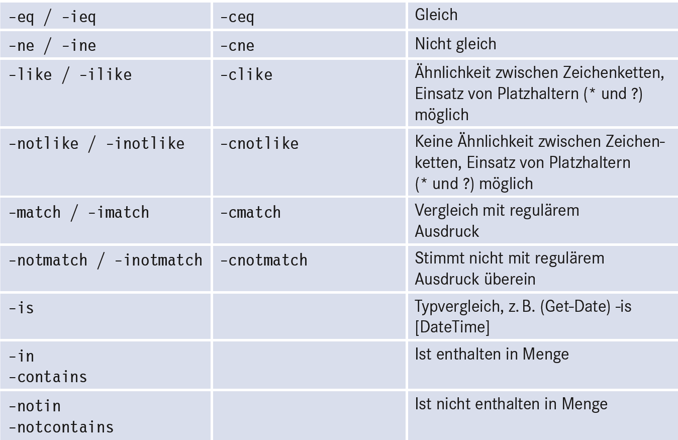
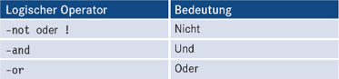
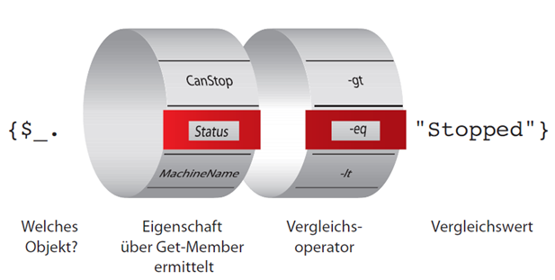
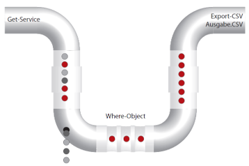

|                             |                          |                                 |
| --------------------------- | ------------------------ | ------------------------------- |
| **Techniker HF Informatik** | **Scripting / Big data** |  |

- [1. PowerShell - Cmdlets/Pipeline](#1-powershell---cmdletspipeline)
  - [1.1. Pipeline-Variablen](#11-pipeline-variablen)
  - [1.2. Vergleichsoperatoren](#12-vergleichsoperatoren)
  - [1.3. Where-Object](#13-where-object)
  - [1.4. ForEach-Object - Schleife](#14-foreach-object---schleife)
  - [1.5. Count - Anzahl der Objekte in der Pipe](#15-count---anzahl-der-objekte-in-der-pipe)
  - [1.6. Cmdlet Get-Unique - Duplikate entfernen](#16-cmdlet-get-unique---duplikate-entfernen)
  - [1.7. Group-Object - Gruppierung](#17-group-object---gruppierung)
  - [1.8. Measure-Object - Berechnungen](#18-measure-object---berechnungen)
  - [1.9. Methoden ausführen](#19-methoden-ausführen)
- [2. Aufgaben](#2-aufgaben)
  - [2.1. PowerShell Pipelining (einfach)](#21-powershell-pipelining-einfach)
  - [2.2. PowerShell Pipelining (schwer)](#22-powershell-pipelining-schwer)
  - [2.3. Gruppenarbeit Cmdlets](#23-gruppenarbeit-cmdlets)

</br>

# 1. PowerShell - Cmdlets/Pipeline

PowerShell nutzt eine objektbasierte Pipeline, d.h.:
Es werden Objekte (mit Eigenschaften & Methoden) übergeben, nicht nur Text (wie in der klassischen Windows CMD oder Bash).

**`[Cmdlet A] --(Objekt1, Objekt2, Objekt3)--> [Cmdlet B] --> [Cmdlet C]`**

Mit der Pipeline verketten Sie Cmdlets untereinander. Die Ausgabe (Objekte) des einen Cmdlets wird an ein anderes Cmdlet weitergeleitet.

- Ausgabe eines Cmdlets → InputObjects des nächsten Cmdlets
- Übergabe erfolgt objektweise (Object-by-Object)
- viele Cmdlets haben einen versteckten Parameter -InputObject

```powershell
Get-Process | Sort-Object CPU | Select-Object -First 5
```

- 
- `Get-Process` - Liefert pro Prozess ein Objekt.
- `Sort-Object`  - Sortiert die Objekte nach der CPU Eigenschaft
- `Select-Object`  - Selektiert nur die ersten 5 Objekte

Die Pipeline kann in 4 grundlegende Phasen unterteilt werden:

1. Erzeugen der Daten (z.B. Get-ChildItem, Get-Process)
2. Filtern / Eingrenzen (z.B. Where-Object)
3. Transformieren / Auswählen / Sortieren (z.B. Select-Object, Sort-Object, Group-Object)
4. Ausgabe / Aktion (z.B. Out-File, Export-CSV, Remove-Item, Set-Service)

```powershell
Get-EventLog -LogName System | 
  Where-Object { $_.EntryType -eq 'Error' } | 
  Select-Object TimeGenerated, Source, Message | 
  Out-File C:\Errors.txt
```

Die Pipeline kann beliebig lang sein, d.h., die Anzahl der Cmdlets in einer einzigen Pipeline ist nicht begrenzt.
Cmdlets müssen mit Pipeline-Operator getrennt werden

```powershell
Get-EventLog -LogName System -After (Get-Date).AddDays(-7) | 
  Where-Object { $_.EntryType -eq "Error" } | 
  Sort-Object TimeGenerated -Descending | 
  Select-Object TimeGenerated, Source, EventID, Message -First 5 | 
  ConvertTo-Html -Title "Error Report" ` | 
  Out-File C:\errorreport.html
```

- `Get-EventLog`  - ermittelt alle System-Ereigniseinträge der letzten Woche
- `Where-Object`  - Restriktion der Datenmenge mit Type = Error
- `Sort-Object`   - Elemente werden nach der Zeit sortiert
- `Select-Object` - Attribute Zeit, Quelle, Ereignis und Meldung werden ausgewählt
- `Out-File`      - Ausgabe in errorreport.html Datei

## 1.1. Pipeline-Variablen

PowerShell stellt einige automatische Variablen bereit:

- `$_` - aktuelles Pipeline-Objekt
- `$PSItem` - Alias von $_ (lesbarer)
- `$Input`  - Sammlung aller Objekte in einem Funktionskontext

## 1.2. Vergleichsoperatoren





## 1.3. Where-Object

- Oft werden Sie auf der Suche nach bestimmten Objekten sein, etwa beendete Dienste, Benutzerkonten mit abgelaufenem Kennwort, volle Mailboxen, etc.
- Mit Where-Object filtern Sie Objekte in der Pipeline.

```powershell
Get-Service | 
  Where-Object { $_.Status -eq "Stopped" } | 
  Export-CSV Dienste.csv
```





## 1.4. ForEach-Object - Schleife

Wollen Sie ermittelte Objekte mit mehreren Befehlen verarbeiten oder gibt es kein Cmdlet für die gewünschte Aufgabe und Sie müssen auf eine Objektmethode zurückgreifen, hilft eine Schleife mit dem Cmdlet `ForEach-Object`.

```powershell
Get-ChildItem | ForEach-Object { $_.Length / 1KB }
```

- Die Kommandos in den geschweiften Klammern werden für alle Objekte von Get-ChildItem ausgeführt.
- Das Trennzeichen zwischen Befehlen ist das Semikolon (;) oder ein Zeilenwechsel.
- Wie bei Where-Object steht die Variable `$_` für die jeweiligen Objekte aus der Pipeline

## 1.5. Count - Anzahl der Objekte in der Pipe

Mit `Count` oder Length kann die Anzahl der Objekte in der Pipe abgefragt werden.
Wie viele Prozesse gibt es, die mehr als 20 MB Speicher verbrauchen?

```powershell
(Get-Process | where-object { $_.WorkingSet64 -gt 20mb }).Count
```

## 1.6. Cmdlet Get-Unique - Duplikate entfernen

Cmdlet `Get-Unique` entfernt Duplikate aus einer Liste.
> **Achtung: Die Liste muss vorher sortiert sein!**

```powershell
1,5,7,8,5,7 | 
  Sort-Object | 
  Get-Unique 
```

## 1.7. Group-Object - Gruppierung

Mit `Group-Object` kann man Objekte in der Pipeline nach Eigenschaften gruppieren.
Dienste werden nach Ihrem Status gruppiert ausgegeben:

```powershell
Get-Service | 
  Group-Object status 
```

## 1.8. Measure-Object - Berechnungen

Mit `Measure-Object` lassen sich verschiedene Berechnungen von Objekteigenschaften ausführen.
Ohne Parameter liefert das Measure-Object nur die Anzahl. Die weiteren Berechnungen wie min, max, etc. müssen explizit angegeben werden.

```powershell
Get-ChildItem c:\windows |
  Measure-Object -Property length -min -max -average -sum 
```

## 1.9. Methoden ausführen

NET-Objekte besitzen nicht nur Attribute, sondern auch Methoden. Diese können in der Pipeline aufgerufen werden.
Beim Aufruf von Methoden müssen zwingend die runden Klammern angegeben werden.

**Beispiel:**
Hier wird die Kill()-Methode aufgerufen.

```powershell
Get-Process iexplore | 
  Foreach-Object { $_.Kill() } 
```

---

</br>

# 2. Aufgaben

## 2.1. PowerShell Pipelining (einfach)

| **Vorgabe**             | **Beschreibung**                                                                                          |
| :---------------------- | :-------------------------------------------------------------------------------------------------------- |
| **Lernziele**           | Die Teilnehmer sind in der Lage, in Skript Dateien Powershell Cmdlets mit Pipelining korrekt einzusetzen. |
|                         | Sie können die Online Hilfe nutzen                                                                        |
|                         | Sie verstehen die Syntax von PowerShell                                                                   |
| **Sozialform**          | Einzelarbeit                                                                                              |
| **Auftrag**             | siehe unten                                                                                               |
| **Hilfsmittel**         | Google / ChatGPT usw.                                                                                     |
| **Erwartete Resultate** | Präsentation                                                                                              |
| **Zeitbedarf**          | 40min (Arbeit)                                                                                            |
|                         | 5-10min (Präsentation)                                                                                    |
| **Lösungselmente**      | Eine Skript Datei mit vollständigen Lösungen                                                              |
|                         | Bei jeder Lösung ist die Aufgaben Nr. zu versehen (Kommentar)                                             |

**A1:**

Zeigen Sie alle Dienste an, die mit dem Buchstaben **s** beginnen, aber **beendet (stopped)** sind.

**A2:**

**Sortieren** Sie den Verzeichnisinhalt des **Windows**-Verzeichnisses (nur Dateien) **absteigend nach Grösse** und exportieren das Ergebnis in die CSV-Datei `dateien.csv` im aktuellen Verzeichnis.

**A3:**
Es liegen drei Dateien vor:

- `prozesse1.csv`
- `prozesse2.csv`
- `prozesse3.csv`

Die Dateien wurden mit folgenden Befehlen erstellt:
`Get-Process | Export-Csv -Path .\prozesse1.csv`
`Get-Process | Export-Csv -Path .\prozesse2.csv -Delimiter ";"`
`Get-Process | Export-Csv -Path .\prozesse3.csv -UseCulture`

Welche **Unterschiede** weisen die Dateien 1., 2. und 3. auf?
Was ist der **Unterschied** zwischen den Dateien 2. und 3.?

**A4:**

- Wie viele Dateien mit der Erweiterung **.exe (extension)** weist Ihr Windows-Verzeichnis auf?
- Wie **gross** sind diese Dateien insgesamt und durchschnittlich?

**A5:**

a)

- Rufen Sie **zehnmal** die Anwendung **notepad.exe** auf

b)

- Lassen Sie sich die **zehn laufenden Prozesse** anzeigen und beenden sie dann.

---

</br>

## 2.2. PowerShell Pipelining (schwer)

| **Vorgabe**             | **Beschreibung**                                                                                          |
| :---------------------- | :-------------------------------------------------------------------------------------------------------- |
| **Lernziele**           | Die Teilnehmer sind in der Lage, in Skript Dateien Powershell Cmdlets mit Pipelining korrekt einzusetzen. |
|                         | Sie können die Online Hilfe nutzen                                                                        |
|                         | Sie verstehen die Syntax von PowerShell                                                                   |
| **Sozialform**          | Einzelarbeit                                                                                              |
| **Auftrag**             | siehe unten                                                                                               |
| **Hilfsmittel**         | Google / ChatGPT usw.                                                                                     |
| **Erwartete Resultate** | Präsentation                                                                                              |
| **Zeitbedarf**          | 60min (Arbeit)                                                                                            |
|                         | 5-10min (Präsentation)                                                                                    |
| **Lösungselmente**      | Eine Skript Datei mit vollständigen Lösungen                                                              |
|                         | Bei jeder Lösung ist die Aufgaben Nr. zu versehen (Kommentar)                                             |

**A1:**
Beende durch Aufruf der Methode `Kill()` alle Prozesse, die **„chrome“** heissen, wobei die Gross/Kleinschreibung des Prozessnamens irrelevant ist.

**A2:**
Sortiere die Prozesse, die das Wort **„chrome“** im Namen tragen, gemäss ihrer CPU-Nutzung und beende den Prozess, der in der aufsteigenden Liste der CPU-Nutzung am weitesten unten steht (also am meisten Rechenleistung verbraucht).

**A3:**
Gib die **Summe** der Speichernutzung aller **Prozesse** aus.

**A4:**
**Gruppiere** die Einträge im **System-Ereignisprotokoll** nach **Benutzernamen**.

**A5:**
Zeige die letzten zehn Einträge im **System-Ereignisprotokoll**.

**A6:**
Zeige für die letzten **zehn Einträge im System-Ereignisprotokoll** die Quelle an.

**A7:**
Importiere die Textdatei `test.csv`, wobei die Textdatei als eine CSV-Datei mit dem **Semikolon** als Trennzeichen zu interpretieren ist und die erste Zeile die Spaltennamen enthalten muss.
Zeige daraus die Spalten `ID` und `Url`. Die `test.csv` Datei muss von Ihnen erstellt werden.

**A8:**
Ermittle aus dem Verzeichnis **System32** alle Dateien, die mit dem Buchstaben **„a“** beginnen.
Beschränke die Menge auf diejenigen Dateien, die grösser als **40000 Byte** sind, und **gruppiere** die Ergebnismenge nach Dateinamenerweiterungen.
**Sortiere** die gruppierte Menge nach dem Namen der **Dateierweiterung**.

**A9:**
Ermittle aus dem Verzeichnis **System32** alle Dateien, die mit dem Buchstaben **„b“** beginnen.
Beschränke die Menge auf diejenigen Dateien, die **grösser als 40000 Byte** sind, und **gruppiere** die Ergebnismenge nach **Dateierweiterungen**.
**Sortiere** die Gruppen nach der Anzahl der Einträge absteigend und beschränke die Menge auf das **oberste Element**.
Gib für alle Mitglieder dieser Gruppe die Attribute **Name** und **Length** aus und passe die Spaltenbreite automatisch an.

---

</br>

## 2.3. Gruppenarbeit Cmdlets

| **Vorgabe**             | **Beschreibung**                                                                                          |
| :---------------------- | :-------------------------------------------------------------------------------------------------------- |
| **Lernziele**           | Die Teilnehmer sind in der Lage, in Skript Dateien Powershell Cmdlets mit Pipelining korrekt einzusetzen. |
|                         | Sie können die Online Hilfe nutzen                                                                        |
|                         | Sie verstehen die Syntax von PowerShell                                                                   |
| **Sozialform**          | Gruppenarbeit                                                                                             |
| **Auftrag**             | siehe unten                                                                                               |
| **Hilfsmittel**         | Google / ChatGPT usw.                                                                                     |
| **Erwartete Resultate** | Präsentation                                                                                              |
| **Zeitbedarf**          | 40min (Arbeit)                                                                                            |
|                         | 5-10min (Präsentation)                                                                                    |
| **Lösungselmente**      | Eine Skript Datei mit vollständigen Lösungen                                                              |

Analysieren Sie den Einsatz der aufgeführten **Cmdlets** und programmieren Sie ein Beispiel, welches Sie im Anschluss der Klasse präsentieren.

Ergänzen Sie Ihr Beispiel mit ausführlichen Kommentaren im Code, sodass die Funktionsweise des Cmdlets von Ihren Kollegen gut verstanden wird.

**Gruppe 1:**

- Get-PSDrive
- New-PSDrive
- Remove-PSDrive

**Gruppe 2:**

- Get-Location
- Set-Location
- Push-Location
- Pop-Location

**Gruppe 3:**

- Clear-Item
- Copy-Item
- Get-Item
- Invoke-Item
- Move-Item
- New-Item
- Remove-Item
- Rename-Item

**Gruppe 4:**

- Add-Content
- Clear-Content
- Get-Content
- Set-Content

---

© 2026 Lukas Müller – Licensed under CC BY-NC-ND 4.0
See [LICENSE](..\license.md) file for details.
