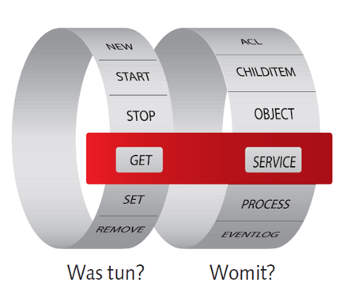
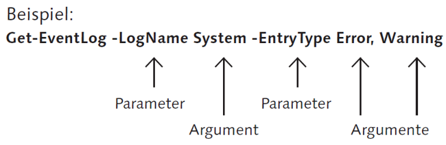
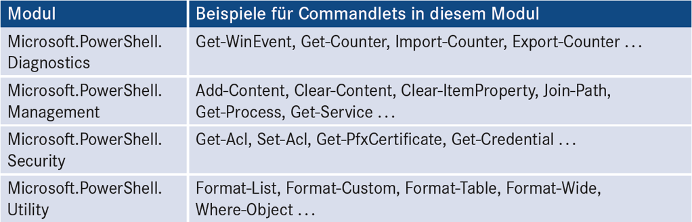
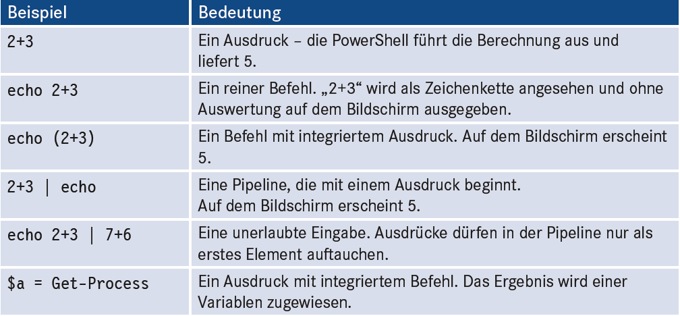

|                             |                               |                              |
| --------------------------- | ----------------------------- | ---------------------------- |
| **Techniker HF Informatik** | **Kurs Scripting / Big data** |  |

- [1. PowerShell Sprachelemente](#1-powershell-sprachelemente)
  - [1.1. Einzelbefehle der PowerShell](#11-einzelbefehle-der-powershell)
  - [1.2. Commandlets](#12-commandlets)
  - [1.3. Aufbau Cmdlets](#13-aufbau-cmdlets)
  - [1.4. Cmdlets – Parameter \& Attribute](#14-cmdlets--parameter--attribute)
  - [1.5. Cmdlets – Allg. Parameter](#15-cmdlets--allg-parameter)
  - [1.6. Module](#16-module)
  - [1.7. Alias](#17-alias)
  - [1.8. Ausdrücke](#18-ausdrücke)
- [2. Hilfe-System / Hilfefunktionen](#2-hilfe-system--hilfefunktionen)
  - [2.1. Cmdlets – Hilfe](#21-cmdlets--hilfe)
  - [2.2. Cmdlets – Get-Help](#22-cmdlets--get-help)
  - [2.3. Cmdlets – Get-Command](#23-cmdlets--get-command)
  - [2.4. Cmdlets – Get-Member](#24-cmdlets--get-member)
  - [2.5. Updatable Help System](#25-updatable-help-system)
- [3. Aufgaben](#3-aufgaben)
  - [3.1. Gruppenarbeit „Skriptsprachen“](#31-gruppenarbeit-skriptsprachen)
  - [3.2. PowerShell Einführung](#32-powershell-einführung)
  - [3.3. Systeminformationen](#33-systeminformationen)

---

</br>

# 1. PowerShell Sprachelemente

## 1.1. Einzelbefehle der PowerShell

Die PowerShell kennt folgende Arten von Einzelbefehlen:

- Commandlets (inkl. Funktionen)
- Aliase
- Ausdrücke
- Externe Befehle
- Dateinamen

## 1.2. Commandlets

Die Powershell Befehle werden Commandlet (kurz: Cmdlet) benannt.

Ein Commandlet besteht typischerweise aus **drei Teilen**:

- einem Verb,
- einem Substantiv und
- einer (optionalen) Parameterliste.

**Verb** und **Substantiv** werden durch einen **Bindestrich "-"** voneinander getrennt, die optionalen Parameter durch Leerzeichen.
`Verb-Substantiv [-Parameterliste]`

Beispiel:

```powershell
Get-Process
```

## 1.3. Aufbau Cmdlets

- Alle **Cmdlets** folgen denselben Namenskonventionen.
- Jeder Bezeichner beginnt mit einem **Verb**, dann ein **Minuszeichen** und zuletzt ein **Subjekt**, mit dem die Art der zu verarbeitenden Daten bestimmt wird.
- Die Gross-/ Kleinschreibung ist dabei grundsätzlich egal.



## 1.4. Cmdlets – Parameter & Attribute

- Auch die Übergabe von Parametern und Attributen folgt bei jedem Cmdlet denselben Regeln.
- Parameter werden immer mit einem Minuszeichen eingeleitet. Argumente bestimmen den Wert des jeweiligen Parameters.
- Soll ein Parameter mit mehr als einem Argument belegt werden (im Beispiel `-EntryType`), werden diese mit einem Komma getrennt



## 1.5. Cmdlets – Allg. Parameter

Es gibt einige Parameter, die in vielen (aber nicht allen) **Commandlets** vorkommen.

- **`-Force`**: Eine Aktion wird erzwungen, keine Abfrage
- **`-Whatif`**: («**Was wäre wenn**»): Die Aktion wird nicht ausgeführt, Simulation
- **`-Confirm`**: Der Benutzer erhält eine Nachfrage für jede Änderungsaktion
- **`-ErrorAction`**: (abgekürzt -ea) und -WarningAction (-wa): Error Handling
- **`-Verbose`**: Das Commandlet liefert eine detaillierte Bildschirmausgabe
…

## 1.6. Module

- Die **Commandlets** und Funktionen sind in Modulen organisiert.
- Diese werden bei Bedarf automatisch (Module Auto-Loading) geladen.
- Der eigentliche Import des Moduls erfolgt dann beim ersten Aufruf eines Befehls aus einem Modul.



## 1.7. Alias

Durch sogenannte **Aliase** kann die Eingabe von **Commandlets** verkürzt werden. So ist `ps` als **Alias** für `Get-Process` oder `help` für `Get-Help` vordefiniert.
Statt `Get-Process i*` kann also auch geschrieben werden: `ps i*`.

Durch Angabe eines Namens bei Get-Alias erhält man die Bedeutung eines Alias.

```powershell
Get-Alias pgs
```

Vordefinierte Aliase:

- `cls` => `Clear-Host`
- `del` => `Remove-Item`

## 1.8. Ausdrücke

Ausdrücke, z.B. mathematische Ausdrücke können als Befehl direkt in die Powershell eingegeben werden.

```powershell
# Mathematische Ausdrücke
10 * (8 + 6)
```

```powershell
# Zeichenkettenausdrücke wie
"Hello " + " " + "World" 
```



---

# 2. Hilfe-System / Hilfefunktionen

## 2.1. Cmdlets – Hilfe

- Powershell bringt eine umfangreiche Hilfe mit
- Oft schwierig die vorliegende Hilfe zu finden
- Folgende Befehle bilden die Grundausrüstung
  - **`Get-Help`**
  - **`Get-Command`**
  - **`Get-Member`**


## 2.2. Cmdlets – Get-Help

Einen Hilfetext zu einem Commandlet bekommt man über `Get-Help cmdletname`.
Dabei kann man durch die Parameter `-detailed` und `-full` mehr Hilfe erhalten.

```powershell
# Get-Help liefert die Befehlssyntax und 
# Beispiele für jedes Powershell Command.
Get-Help CMDLET               # (Befehlsübersicht)
Get-Help CMDLET -Full         # (Gesamte Information) 
Get-Help CMDLET -Detailed     # (Detaillierte Informationen)
Get-Help CMDLET -Examples     # (Einsatzbeispiele)
Get-Help CMDLET –Parameter *  # (Hilfe zu den Parametern) 
```

## 2.3. Cmdlets – Get-Command

Mit `Get-Command` kann man einerseits nach **cmdlets** für eine bestimmte Aufgabe suchen, aber auch interessante Informationen über cmdlets auslesen.
In PowerShell 5.0 unter Win10 gibt es inzwischen **340 cmdlets**

z.B.
Es sollen **Cmdlets** herausgefiltert werden, mit denen Prozesse verwaltet werden können

```powershell
Get-Command –Commandtype cmdlet *process* | Format-Table Name -Auto
```

```powershell
# Ausgabe
Name         
Debug-Process
Get-Process  
Start-Process
Stop-Process 
Wait-Process  
```

Das cmdlet `Get-Command` hat in der Powershell 3.0 den neuen Positionsparameter `-Parametername` bekommen, mit dem sich **cmdlets** nach bestimmten Parametern filtern lassen

z.B.
Dadurch lassen sich die **Cmdlets** herausfinden, mit denen sich besonders einfach Remotemaschinen verwalten lassen

```powershell
Get-Command -ParameterName Computername

# Ausgabe gekürzt
CommandType     Name 
Cmdlet          Add-Computer
Cmdlet          Clear-EventLog
Cmdlet          Connect-PSSession 
```

## 2.4. Cmdlets – Get-Member

Der Umgang mit `Get-Member` ist Voraussetzung, um die Mächtigkeit von Powershell ausnutzen zu können.
Der Aufruf von `Get-Member` ohne Parameter liefert alle default Methoden und Eigenschaften eines **cmdlets** oder **Objekts**.

z.B.
Default Methoden und Eigenschaften des Cmdlets Get-Date bestimmen.

```powershell
Get-Date | Get-Member 

# Ausgabe gekürzt
TypeName: System.DateTime

ToLongTimeString     Method         string ToLongTimeString()
ToString             Method         string ToString(), string 
…  

(Get-Date).Date               #<-Property
(Get-Date).ToLongTimeStram()  #<-Methoden mit ()
```

**Beispiel: Erforschen eines String Objects:**

```powershell
$String = "Mein Freund Karl Napf"
$String | Get-Member 

#Ausgabe gekürzt
TypeName: System.String
Name             MemberType            Definition
Replace          Method                string Replace(char oldChar, char newChar), string Replace(string oldValue, s.
Substring        Method                string Substring(int startIndex), string Substring(int startIndex, int length)
ToCharArray      Method                char[] ToCharArray(), char[] ToCharArray(int startIndex, int length)
ToLower          Method                string ToLower(), string ToLower(System.Globalization.CultureInfo culture)
ToLowerInvariant Method                string ToLowerInvariant()
ToString         Method                string ToString(), string ToString(System.IFormatProvider provider) 
```

## 2.5. Updatable Help System

Die Hilfe Dateien können aus der laufenden PowerShell heraus aktualisiert werden (**«Updatable Help System»**).

Die Ausführung des Commandlets `Update-Help` kontaktiert den Microsoft-Downloadserver (download.microsoft.com) und aktualisiert im laufenden Betrieb die Hilfedateien

**Beispiel:**

```powershell
#
# Version u. Help Update
#
Update-Help -UICulture en-US -Verbose -Force -ErrorAction SilentlyContinue

Get-Help Get-Help -Full

Get-Help Get-Help -Online  # Online Hilfe im Browser

# Online Hilfe
# https://docs.microsoft.com/en-us/powershell/scripting/powershell-scripting?view=powershell-6
```

---

</br>

# 3. Aufgaben

## 3.1. Gruppenarbeit „Skriptsprachen“

| **Vorgabe**             | **Beschreibung**                                                                                                                                      |
| :---------------------- | :---------------------------------------------------------------------------------------------------------------------------------------------------- |
| **Lernziele**           | Die Studierenden gewinnen eine Einsicht über die verschiedenen Skriptsprachen welche für die Entwicklung von kleinen Programmen zur Verfügung stehen. |
|                         | Sie verstehen die unterschiedlichen Merkmale und deren Einsatzgebiete                                                                                 |
|                         | Die Studierenden gewinnen eine Einsicht über die verschiedenen Skriptsprachen welche für die Entwicklung von kleinen Programmen zur Verfügung stehen. |
|                         | Sie verstehen die unterschiedlichen Merkmale und deren Einsatzgebiete                                                                                 |
| **Sozialform**          | Teamarbeit mit max. Grösse von 3-4 Personen                                                                                                           |
| **Auftrag**             | siehe unten                                                                                                                                           |
| **Hilfsmittel**         | ChatGPT / Google usw.                                                                                                                                 |
| **Erwartete Resultate** | Präsentation                                                                                                                                          |
| **Zeitbedarf**          | 45min (Arbeit)                                                                                                                                        |
|                         | 10min (Präsentation)                                                                                                                                  |
| **Lösungselmente**      | Markdown Dokument mit Code Beispielen                                                                                                                 |

**Auftrag:**

Ermitteln Sie alle wichtigen Informationen über die Ihnen zugeteilte Skriptsprache und erstellen Sie eine kleine Zusammenfassung.
Dabei sollen folgende Punkte untersucht werden:

- Betriebssystem (Verfügbarkeit)
- Spezifische Merkmale (Voraussetzungen, Typisierung, OOP, Remote, Modularisierung etc.)
- Einsatzbereich
- Beispiel zu einem kleinen Skriptprogramm

Stellen Sie Ihre Ergebnisse mittels einer Kurzpräsentation der Klasse vor. Verwenden Sie dabei die Hilfsmittel wie Flow-Charts, Video Beamer, Wandtafel usw. und verweisen Sie ggf. auf weitere die Literatur. Die Zusammenfassungen sind dann den anderen Klassenkameraden zur Verfügung zu stellen.

**Gruppen:**

In einzelnen Gruppen sollen folgende Scriptsprachen untersucht werden:

- VBScript
- PHP
- bash
- PowerShell
- Python
- Perl
- …

---

## 3.2. PowerShell Einführung

| **Vorgabe**             | **Beschreibung**                               |
| :---------------------- | :--------------------------------------------- |
| **Lernziele**           | Sie kennen einige Grundkonzepte von PowerShell |
|                         | Sie verstehen die Ausführungsrichtlinien       |
|                         | Sie können die Online Hilfe nutzen             |
|                         | Sie verstehen die Syntax von PowerShell        |
| **Sozialform**          | Gruppenarbeit                                  |
| **Auftrag**             | siehe unten                                    |
| **Hilfsmittel**         | Google / ChatGPT usw.                          |
| **Erwartete Resultate** | Präsentation                                   |
| **Zeitbedarf**          | 40min (Arbeit)                                 |
|                         | 5-10min (Präsentation)                         |
| **Lösungselmente**      | Markdown Dokument mit Code Beispielen          |

**Aufgabe:**

Recherchieren Sie die folgenden Grundkonzepte von PowerShell und fassen Sie die wichtigsten Informationen kurz zusammen.

**Gruppe 1 - Unterschied von PowerShell zu Eingabeaufforderung:**

- Vor- und Nachteile
- Warum gibt es PowerShell
- Typische Anwendungsbereiche

**Gruppe 2 - Ausführungsrichtlinien:**

- Sinn u. Zweck
- Für die Ausführung von PowerShell Skriptdateien
- Welche Möglichkeiten stehen zur Verfügung

**Gruppe 3 - Online Hilfe:**

- Aufruf und Anzeigemöglichkeiten
- Suchmöglichkeiten nach Befehlen (CmdLets)

**Gruppe 4 - Syntax von PowerShell Befehlen (allgemein):**

- Wie funktioniert PowerShell
- Min. 3 wichtige Befehle
- Befehlsparameter

---

## 3.3. Systeminformationen

| **Vorgabe**             | **Beschreibung**                                                |
| :---------------------- | :-------------------------------------------------------------- |
| **Lernziele**           | Sie können ein Skript auf Ihrem System ausführen                |
|                         | Sie können ein Skript im Editor analysieren und ggf. bearbeiten |
|                         | Sie können die Ausführungsrichtlinie korrekt einstellen         |
| **Sozialform**          | Einzelarbeit                                                    |
| **Auftrag**             | siehe unten                                                     |
| **Hilfsmittel**         |                                                                 |
| **Erwartete Resultate** |                                                                 |
| **Zeitbedarf**          | 15min                                                           |
| **Lösungselmente**      | Lauffähiger Skript                                              |

Speichere den Beispielskriptdatei lokal auf der Festplatte und führen den Skript aus.
Prüfe die korrekte Funktionsweise des Skripts und kontrolliere die Skriptausgabe.

[Beispiel Script](./x_gitres/get-systeminformation.ps1)

```powershell
<#
  .SYNOPSIS
  Kurzbeschreibung
  .DESCRIPTION
  Ausführliche Beschreibung
  .PARAMETER <ParameterName-1>
  Beschreibung des ersten Parameters
  .PARAMETER <ParameterName-N>
  Beschreibung des n. Parameters
  .EXAMPLE
  Beispielanwendung und -erläuterung
  .EXAMPLE
  Weitere Beispielanwendung und -erläuterung
  .NOTES
  Weitere Hinweise
  .LINK
  Angabe von URLs oder ähnlichen Cmdlets
#> 
# Set-ExecutionPolicy -ExecutionPolicy Unrestricted
#### HTML Output Formatting #######
$a = "<style>"
$a = $a + "BODY{background-color:Lavender ;}"
$a = $a + "TABLE{border-width: 1px;border-style: solid;border-color: black;border-collapse: collapse;}"
$a = $a + "TH{border-width: 1px;padding: 0px;border-style: solid;border-color: black;background-color:thistle}"
$a = $a + "TD{border-width: 1px;padding: 0px;border-style: solid;border-color: black;background-color:PaleGoldenrod}"
$a = $a + "</style>"
################################################################################################
###### Global variables ####
$vUserName = (Get-Item env:\username).Value         ## This will get username using environment variable
$vComputerName = (Get-Item env:\Computername).Value     ## this is computer name using environment variable
$filepath = (Get-ChildItem env:\userprofile).value    ## this is user profile  using environment variable

ConvertTo-Html -Title "System Information for $vComputerName" -Body "<h1> Computer Name : $vComputerName </h1>" >  "$filepath\$vComputerName.html" 
################################################
#  Hardware Information
#################################################
ConvertTo-Html -Body "<H1>HARDWARE INFORMATION </H1>" >> "$filepath\$vComputerName.html"

Get-WmiObject win32_bios -ComputerName $vComputerName | 
  Select-Object Status,Version,PrimaryBIOS,Manufacturer,ReleaseDate,SerialNumber | 
  ConvertTo-html -Body "<H2> BIOS Information</H2>" >>  "$filepath\$vComputerName.html"
                      
Get-WmiObject win32_DiskDrive -ComputerName $vComputerName | 
  Select-Object Model,SerialNumber,Description,MediaType,FirmwareRevision |
  ConvertTo-html -Body "<H2> Physical DISK Drives </H2>" >>  "$filepath\$vComputerName.html"
get-WmiObject win32_networkadapter -ComputerName $vComputerName | 
  Select-Object Name,Manufacturer,Description ,AdapterType,Speed,MACAddress,NetConnectionID | 
  ConvertTo-html -Body "<H2> Network Adapters</H2>" >>  "$filepath\$vComputerName.html"
                      
################################################
#  OS Information
#################################################
ConvertTo-Html -Body "<H1>OS INFORMATION </H1>" >> "$filepath\$name.html" 
get-WmiObject win32_operatingsystem -ComputerName $vComputerName | 
  Select-Object Caption,Organization,InstallDate,OSArchitecture,Version,SerialNumber,BootDevice,WindowsDirectory,CountryCode | 
  ConvertTo-html -Body "<H2> Operating System Information</H2>" >>  "$filepath\$vComputerName.html"
                      
Get-WmiObject win32_logicalDisk -ComputerName $vComputerName | 
  Select-Object DeviceID,VolumeName,@{Expression={$_.Size /1Gb -as [int]};Label="Total Size(GB)"}, @{Expression={$_.Freespace / 1Gb -as [int]};Label="Free Size (GB)"} | 
  ConvertTo-html -Body "<H2> Logical DISK Drives </H2>" >>  "$filepath\$vComputerName.html"
                     
Get-WmiObject Win32_NetworkAdapterConfiguration -ComputerName $vComputerName |
    Select-Object Description, 
        DHCPServer, 
        @{Name='IpAddress';Expression={$_.IpAddress -join '; '}}, 
        @{Name='IpSubnet';Expression={$_.IpSubnet -join '; '}}, 
        @{Name='DefaultIPgateway';Expression={$_.DefaultIPgateway -join '; '}}, 
        @{Name='DNSServerSearchOrder';Expression={$_.DNSServerSearchOrder -join '; '}}, 
        WinsPrimaryServer, 
        WINSSecondaryServer | 
    ConvertTo-html -Body "<H2>IP Address </H2>" >>  "$filepath\$vComputerName.html"                      


################################################
#  OS Information
#################################################
ConvertTo-Html -Body "<H1>SOFTWARE INFORMATION </H1>" >> "$filepath\$vComputerName.html"
Get-WmiObject win32_startupCommand -ComputerName $vComputerName | 
  Select-Object Name,Location,Command,User,caption | 
  ConvertTo-html  -Body "<H2>Startup Softwares</H2>" >>  "$filepath\$vComputerName.html"
Get-WmiObject win32_process -ComputerName $vComputerName | 
  Select-Object Caption,ProcessId,@{Expression={$_.Vm /1mb -as [Int]};Label="VM (MB)"},@{Expression={$_.Ws /1Mb -as [Int]};Label="WS (MB)"} |
  Sort-Object "Vm (MB)" -Descending | 
  ConvertTo-html -Head $a -Body "<H2> Running Processes</H2>" >>  "$filepath\$vComputerName.html"
                     
Get-WmiObject win32_Service  | 
  Where-Object {$_.StartMode -eq "Auto" -and $_.State -eq "stopped"} |  
  Select-Object Name,StartMode,State | 
  ConvertTo-html  -Head $a -Body "<H2> Services </H2>" >>  "$filepath\$vComputerName.html"                     
                     
$Report = "The Report is generated On  $(get-date) by $((Get-Item env:\username).Value) on computer $((Get-Item env:\Computername).Value)"
$Report  >> "$filepath\$vComputerName.html" 
invoke-Expression "$filepath\$vComputerName.html"  
#################### END of SCRIPT ####################################
```
