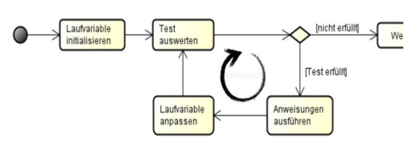
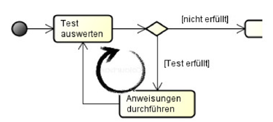

|                             |                               |                                 |
| --------------------------- | ----------------------------- | ------------------------------- |
| **Techniker HF Informatik** | **Kurs Scripting / Big data** |  |

- [1. Powershell-Kontrollstrukturen](#1-powershell-kontrollstrukturen)
  - [1.1. Lernziele](#11-lernziele)
  - [1.2. Bedingungen \& Vergleichsoperatoren](#12-bedingungen--vergleichsoperatoren)
  - [1.3. IF / ELSEIF / ELSE — Entscheidungen](#13-if--elseif--else--entscheidungen)
  - [1.4. SWITCH – mächtige Mehrfachentscheidung](#14-switch--mächtige-mehrfachentscheidung)
  - [1.5. Schleifen – Wiederholung](#15-schleifen--wiederholung)
    - [1.5.1. foreach – objektorientierte Standardschleife](#151-foreach--objektorientierte-standardschleife)
    - [1.5.2. for – zählgesteuerte Schleife](#152-for--zählgesteuerte-schleife)
  - [1.6. Pipeline‑Schleife: ForEach-Object](#16-pipelineschleife-foreach-object)
  - [1.7. while – Schleife mit Vorbedingung](#17-while--schleife-mit-vorbedingung)
  - [1.8. do { … } while/until – Nachbedingung](#18-do----whileuntil--nachbedingung)
  - [1.9. Schleifensteuerung: break \& continue](#19-schleifensteuerung-break--continue)
  - [1.10. continue – fahre mit nächstem Durchlauf fort](#110-continue--fahre-mit-nächstem-durchlauf-fort)
- [2. Aufgaben](#2-aufgaben)
  - [2.1. Kontrollstrukturen implementieren](#21-kontrollstrukturen-implementieren)
  - [2.2. Skript mit Variablen erstellen](#22-skript-mit-variablen-erstellen)

</br>

# 1. Powershell-Kontrollstrukturen

## 1.1. Lernziele

- Erklären, was Kontrollstrukturen sind und warum sie essenziell für Automatisierung sind,
- Bedingungen und Entscheidungen mit `if`, `elseif`, `else` korrekt formulieren,
- mehrere Entscheidungswege effizient mit `switch` abbilden,
- Schleifen zur wiederholten Verarbeitung nutzen: `for`, `foreach`, `while`, `do/until`,
- Schleifen steuern mit `break`, `continue`, `Labels`,
- typische Fehlerquellen vermeiden (Endlosschleifen, falsche Bedingungen, $null‑Vergleiche),
- diese Bausteine kombinieren und in eigenen Skripten einsetzen.

## 1.2. Bedingungen & Vergleichsoperatoren

| **Operator** | **Beschreibung**         |
| ------------ | ------------------------ |
| `-eq`        | gleich                   |
| `-ne`        | ungleich                 |
| `-gt`        | grösser als              |
| `-ge`        | grösser/gleich           |
| `-lt`        | kleiner als              |
| `-le`        | kleiner/gleich           |
| `-like`      | Wildcards (z. B. 'Win*') |
| `-match`     | Regex                    |

## 1.3. IF / ELSEIF / ELSE — Entscheidungen

```powershell
if (<Bedingung>) {
    # Block A
}
elseif (<Bedingung>) {
    # Block B
}
else {
    # Block C
}
```

**Beispiel:**

```powershell
$size = 800MB

if ($size -gt 1GB) {
    "Sehr grosse Datei"
}
elseif ($size -gt 500MB) {
    "Grosse Datei"
}
else {
    "Normale Datei"
}
```

## 1.4. SWITCH – mächtige Mehrfachentscheidung

`switch` ist klarer und effizienter, wenn viele Fälle oder Muster geprüft werden müssen.

```powershell
switch ($value) {
    'start'  { "Starte Service" }
    'stop'   { "Stoppe Service" }
    default  { "Unbekannter Befehl" }
}
```

**Beispiel:**

```powershell
$age = 17
switch ($age) {
    { $_ -ge 18 } { "Volljährig"; break }
    { $_ -ge 16 } { "Jugendlich" }
    default { "Kind" }
}
```

## 1.5. Schleifen – Wiederholung

### 1.5.1. foreach – objektorientierte Standardschleife

Ideal für Objektlisten (Dateien, Dienste, Prozesse).

```powershell
foreach ($file in Get-ChildItem -File) {
    "$($file.Name) – $($file.Length) Bytes"
}
```

### 1.5.2. for – zählgesteuerte Schleife

Nützlich für Indizes oder feste Wiederholungen.



```powershell
for ($i = 1; $i -le 5; $i++) {
    "Durchlauf $i"
}
```

## 1.6. Pipeline‑Schleife: ForEach-Object

Nützlich, wenn ohnehin in der Pipeline gearbeitet wird.

```powershell
Get-ChildItem -File |
  ForEach-Object {
    if ($_.Length -gt 10MB) { "Gross: $($_.Name)" }
  }
```

## 1.7. while – Schleife mit Vorbedingung



```powershell
$count = 0
while ($count -lt 3) {
    "count=$count"
    $count++
}
```

## 1.8. do { … } while/until – Nachbedingung

> **Mindestens ein Durchlauf**

```powershell
do {
    $n = Read-Host "Zahl eingeben"
} while ($n -ne 5)
```

> **Durchlauf bis Bedingung erfüllt ist**

```powershell
do {
    $n = Get-Random -Minimum 1 -Maximum 10
} until ($n -eq 7)
```

## 1.9. Schleifensteuerung: break & continue

`break` – beende die aktuelle Schleife

```powershell
foreach ($n in 1..10) {
    if ($n -eq 5) { break }
    $n
}
```

## 1.10. continue – fahre mit nächstem Durchlauf fort

```powershell
foreach ($n in 1..10) {
    if ($n % 2 -eq 0) { continue } # Überspringe gerade Zahlen
    $n
}
```

</br>

---

# 2. Aufgaben

## 2.1. Kontrollstrukturen implementieren

| **Vorgabe**             | **Beschreibung**                                                        |
| :---------------------- | :---------------------------------------------------------------------- |
| **Lernziele**           | Bedingungen und Entscheidungen mit if, elseif, else korrekt formulieren |
|                         | mehrere Entscheidungswege effizient mit switch abbilden                 |
|                         | Schleifen zur wiederholten Verarbeitung nutzen                          |
| **Sozialform**          | Einzelarbeit                                                            |
| **Hilfsmittel**         |                                                                         |
| **Erwartete Resultate** |                                                                         |
| **Zeitbedarf**          | 10 min                                                                  |
| **Lösungselemente**     | PowerShell Datei mit sämtlichen Lösungen                                |

**A1: If/Else: Dateigrössen prüfen:**

Schreibe ein Skript, das:

- Ein Verzeichnis einliest
- Jede Datei klassifiziert:
  - 10 MB → „Gross“
  - 1–10 MB → „Mittel“
  - < 1 MB → „Klein“

**A2: Switch: Dateiarten erkennen:**

Erstelle ein Skript, das Dateiendungen klassifiziert:

- .log → „Protokoll“
- .csv → „Daten“
- .ps1 → „Skript“
- alle anderen → „Sonstiges“

**A3: While/Do‑Until: Retry‑Mechanismus:**

Erstelle einen Retry‑Mechanismus:

- Versuche bis zu 5‑mal eine Datei zu löschen
- Wenn gesperrt: 2 Sekunden warten
- Bei Erfolg → Ausgeben „Erfolgreich“
- Bei 5 Fehlversuchen → Fehlermeldung

**A4: Schleifensteuerung:**

Durchsuche mehrere Verzeichnisse nach Dateien, die mit STOP beginnen.
Sobald eine gefunden wird → Schleife sofort komplett verlassen.

---

## 2.2. Skript mit Variablen erstellen

| **Vorgabe**             | **Beschreibung**                                                                                               |
| :---------------------- | :------------------------------------------------------------------------------------------------------------- |
| **Lernziele**           | Die Teilnehmer sind in der Lage, in Skript Dateien Variablen für Objekte und Objektmengen korrekt einzusetzen. |
|                         | Sie kennen die mathematischen Operatoren und können diese in Berechnungen korrekt anwenden.                    |
| **Sozialform**          | Einzelarbeit                                                                                                   |
| **Hilfsmittel**         |                                                                                                                |
| **Erwartete Resultate** |                                                                                                                |
| **Zeitbedarf**          | 50 min                                                                                                         |
| **Lösungselemente**     | PowerShell Datei mit sämtlichen Lösungen                                                                       |

**A1:**

a) Vergleichen Sie, ob «Hans» mit «hans» identisch sind (einmal mit und einmal ohne Unterscheidung von Gross- und Kleinschreibung).

b) Prüfen Sie, ob 74/3 grösser oder gleich 24.6 ist

c) Finden Sie heraus, ob im Wert der Variablen $HOME der Buchstabe o enthalten ist.

---

**A2:**

a) Speichern Sie einen Wert zwischen 1 und 10 in einer Variablen. Fragen Sie ab, ob der Wert grösser als 5 ist, und geben Sie den Text «Wert ist grösser als 5» aus, wenn die Bedingung zutrifft.

b) Erweitern Sie das Beispiel: Prüfen Sie, ob der Variablenwert gleich 5 ist, und geben Sie in dem Fall den Text «Wert ist gleich 5» aus.

c) Erweitern Sie nochmals das Beispiel: Geben Sie jetzt nur noch für alle anderen Fälle den Text «Wert ist kleiner als 5» aus.

---

**A3:**
Legen Sie eine Variable $note an und weisen Sie ihr einen Wert zwischen 1 und 6 zu.
Verwenden Sie die Switch Anweisung, um für die Werte die entsprechenden Texte gemäss der folgenden Tabelle auszugeben.
Experimentieren Sie mit verschiedenen Werten.

| **Note** | **Text**     |
| -------- | ------------ |
| 1        | Ungenügend   |
| 2        | Mangelhaft   |
| 3        | Ausreichend  |
| 4        | Befriedigend |
| 5        | Gut          |
| 6        | Sehr gut     |

---

**A4:**
Programmieren Sie eine Schleife, die die Werte 10 bis 100 in Zehnerschritten ausgibt.

---

**A5:**
Geben Sie mithilfe einer For Schleife die ganzen Vielfachen der Zahl 5 bis zum Wert 100 aus.
