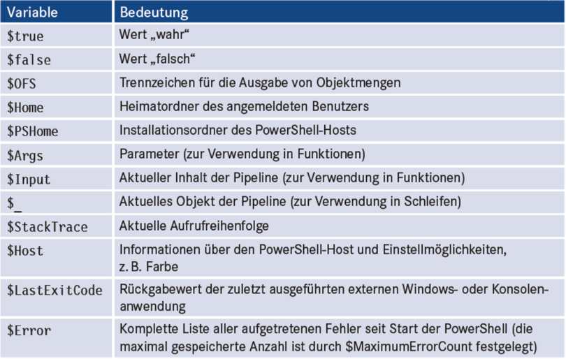

|                             |                          |                                 |
| --------------------------- | ------------------------ | ------------------------------- |
| **Techniker HF Informatik** | **Scripting / Big data** |  |

- [1. Powershell-Variablen](#1-powershell-variablen)
  - [1.1. Lernziele](#11-lernziele)
  - [1.2. Was ist eine Variable in PowerShell?](#12-was-ist-eine-variable-in-powershell)
  - [1.3. Benennung \& Sichtbarkeit](#13-benennung--sichtbarkeit)
  - [1.4. Datentypen: dynamisch vs. explizit](#14-datentypen-dynamisch-vs-explizit)
  - [1.5. Typisierungszwang](#15-typisierungszwang)
  - [1.6. Variablenbedingungen](#16-variablenbedingungen)
  - [1.7. Vordefinierte Variablen](#17-vordefinierte-variablen)
  - [1.8. Sonderzeichen](#18-sonderzeichen)
  - [1.9. Wichtige Datentypen](#19-wichtige-datentypen)
    - [1.9.1. Strings \& Interpolation](#191-strings--interpolation)
    - [1.9.2. Here-Strings (mehrzeilig)](#192-here-strings-mehrzeilig)
    - [1.9.3. Formatierung mit -f](#193-formatierung-mit--f)
    - [1.9.4. Stringfunktionen](#194-stringfunktionen)
    - [1.9.5. Zahlen (int, long, double, decimal)](#195-zahlen-int-long-double-decimal)
    - [1.9.6. Arrays \& Listen](#196-arrays--listen)
    - [1.9.7. Hashtables (Key/Value) \& geordnete Hashtables](#197-hashtables-keyvalue--geordnete-hashtables)
    - [1.9.8. Objekte (PSCustomObject)](#198-objekte-pscustomobject)
  - [1.10. Variable Scope \& Lebensdauer](#110-variable-scope--lebensdauer)
  - [1.11. Preference Variables (Auswahl)](#111-preference-variables-auswahl)
  - [1.12. Umgebungsvariablen ($env: Drive)](#112-umgebungsvariablen-env-drive)
  - [1.13. Sicherheit \& sensible Werte](#113-sicherheit--sensible-werte)
  - [1.14. Beispiel](#114-beispiel)
  - [1.15. Reguläre Ausdrücke](#115-reguläre-ausdrücke)
- [2. Aufgaben](#2-aufgaben)
  - [2.1. Skript erstellen - Pfad prüfen](#21-skript-erstellen---pfad-prüfen)

# 1. Powershell-Variablen

## 1.1. Lernziele

- Variablen korrekt deklarieren, typisieren, zuweisen und auslesen.
- Datentypen (Strings, Zahlen, Arrays, Hashtables, Objekte) sicher verwenden.
- Variable Scopes und Lebenszyklen verstehen und zielgerichtet einsetzen.
- Besondere Variablen (Automatic/Preference/Umgebungsvariablen) kennen und korrekt handhaben.
- Interpolation, Formatierung und Splatting im Alltag nutzen.
- Null‑Semantik, Kultur‑/Encoding-Aspekte und Sicherheit berücksichtigen.

## 1.2. Was ist eine Variable in PowerShell?

Eine Variable ist ein benannter Speicherplatz, in dem zur Laufzeit Objekte referenziert werden. PowerShell ist dynamisch typisiert jede Variable kann grundsätzlich jedes .NET‑Objekt halten.

```powershell
$greeting = "Hallo Welt"         # String
$count    = 42                   # Int32
$price    = 19.95                # Double
$today    = Get-Date             # DateTime (Objekt)
```

> **Merke: PowerShell arbeitet objektbasiert – Variablen verweisen auf Objekte, nicht auf reinen Text.**

## 1.3. Benennung & Sichtbarkeit

- **Syntax:** Variablennamen beginnen mit `$` und bestehen aus Buchstaben/Ziffern/_; Gross/Kleinschreibung ist nicht relevant (case-insensitive).
- **Empfehlung:** kebab_case vermeiden, stattdessen **camelCase** bzw. **PascalCase** verwenden.
- **Einfachheit:** schlägt Cleverness: Bezeichner klar und sprechend wählen.

```powershell
# Gute Namen
$userName = "Lukas"
$maxRetries = 3
```

## 1.4. Datentypen: dynamisch vs. explizit

```powershell
# Implizit typisiert, Dynamisch (Standard)
$value = "123"     # String
$value = 123       # nun Int32 – zulässig

# Explizit (stark typisiert), die Typinformation erzwingen, um Fehler früh zu erkennen.
[int]$year = 2026               # Erzwinge Int32
[string]$code = 123             # Autokonvertierung: "123"
[datetime]$when = "2026-02-02"  # Parsing zu DateTime

# ReadOnly/Constant:
# ReadOnly lässt sich mit -Force überschreiben; Constant nicht (nur im gleichen Scope während der Definition).
Set-Variable -Name AppName -Value "BackupTool" -Option ReadOnly
Set-Variable -Name ApiKey  -Value "ABC..."     -Option Constant
```

## 1.5. Typisierungszwang

Variablen müssen nicht explizit deklariert werden und es besteht bei Schreibfehlern die Gefahr, dass es unerwünschte Effekte gibt.

Typisierungszwang einschalten mit:

```powershell
Set-StrictMode -Version 4.0 
```

## 1.6. Variablenbedingungen

Powershell kann zu Variablen Bedingungen abgelegt, diese werden bei Zuweisungen geprüft.

Gültige Zuweisungen bei Initialisierung:

```powershell
[ValidateRange(0,1000)] [int] $BenutzerAnzahl = 0
[ValidateLength(1,15)] [string] $benutzername = "Muster"
[ValidateScript({$_.StartsWith("I")})] [string] $Domain = "ITV“

[ValidatePattern("(\w[-._\w]*\w@\w[-._\w]*\w\.\w{2,3})")] 
[string] $BenutzerEMail = "muster@schule.ch"
```

**Ungültige Zuweisungen:**

```powershell
$BenutzerAnzahl = -1
$BenutzerEMail = "Unsinn" 
```

## 1.7. Vordefinierte Variablen



## 1.8. Sonderzeichen

Sonderzeichen werden in PowerShell mit dem Gravis [`] eingeleitet.

| **Zeichen** | **Beschreibung**             |
| ----------- | ---------------------------- |
| [`a]        | Ton (Beep)                   |
| [`b]        | Backspace                    |
| [`f]        | Form Feed (für Drucker)      |
| [`n]        | New Line                     |
| [`r]        | Carriage Return              |
| [`r`n]      | Carriage Return und New Line |
| [`t]        | Tabulator                    |

## 1.9. Wichtige Datentypen

### 1.9.1. Strings & Interpolation

- Single Quotes '...' → **keine** Interpolation.
- Double Quotes "..." → Interpolation von Variablen und Sub‑Expressions $().

```powershell
$name = "Lukas"
'Hallo $name'         # => Hallo $name
"Hallo $name"         # => Hallo Lukas
"Summe: $(2+3)"       # => Summe: 5
```

### 1.9.2. Here-Strings (mehrzeilig)

```powershell
$text = @"
Hallo $name,
dies ist ein mehrzeiliger Text mit Interpolation.
"@
```

### 1.9.3. Formatierung mit -f

```powershell
"{0:yyyy-MM-dd} - {1:N2}" -f (Get-Date), 12345.6789
```

### 1.9.4. Stringfunktionen

Methoden der .NET Klasse System.String
Alle Methoden anzeigen:

```console
PS> "" | get-member -MemberType Method 
```

Auszug der String-Funktionen:

- `Clone()`
- `CompareTo()`
- `Contains()`
- `CopyTo()`

### 1.9.5. Zahlen (int, long, double, decimal)

```powershell
[int]   $i = 42
[long]  $l = 9007199254740991
[double]$d = 19.95
[decimal]$m = [decimal]19.95  # Geld/Cents sicherer als double
```

### 1.9.6. Arrays & Listen

```powershell
# Implizites Array durch Kommaoperator
$numbers = 1,2,3,4
$numbers[0]        # 1
$numbers.Count     # 4

# Explizit
[int[]]$ids = 1001,1002,1003

# Dynamisch erweitern
$numbers += 5
```

### 1.9.7. Hashtables (Key/Value) & geordnete Hashtables

```powershell
$map = @{ Name = "Lukas"; Role = "Admin"; Active = $true }
$map["Role"]         # Admin
$map.Active          # True

# Geordnet (Einfügereihenfolge)
$ordered = [ordered]@{ A = 1; B = 2; C = 3 }
$ordered.Keys        # A B C (in der Reihenfolge)
```

### 1.9.8. Objekte (PSCustomObject)

```powershell
$user = [PSCustomObject]@{
    Name   = "Lukas Müller"
    City   = "Lengnau"
    Active = $true
}
$user.Name
```

## 1.10. Variable Scope & Lebensdauer

Scopes bestimmen, wo eine Variable sichtbar ist:

- `$local`: (Standard): innerhalb der aktuellen Funktion/Datei/Skriptblock.
- `$script`: innerhalb dieser Skriptdatei.
- `$global`: global in der Sitzung (sparsam verwenden!).
- `$private`: auf den aktuellen Block beschränkt (verhindert „Durchsickern“).
- `$using`: Übergabe in Remoting/Jobs.

> **Best Practice: So lokal wie möglich, so global wie nötig.**

## 1.11. Preference Variables (Auswahl)

Steuern Verhalten (z. B. Meldungen, Fehler):

- `$ErrorActionPreference` (Continue, Stop, SilentlyContinue, Inquire)
- `$WarningPreference, $VerbosePreference, $DebugPreference`
- `$ProgressPreference` (z.B. auf SilentlyContinue für Performance)

```powershell
$ErrorActionPreference = 'Stop'     # Fehler sollen Catch auslösen
$VerbosePreference     = 'Continue' # Verbose-Ausgaben erlauben
```

## 1.12. Umgebungsvariablen ($env: Drive)

Umgebungsvariablen sind Strings; Änderungen gelten prozessbezogen, sofern nicht im System/Benutzerprofil persistent gesetzt.

```powershell
$env:Path
$env:APPDATA
$env:MySetting = "123"
Remove-Item Env:MySetting
```

## 1.13. Sicherheit & sensible Werte

Passwörter nicht im Klartext in Variablen.
SecureString & PSCredential für Laufzeit:

```powershell
$secure = Read-Host "Passwort" -AsSecureString
$cred   = New-Object System.Management.Automation.PSCredential("DOMAIN\User", $secure)
```

## 1.14. Beispiel

```powershell
param([switch]$DebugMode)

$logFile = ".\script.log"
function Write-Log([string]$msg, [string]$level="INFO") {
  $ts = Get-Date -Format "yyyy-MM-dd HH:mm:ss"
  "$ts [$level] $msg" | Out-File $logFile -Append -Encoding utf8
  if ($level -eq "DEBUG" -and -not $DebugMode) { return }
}

Write-Log "Start"
Write-Log "Nur im Debug sichtbar" "DEBUG"
```

## 1.15. Reguläre Ausdrücke

Prüfen von regulären Ausdrücken mit:

- `-match`
- `-cmatch`
- `-notmatch`
- `-inotmatch`

**Beispiel:**

```powershell
$Muster = "^[A-Z0-9._%+-]+@[A-Z0-9.-]+\.[A-Z]{2,4}$"
$Eingabe1 = "max@muster.ch"
$Ergebnis1 = $Eingabe1 -match $Muster 
```

</br>

---

# 2. Aufgaben

## 2.1. Skript erstellen - Pfad prüfen

| **Vorgabe**             | **Beschreibung**                                                                                               |
| :---------------------- | :------------------------------------------------------------------------------------------------------------- |
| **Lernziele**           | Die Teilnehmer sind in der Lage, in Skript Dateien Variablen für Objekte und Objektmengen korrekt einzusetzen. |
|                         | Sie kennen die mathematischen Operatoren und können diese in Berechnungen korrekt anwenden.                    |
| **Sozialform**          | Einzelarbeit                                                                                                   |
| **Hilfsmittel**         |                                                                                                                |
| **Erwartete Resultate** |                                                                                                                |
| **Zeitbedarf**          | 20 min                                                                                                         |
| **Lösungselemente**     | PowerShell Datei mit sämtlichen Lösungen                                                                       |

**A1:**

a) Erstellen Sie eine Variable $geld und weisen Sie ihr den Wert 68 zu.
b) Teilen Sie den Wert mit einem weiteren Befehl durch 4. Nutzen Sie dafür einen möglichst kurzen Befehl.
c) Erstellen Sie eine Konstante $c_euro mit dem Wert Euro in meiner Geldbörse.
d) Lassen Sie den Satz «Ich habe x Euro in meiner Geldbörse» ausgeben. Anstelle des «x» sollt der Wert der Variablen $geld stehen.

**A2:**

a) Legen Sie eine Arrayvariable $prozesse an, die als Werte die Namen der aktuellen auf Ihrem System laufende Prozesse enthält.
b) Lassen Sie den 6. Eintrag des Arrays anzeigen.

**A3:**

Schreiben Sie für die Notendurchschnitt Berechnung ein Script, welches Sie zur Eingabe von Prüfungsnoten auffordert und danach die Durchschnittsnote ausgibt.
Die Aufforderung zur Noteneingabe wird mit der Eingabe von 0 beendet.

---

© 2026 Lukas Müller – Licensed under CC BY-NC-ND 4.0
See [LICENSE](..\license.md) file for details.
