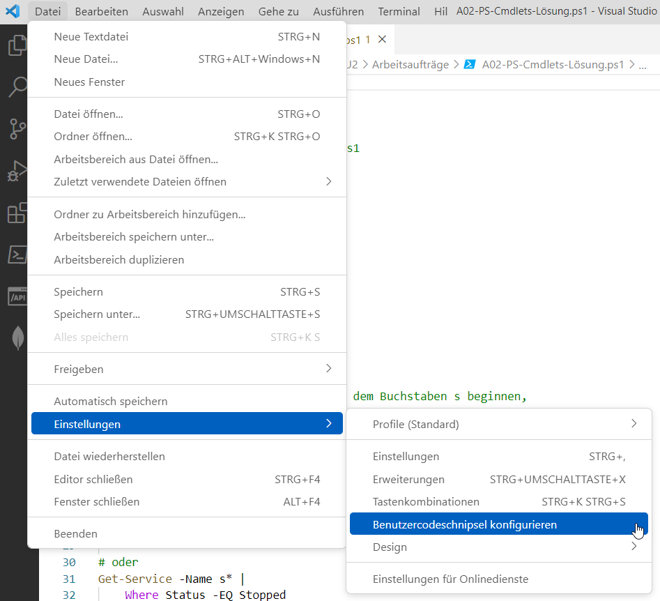

|                             |                          |                                 |
| --------------------------- | ------------------------ | ------------------------------- |
| **Techniker HF Informatik** | **Scripting / Big data** |  |

# 1. Visual Studio Code

## 1.1. Eigene Snippet's erstellen

- Der Visual-Studio-Code-Editor stellt viele nützliche Helfer wie die Standard-Snippets zur Verfügung.
- Damit können wiederkehrende Kommentare oder Programmiercodes schnell und ohne Tipparbeit eingefügt werden.



Mit nachfolgender Konfiguration wird das Snippet **"Comment Header"** erstellt.
Anschliessend kann der Standard-Dokumentations-Header über das entsprechende Snippet im Editor eingefügt werden.

```json
{
    "Comment Header": {
        "prefix": "comment",
            "body": [
                "<#",
                ".SYNOPSIS",
                "Kurzbeschreibung",
                ".DESCRIPTION",
                "Ausführliche Beschreibung",
                ".PARAMETER <ParameterName-1>",
                "Beschreibung des ersten Parameters",
                ".PARAMETER <ParameterName-N>",
                "Beschreibung des n. Parameters",
                ".EXAMPLE",
                "Beispielanwendung und -erläuterung",
                ".EXAMPLE",
                "Weitere Beispielanwendung und -erläuterung",
                ".NOTES",
                "Weitere Hinweise",
                ".LINK",
                "Angabe von URLs oder ähnlichen Cmdlets",
              "#>",
                "$2"
            ],
            "description": "Comment Header"
    }   
}
```

---

© 2026 Lukas Müller – Licensed under CC BY-NC-ND 4.0
See [LICENSE](..\license.md) file for details.
