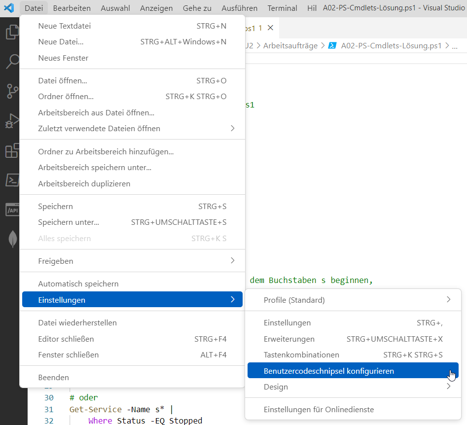

|                             |                          |                                 |
| --------------------------- | ------------------------ | ------------------------------- |
| **Techniker HF Informatik** | **Scripting / Big data** |  |

- [1. Visual Studio Code – Snippets](#1-visual-studio-code--snippets)
  - [1.1. Was sind Snippets?](#11-was-sind-snippets)
  - [1.2. Snippet-Datei öffnen und speichern](#12-snippet-datei-öffnen-und-speichern)
  - [1.3. Aufbau eines Snippets](#13-aufbau-eines-snippets)
    - [1.3.1. Tab-Stops und Platzhalter](#131-tab-stops-und-platzhalter)
  - [1.4. Snippet: Comment Header](#14-snippet-comment-header)
  - [1.5. Weitere nützliche Snippets für PowerShell](#15-weitere-nützliche-snippets-für-powershell)
    - [1.5.1. Snippet: try/catch/finally](#151-snippet-trycatchfinally)
    - [1.5.2. Snippet: param-Block](#152-snippet-param-block)
    - [1.5.3. Snippet: Funktion mit Logging](#153-snippet-funktion-mit-logging)
    - [1.5.4. Snippet: foreach-Schleife](#154-snippet-foreach-schleife)
  - [1.6. Vollständige powershell.json](#16-vollständige-powershelljson)
- [2. Aufgaben](#2-aufgaben)
  - [2.1. Eigenes Snippet erstellen](#21-eigenes-snippet-erstellen)

---

</br>

# 1. Visual Studio Code – Snippets

## 1.1. Was sind Snippets?

Snippets sind **wiederverwendbare Code-Vorlagen**, die per Kürzel (Prefix) im Editor eingefügt werden.
Sie vermeiden Tipparbeit, reduzieren Fehler und sorgen für konsistente Codestruktur im ganzen Team.

VS Code bringt viele Standard-Snippets mit – eigene können pro Sprache ergänzt werden.



## 1.2. Snippet-Datei öffnen und speichern

**Schritt 1:** Snippet-Datei öffnen

- Menü: **File → Preferences → Configure Snippets**
- Alternativ: `STRG+SHIFT+P` → «Snippets: Configure Snippets» eingeben
- Sprache wählen: **PowerShell**

VS Code öffnet die Datei `powershell.json` (liegt im Benutzerprofil unter `%APPDATA%\Code\User\snippets\`).

**Schritt 2:** Snippets eintragen und speichern (`STRG+S`)

**Schritt 3:** Snippet verwenden

- Im Editor `STRG+LEERTASTE` drücken (IntelliSense)
- Prefix eingeben (z. B. `comment`) → Snippet aus der Liste wählen → `TAB` oder `ENTER`

## 1.3. Aufbau eines Snippets

Ein Snippet besteht immer aus vier Pflichtfeldern:

```json
"Name des Snippets": {
    "prefix":      "kürzel",
    "body":        [ "Zeile 1", "Zeile 2", "..." ],
    "description": "Kurzbeschreibung (erscheint im IntelliSense)"
}
```

| **Feld**      | **Bedeutung**                                           |
| ------------- | ------------------------------------------------------- |
| `prefix`      | Kürzel, das im Editor die Autovervollständigung auslöst |
| `body`        | Inhalt als Array von Strings – jede Zeile ein Element   |
| `description` | Beschreibung, die in der IntelliSense-Liste erscheint   |

### 1.3.1. Tab-Stops und Platzhalter

Innerhalb des `body` können **Tab-Stops** definiert werden, zwischen denen der Cursor mit `TAB` springt:

| **Syntax**          | **Bedeutung**                                      |
| ------------------- | -------------------------------------------------- |
| `$1`, `$2`, `$3`, … | Cursor-Positionen in Reihenfolge                   |
| `$0`                | Letzte Cursor-Position (nach allen anderen)        |
| `${1:Platzhalter}`  | Tab-Stop mit vorausgefülltem, ersetzbarem Text     |
| `${1\|A,B,C\|}`     | Auswahlmenü mit fixen Optionen                     |
| `$TM_FILENAME_BASE` | Dateiname ohne Erweiterung (automatische Variable) |

**Beispiel:**

```json
"body": [
    "function ${1:FunctionName} {",
    "    param(",
    "        [string]$$${2:ParamName}",
    "    )",
    "    $0",
    "}"
]
```

> **Hinweis:** Das `$`-Zeichen im PowerShell-Code muss im JSON als `$$` geschrieben werden, damit es nicht als Tab-Stop interpretiert wird.

---

## 1.4. Snippet: Comment Header

Das folgende Snippet fügt einen vollständigen PowerShell Comment-Based Help Header ein:

```json
"Comment Header": {
    "prefix": "comment",
    "body": [
        "<#",
        ".SYNOPSIS",
        "    ${1:Kurzbeschreibung}",
        ".DESCRIPTION",
        "    ${2:Ausführliche Beschreibung}",
        ".PARAMETER ${3:ParameterName}",
        "    ${4:Beschreibung des Parameters}",
        ".EXAMPLE",
        "    ${5:Beispielaufruf}",
        ".NOTES",
        "    Autor  : ${6:Name}",
        "    Version: 1.0",
        "    Datum  : $CURRENT_YEAR-$CURRENT_MONTH-$CURRENT_DATE",
        ".LINK",
        "    ${7:URL oder verwandtes Cmdlet}",
        "#>",
        "$0"
    ],
    "description": "PowerShell Comment-Based Help Header"
}
```

> **Verwendung:** Prefix `comment` eingeben → `STRG+LEERTASTE` → Snippet wählen → mit `TAB` durch die Platzhalter navigieren.

---

## 1.5. Weitere nützliche Snippets für PowerShell

### 1.5.1. Snippet: try/catch/finally

```json
"Try-Catch-Finally": {
    "prefix": "tryc",
    "body": [
        "$$ErrorActionPreference = 'Stop'",
        "try {",
        "    ${1:# Code hier}",
        "}",
        "catch {",
        "    Write-Error \"Fehler: $$($_.Exception.Message)\"",
        "    ${2:exit 1}",
        "}",
        "finally {",
        "    ${3:# Aufräumen}",
        "}"
    ],
    "description": "try/catch/finally mit ErrorActionPreference"
}
```

### 1.5.2. Snippet: param-Block

```json
"Param Block": {
    "prefix": "param",
    "body": [
        "[CmdletBinding()]",
        "param(",
        "    [Parameter(Mandatory)]",
        "    [string]$$${1:ParameterName},",
        "",
        "    [string]$$${2:OptionalParam} = '${3:Standardwert}'",
        ")",
        "$0"
    ],
    "description": "param-Block mit CmdletBinding"
}
```

### 1.5.3. Snippet: Funktion mit Logging

```json
"Function with Log": {
    "prefix": "funclog",
    "body": [
        "function ${1:Verb}-${2:Noun} {",
        "    [CmdletBinding()]",
        "    param(",
        "        [Parameter(Mandatory)]",
        "        [string]$$${3:ParamName}",
        "    )",
        "    Write-Verbose \"Start: ${1:Verb}-${2:Noun}\"",
        "    try {",
        "        ${4:# Logik hier}",
        "    }",
        "    catch {",
        "        Write-Error \"Fehler in ${1:Verb}-${2:Noun}: $$($_.Exception.Message)\"",
        "    }",
        "}"
    ],
    "description": "Funktion mit CmdletBinding, param und try/catch"
}
```

### 1.5.4. Snippet: foreach-Schleife

```json
"ForEach Loop": {
    "prefix": "fore",
    "body": [
        "foreach ($$${1:item} in ${2:collection}) {",
        "    ${3:# Code für jedes Element}",
        "}"
    ],
    "description": "foreach-Schleife"
}
```

---

## 1.6. Vollständige powershell.json

Alle obigen Snippets zusammen als vollständige Datei zum Einfügen in die `powershell.json`:

```json
{
    "Comment Header": {
        "prefix": "comment",
        "body": [
            "<#",
            ".SYNOPSIS",
            "    ${1:Kurzbeschreibung}",
            ".DESCRIPTION",
            "    ${2:Ausführliche Beschreibung}",
            ".PARAMETER ${3:ParameterName}",
            "    ${4:Beschreibung des Parameters}",
            ".EXAMPLE",
            "    ${5:Beispielaufruf}",
            ".NOTES",
            "    Autor  : ${6:Name}",
            "    Version: 1.0",
            "    Datum  : $CURRENT_YEAR-$CURRENT_MONTH-$CURRENT_DATE",
            ".LINK",
            "    ${7:URL oder verwandtes Cmdlet}",
            "#>",
            "$0"
        ],
        "description": "PowerShell Comment-Based Help Header"
    },

    "Try-Catch-Finally": {
        "prefix": "tryc",
        "body": [
            "$$ErrorActionPreference = 'Stop'",
            "try {",
            "    ${1:# Code hier}",
            "}",
            "catch {",
            "    Write-Error \"Fehler: $$($_.Exception.Message)\"",
            "    ${2:exit 1}",
            "}",
            "finally {",
            "    ${3:# Aufräumen}",
            "}"
        ],
        "description": "try/catch/finally mit ErrorActionPreference"
    },

    "Param Block": {
        "prefix": "param",
        "body": [
            "[CmdletBinding()]",
            "param(",
            "    [Parameter(Mandatory)]",
            "    [string]$$${1:ParameterName},",
            "",
            "    [string]$$${2:OptionalParam} = '${3:Standardwert}'",
            ")",
            "$0"
        ],
        "description": "param-Block mit CmdletBinding"
    },

    "Function with Log": {
        "prefix": "funclog",
        "body": [
            "function ${1:Verb}-${2:Noun} {",
            "    [CmdletBinding()]",
            "    param(",
            "        [Parameter(Mandatory)]",
            "        [string]$$${3:ParamName}",
            "    )",
            "    Write-Verbose \"Start: ${1:Verb}-${2:Noun}\"",
            "    try {",
            "        ${4:# Logik hier}",
            "    }",
            "    catch {",
            "        Write-Error \"Fehler in ${1:Verb}-${2:Noun}: $$($_.Exception.Message)\"",
            "    }",
            "}"
        ],
        "description": "Funktion mit CmdletBinding, param und try/catch"
    },

    "ForEach Loop": {
        "prefix": "fore",
        "body": [
            "foreach ($$${1:item} in ${2:collection}) {",
            "    ${3:# Code für jedes Element}",
            "}"
        ],
        "description": "foreach-Schleife"
    }
}
```

---

</br>

# 2. Aufgaben

## 2.1. Eigenes Snippet erstellen

| **Vorgabe**             | **Beschreibung**                                          |
| :---------------------- | :-------------------------------------------------------- |
| **Lernziele**           | Eigene VS Code Snippets erstellen und produktiv einsetzen |
| **Sozialform**          | Einzelarbeit                                              |
| **Hilfsmittel**         | VS Code, Dokumentation                                    |
| **Erwartete Resultate** | Funktionierendes Snippet in VS Code                       |
| **Zeitbedarf**          | 20 min                                                    |
| **Lösungselemente**     | Eingetragenes Snippet in der `powershell.json`            |

**A1:**

Öffne die PowerShell Snippet-Datei (`STRG+SHIFT+P` → «Configure Snippets» → PowerShell) und füge den **Comment Header** aus Abschnitt 1.4 ein. Teste das Snippet in einer neuen `.ps1`-Datei.

- Prefix `comment` eingeben
- IntelliSense mit `STRG+LEERTASTE` öffnen
- Mit `TAB` durch alle Platzhalter navigieren

**A2:**

Erstelle ein eigenes Snippet für eine **Write-Log-Funktion**, die du in mehreren Skripten einsetzt.

- Definiere einen sinnvollen Prefix (z. B. `wlog`)
- Verwende mindestens einen Tab-Stop (`$1`) für den Log-Pfad
- Füge das Snippet ein und teste es

**A3 (optional):**

Exportiere deine `powershell.json` und teile sie mit deinen Teamkollegen, sodass das ganze Team dieselben Snippets nutzt.

- Pfad der Datei: `%APPDATA%\Code\User\snippets\powershell.json`
- Mögliche Verteilung: Git-Repository, Shared Drive, Teams-Kanal

---

© 2026 Lukas Müller – Licensed under CC BY-NC-ND 4.0
See [LICENSE](../license.md) file for details.
