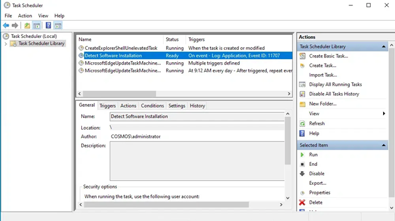
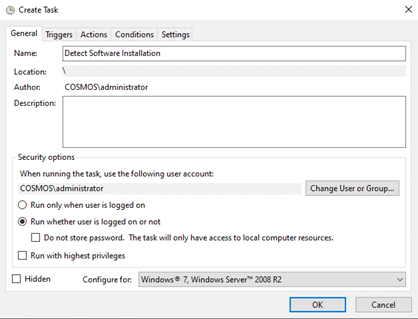
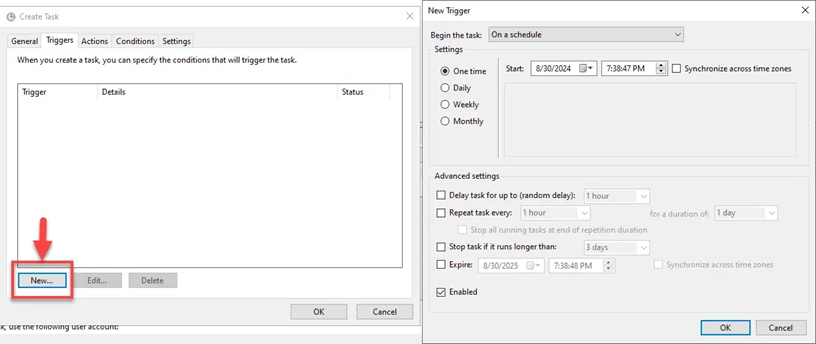
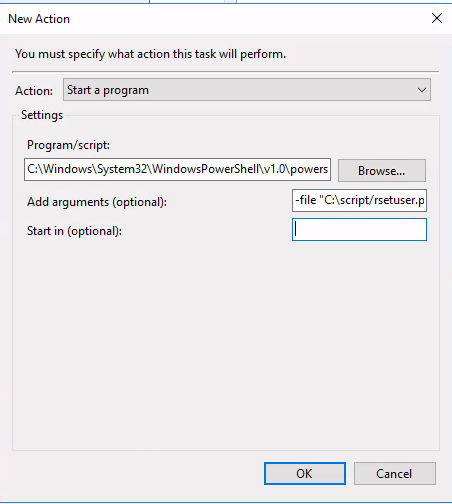

|                             |                          |                                 |
| --------------------------- | ------------------------ | ------------------------------- |
| **Techniker HF Informatik** | **Scripting / Big data** |  |

- [1. Systemintegration](#1-systemintegration)
  - [1.1. Lernziele](#11-lernziele)
  - [1.2. Grundprinzipien der Systemintegration](#12-grundprinzipien-der-systemintegration)
  - [1.3. Execution Policy, Signierung \& Vertrauensmodell](#13-execution-policy-signierung--vertrauensmodell)
  - [1.4. Skript‑/Modul‑Signierung (Überblick)](#14-skriptmodulsignierung-überblick)
  - [1.5. Startmechanismen: Zeit‑/Boot‑/Event‑gesteuert](#15-startmechanismen-zeitbooteventgesteuert)
  - [1.6. PowerShell Scripts in Scheduled Tasks ausführen](#16-powershell-scripts-in-scheduled-tasks-ausführen)
  - [1.7. Logging, Exitcodes \& Monitoring](#17-logging-exitcodes--monitoring)
  - [1.8. Windows Eventlog (optional)](#18-windows-eventlog-optional)
  - [1.9. Exitcodes](#19-exitcodes)
  - [1.10. Fehlerbehandlung \& Robustheit](#110-fehlerbehandlung--robustheit)
- [2. Aufgaben](#2-aufgaben)
  - [2.1. Backup Task erstellen](#21-backup-task-erstellen)
  - [2.2. Scheduled Task‑Auftrag](#22-scheduled-taskauftrag)

---

</br>

# 1. Systemintegration

## 1.1. Lernziele

- Execution Policy, Signierung und Sicherheitskonzepte korrekt einordnen.
- Skripte zweckmässig ablegen, versionieren und über den Systemstart, Scheduled Tasks oder Ereignisse automatisiert ausführen.
- Parameter, Konfigurationsdateien, Umgebungsvariablen und Benutzer-/Dienst‑Kontexte sicher nutzen.
- Logging/Monitoring (Exitcodes, Protokolle, Eventlog) implementieren.
- Remoting, Rechte, JEA (Übersicht) verstehen und Fehlerquellen vermeiden.

---

## 1.2. Grundprinzipien der Systemintegration

- **Reproduzierbarkeit**: Skripte müssen unabhängig von einem interaktiven Benutzer laufen (keine GUI‑Prompts, keine Read-Host in Automation).
- **Determinismus**: Eindeutige Eingaben (Parameter/Konfiguration) ⇒ klare Outputs (Logfiles/Exitcodes).
- **Sicherheit**: Geringste Rechte, Code‑Signierung, Secrets nie im Klartext.
- **Beobachtbarkeit**: Logging (Datei/Eventlog), Exitcodes, ggf. Metriken.
- **Wartbarkeit**: Versionierung, Doku, Idempotenz (mehrfach ausführbar ohne Schaden).

---

## 1.3. Execution Policy, Signierung & Vertrauensmodell

```powershell
Set-ExecutionPolicy -Scope Process -ExecutionPolicy Bypass -Force
```

> **Hinweis: Nur im Scope Process lockern – kein systemweites Absenken. In produktiven Umgebungen auf signierte Skripte setzen.**

---

## 1.4. Skript‑/Modul‑Signierung (Überblick)

- Signaturzertifikat (Code Signing) im Zertifikatsspeicher.
- Skript signieren (Beispiel mit Set-AuthenticodeSignature).
- Verteilung nur aus vertrauenswürdigen Repositories.
- Prüfen: `Get-AuthenticodeSignature .\Script.ps1`.

---

## 1.5. Startmechanismen: Zeit‑/Boot‑/Event‑gesteuert

**Geplante Aufgaben (Task Scheduler):**

- **Trigger**: Zeit (täglich 08:00), At startup, On event.
- **Kontext**: Ausführen unter Service‑Konto (least privilege), Run with highest privileges nur wenn nötig.

```console
powershell.exe -NoProfile -ExecutionPolicy Bypass -File "C:\Scripts\Job.ps1" -ParamA X
```

---

## 1.6. PowerShell Scripts in Scheduled Tasks ausführen

Im Gegensatz zu Command-/Batch-Scripts sollten PowerShell Scripts in Scheduled Tasks nicht direkt über das Feld **Program/Script** ausgeführt werden, sondern über das optionale **Argument** Feld

1. **Öffnen Sie den Taskplaner**: Drücke `Win + R`, gebe „`taskschd.msc`“ in das Dialogfeld **Ausführen** ein und drücke die Eingabetaste.
   1. 
2. Im Aktionsbereich auf der rechten Seite **Aufgabe erstellen** wählen
3. **Namen** und eine **Beschreibung** für Ihre Aufgabe eingeben
   1. 
4. Wechsel zur Registerkarte **„Trigger“** und klicke auf **„Neu“**. Wählen im Bereich **„Neuer Trigger“**
   1. Wann die Aufgabe beginnen soll
   2. Die Häufigkeit, mit der sie ausgeführt werden soll, z.B. einmalig, täglich oder wöchentlich
   3. 
5. Wechsele zur Registerkarte **„Aktionen“**. Klicke auf **„Neu“**, um eine neue Aktion zum Ausführen Ihres PowerShell-Skripts einzurichten:
   1. **Action**: Start a program
   2. **Program/Script**: %SystemRoot%\System32\WindowsPowerShell\v1.0\powershell.exe
   3. Add Arguments (optional): `-ExecutionPolicy Bypass -NoProfile -NoLogo -NonInteractive -File "<Pfad>\<Script-Name>.ps1"`
   4. 

> Der `-ExecutionPolicy Bypass` Parameter sorgt dafür, dass das Script ausgeführt wird, auch wenn die eigentliche Execution Policy des Systems die Ausführung bestimmter Scripts **nicht zulässt**.

[Video](https://www.youtube.com/watch?v=ZtBEQLSRRlc)

**Task mit PowerShell erstellen:**

```powershell
$taskName = "Daily_Job"
$action   = New-ScheduledTaskAction -Execute "powershell.exe" -Argument '-NoProfile -ExecutionPolicy Bypass -File "C:\Scripts\Job.ps1" -Verbose'
$trigger  = New-ScheduledTaskTrigger -Daily -At 08:00
$principal= New-ScheduledTaskPrincipal -UserId "DOMAIN\\svc_automation" -RunLevel Highest
Register-ScheduledTask -TaskName $taskName -Action $action -Trigger $trigger -Principal $principal -Force
```

**Start beim Systemstart (Autostart/Startup Trigger):**

- Geplanter Task mit -AtStartup (robuster als Run‑Key/Autostart‑Ordner).
- Dienst‑Kontexte vermeiden interaktive Abhängigkeiten.

**Ereignis‑Trigger (Event‑Log, Datei‑Watcher):**

- Trigger auf bestimmtes Eventlog‑Ereignis oder **FileSystemWatcher** im Dienst/Job.
- Achtung: Debouncing/Throttling gegen Event‑Stürme.

---

## 1.7. Logging, Exitcodes & Monitoring

**Dateilog + Verbose/Debug:**

```powershell
function New-Logger {
  param([string]$Path = "C:\ProgramData\MyApp\Logs\job.log",[switch]$DebugMode)
  return {
    param([string]$Message,[ValidateSet('INFO','WARN','ERROR','DEBUG')][string]$Level='INFO')
    if ($Level -eq 'DEBUG' -and -not $DebugMode) { return }
    $line = "[{0}] {1} {2}" -f $Level,(Get-Date -Format 'yyyy-MM-dd HH:mm:ss'),$Message
    $line | Out-File -FilePath $Path -Append -Encoding utf8
    if ($Level -eq 'ERROR') { Write-Error $Message }
    elseif ($Level -eq 'WARN') { Write-Warning $Message }
    elseif ($Level -eq 'DEBUG') { Write-Debug $Message }
    else { Write-Verbose $Message }
  }
}
$log = New-Logger -DebugMode
$log.Invoke("Job gestartet")
```

---

## 1.8. Windows Eventlog (optional)

- Eigenes Eventlog/Quelle anlegen, dann `Write-EventLog`.
- Für strukturierte Beobachtung in SIEM/Log‑Tools.

---

## 1.9. Exitcodes

- 0 = Erfolg, ≠0 = Fehler.
- Am Ende des Skripts explizit exit 0/exit 1 setzen.
- Task Scheduler zeigt LastTaskResult.

---

## 1.10. Fehlerbehandlung & Robustheit

- `$ErrorActionPreference = 'Stop'` im Automationskontext, dann **try/catch**.
- Retry‑Muster bei transienten Fehlern (Netz, File Locks).
- Timeouts (z. B. bei externen Tools).
- Idempotenz: Mehrfaches Ausführen hinterlässt konsistenten Zustand.
- Transkription (falls nötig)

```powershell
Start-Transcript -Path "C:\ProgramData\MyApp\Logs\transcript.txt" -Append
# ... Script
Stop-Transcript
```

---

</br>

# 2. Aufgaben

## 2.1. Backup Task erstellen

| **Vorgabe**             | **Beschreibung**                                                   |
| :---------------------- | :----------------------------------------------------------------- |
| **Lernziele**           | Sie können ein Logging + Exitcodes + (optional) Eventlog einsetzen |
|                         | Geplanter Task (Zeit/Boot/Event) mit Monitoring registrieren       |
| **Sozialform**          | Einzelarbeit                                                       |
| **Auftrag**             | siehe unten                                                        |
| **Hilfsmittel**         |                                                                    |
| **Erwartete Resultate** |                                                                    |
| **Zeitbedarf**          | 40 min                                                             |
| **Lösungselemente**     | Lauffähiger Skript                                                 |

Speichere die nachfolgenden Befehle in der `start-backup.ps1` Skript Datei ab und erstelle für automatische Ausführung ein geplante Task (**Name: Backup**)
Die Skriptausführung soll vorerst zu Testzwecken alle **5min** erfolgen (Trigger).

- Prüfe im Logfile die korrekte Ausführung
- Prüfe mit PowerShell die letzte Laufzeit/Ergebnis `Get-ScheduledTask`, `Get-ScheduledTaskInfo`

```powershell
<#
  .SYNOPSIS
  Sytem Backup
  .DESCRIPTION
  Backup Windows System
#>


<#
  .SYNOPSIS
  Write log message
  .DESCRIPTION
  Write a log entry with a timestamp to a log file
#>
function Write-Log {
    param([string]$Message)

    $logFile = Join-Path $PSScriptRoot "backup.log"

    $timestamp = Get-Date -Format "yyyy-MM-dd HH:mm:ss"
    "$timestamp - $Message" | Out-File $logFile -Append
}

#
# MAIN
#

Write-Log "Backup started"

# TODO (Backup)

Write-Log "Backup completed
```

---

## 2.2. Scheduled Task‑Auftrag

| **Vorgabe**             | **Beschreibung**                                                   |
| :---------------------- | :----------------------------------------------------------------- |
| **Lernziele**           | Sie können ein Logging + Exitcodes + (optional) Eventlog einsetzen |
|                         | Geplanter Task (Zeit/Boot/Event) mit Monitoring registrieren       |
| **Sozialform**          | Einzelarbeit                                                       |
| **Auftrag**             | siehe unten                                                        |
| **Hilfsmittel**         |                                                                    |
| **Erwartete Resultate** |                                                                    |
| **Zeitbedarf**          | 30 min                                                             |
| **Lösungselemente**     | Lauffähiger Skript                                                 |

Registriere ein PowerShell Skript, das ein Skript stündlich startet und ein Logfile schreibt.

**Weitere Anforderungen:**

- **Konfigurationsdatei**: Lagere Zielpfade in eine JSON‑Datei aus; lade/verwende sie im Skript.
- **Exitcodes testen**: Provoziere einen Fehler (falscher Pfad), verifiziere LastTaskResult und Log‑Eintrag.

---

© 2026 Lukas Müller – Licensed under CC BY-NC-ND 4.0
See [LICENSE](..\license.md) file for details.
